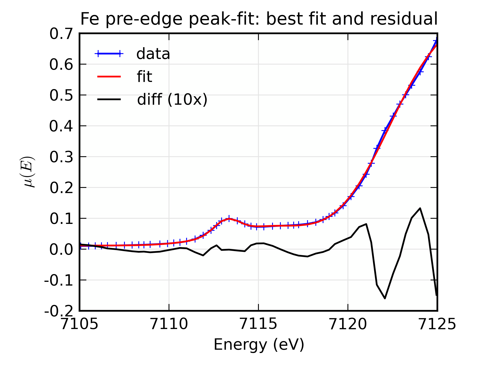
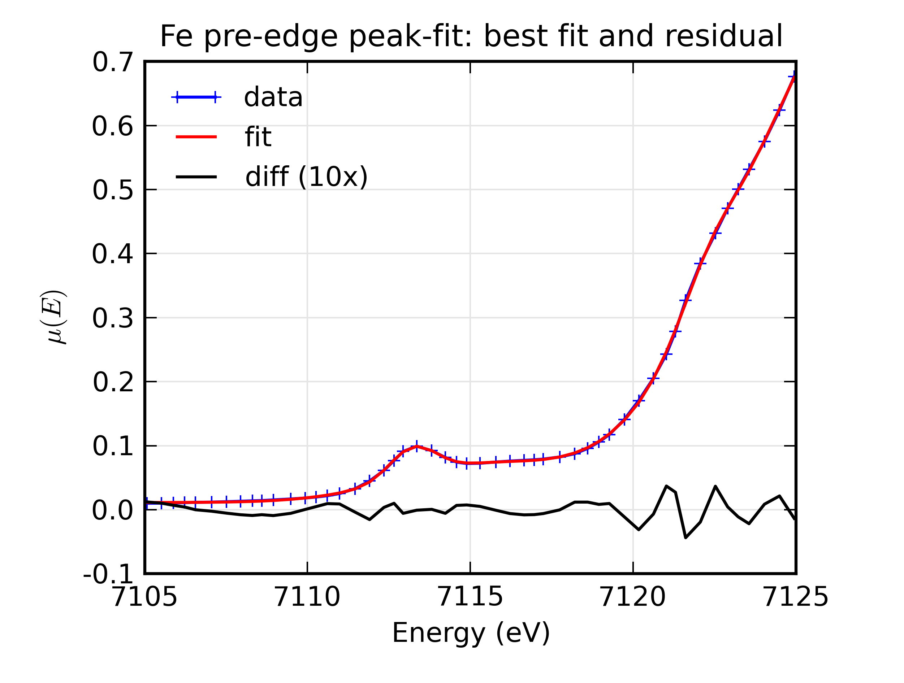

==============
Fit Examples
==============

This section contains a few illustrative fitting examples.  As mentioned
earlier, the important pieces to have for a fit are:

1. a *Parameter Group*: a group that contains all the parameters (both
truly variable parameters as well as any constrained parameters) for the
fit.

2. an *Objective Function* that takes the Parameter Group as the first
argument, and returns an array to be minimized in the least-squares sense.

Example 1: Fitting a Simple Gaussian
======================================

Here we make a simple mock data set and fit a Gaussian function to it.
Though a fairly simple example, and one that is guaranteed to work well, it
touches on all the concepts discussed above, and is a reasonable
representation of the sort of analysis actually done when modeling many
kinds of data.  The script to do the fit looks like this:

.. literalinclude:: ../../examples/fitting/doc_example1.lar

This fitting script consists  of several components, which we'll go over in
some detail.

  1 **create mock data**:  Here we use the builtin :func:`_math.gaussian`
  function to create the model function.  We also add simulated noise to
  the model data with the :func:`random.normal` function from numpy.

  2. **create a group of fit parameters**:  Here we create a group with
  several components, all defined by the :func:`_math.guess` function to
  create variable Parameters.  Two of the parameters have a lower bound
  set.   We also calculate the initial value for the model using the
  initial guesses for the parameter values.

  3. **define objective function for fit residual**: As above, this
  function will receive the group of fit parameters as the first argument,
  and may also receive other arguments as specficied in the call to
  :func:`_math.minimize`.  This function returns the residual of the fit
  (data - model).

  4. **perform fit**.  Here we call :func:`_math.minimize`  with
  arguments of the objective function, the parameter group, and any
  additional positional arguments to the objective function (keyword/value
  arguments can also be supplied).   When this has completed, we calculate
  to model function with the final values of the parameters.

  5. **plot results**.   Here we plot the data, initial, and final fits.

  6. **print report of parameters, uncertainties**.  Here we print out a
  report of the fit statistics, best fit values, uncertainties and
  correlations between variables.

The printed output from ``fit_report(params)`` will look like this::

    ===================== FIT RESULTS =====================
    [[Statistics]]    Fit succeeded,  method = 'leastsq'.
       Message from fit    = Fit succeeded.
       npts, nvarys, nfree = 201, 4, 197
       nfev (func calls)   = 26
       chi_square          = 0.498818
       reduced chi_square  = 0.002532

    [[Variables]]
       amp            =  12.102080 +/- 0.122022 (init=  5.000000)
       cen            =  1.476801 +/- 0.016932 (init=  2.000000)
       off            =  0.996424 +/- 0.006977 (init=  0.000000)
       wid            =  2.022030 +/- 0.016608 (init=  1.000000)

    [[Correlations]]     (unreported correlations are <  0.100)
       amp, off             = -0.861
       amp, wid             =  0.808
       off, wid             = -0.692
    =======================================================

And the plot of data and fit will look like this:

.. image:: ../images/fit_example1.png
   :target: ../_images/fit_example1.png
   :width: 65 %

Example 2: Fitting XANES Pre-edge Peaks
=========================================

This example extends on the previous one of fitting peaks.  Though
following the same basic approach (write an objective function, define
parameters, perform fit), we add several steps that you might use when
modeling real data:

   a) using data read in from a text file,

   b) using more lineshapes, here 3 peak-like functions and an
      error-function.

Consequently, the script is a bit longer:

.. literalinclude:: ../../examples/fitting/doc_example2a.lar

First, we read in the data and do some XAFS-specific preprocessing step.
Also note that we limit the range of the data from the full data set using
the ``index_of`` function.  The objective function ``resid()`` is very
simple, calling ``make_models()`` which creates the model of two Gaussian
peaks, an error function, and an offset.  There are 10 parameters for the
fit.  We're fitting the spectra with two Gaussian functions and an error
function.  It is oten observed that if the centroids of peak functions such
as Gaussians are left to vary completely freely they tend to wander around
and give lousy fits, so here we place fairly tight controls on the
centroids.  We also place bounds on the amplitudes and widths of the peaks,
so they can't go too far astray.

The fit gives a report (ignoring correlations) like this::

    ===================== FIT RESULTS =====================
    [[Statistics]]    Fit succeeded,  method = 'leastsq'.
       Message from fit    = Fit succeeded.
       npts, nvarys, nfree = 51, 10, 41
       nfev (func calls)   = 214
       chi_square          = 0.001194
       reduced chi_square  = 0.000029
     
    [[Variables]] 
       amp1           =  0.078636 +/- 0.015419 (init=  0.250000)
       amp2           =  0.406155 +/- 0.044061 (init=  0.250000)
       cen1           =  7113.212401 +/- 0.074142 (init=  7113.250000)
       cen2           =  7115.571111 +/- 0.297302 (init=  7116.000000)
       erf_amp        =  0.375339 +/- 0.008897 (init=  0.500000)
       erf_cen        =  7122.242846 +/- 0.075486 (init=  7123.500000)
       erf_wid        =  0.289039 +/- 0.012431 (init=  0.500000)
       off            =  0.386845 +/- 0.009081 (init=  0.500000)
       wid1           =  0.489783 +/- 0.068186 (init=  0.600000)
       wid2           =  1.877520 +/- 0.166384 (init=  1.200000)
    =======================================================
 

and the plots of the resulting best-fit and components look like these:

.. image:: ../images/fit_example2a2.png
   :target: ../_images/fit_example2a2.png
   :width: 48 %

and we see the fit is pretty good.  

Looking more closely, however, there is a hint in the data and the residual
that we may have missed a third peak at around E = 7122 eV.  We can add
this by simply adding another peak function to the ``make_models()``
function::
    
    def make_model(pars, data, components=False):
        """make model of spectra: 2 peak functions, 1 erf function, offset"""
        p1 = pars.amp1 * gaussian(data.e, pars.cen1, pars.wid1)
        p2 = pars.amp2 * gaussian(data.e, pars.cen2, pars.wid2)
        p3 = pars.amp3 * gaussian(data.e, pars.cen3, pars.wid3)    
    
        e1 = pars.off + pars.erf_amp * erf( pars.erf_wid*(data.e - pars.erf_cen))
        sum = p1 + p2 + p3 + e1
        if components:
            return sum, p1, p2, p3, e1
        endif
        return sum
    enddef

and 3 more fitting parameters to the parameter group::

    params = group(
        ...
        cen3 = param(7122.0, vary=True, min=7120, max=7124),
        amp3 = param(0.5,    vary=True, min=0),
        wid3 = param(1.2,    vary=True, min=0.05),
	...)

The fit now has 13 variables, and gives a report like this::

    ===================== FIT RESULTS =====================
    [[Statistics]]    Fit succeeded,  method = 'leastsq'.
       Message from fit    = Fit succeeded.
       npts, nvarys, nfree = 51, 13, 38
       nfev (func calls)   = 775
       chi_square          = 0.000103
       reduced chi_square  = 0.000003
     
    [[Variables]] 
       amp1           =  0.080092 +/- 0.005012 (init=  0.250000)
       amp2           =  0.384458 +/- 0.017113 (init=  0.250000)
       amp3           =  0.111112 +/- 0.016366 (init=  0.500000)
       cen1           =  7113.234596 +/- 0.023044 (init=  7113.250000)
       cen2           =  7115.416637 +/- 0.136760 (init=  7116.000000)
       cen3           =  7122.300480 +/- 0.039187 (init=  7122.000000)
       erf_amp        =  0.476421 +/- 0.022186 (init=  0.500000)
       erf_cen        =  7123.374345 +/- 0.215044 (init=  7123.500000)
       erf_wid        =  0.230234 +/- 0.009485 (init=  0.500000)
       off            =  0.487636 +/- 0.022221 (init=  0.500000)
       wid1           =  0.496794 +/- 0.021434 (init=  0.600000)
       wid2           =  1.896698 +/- 0.064887 (init=  1.200000)
       wid3           =  0.614099 +/- 0.040220 (init=  1.200000)
    =======================================================

Adding the third peak here reduced :math:`\chi^2` by a factor of 10, from
0.0001194 to 0.0000103, and so seems to be a significant improvement.  The
values for the energy center and amplitude for the error function have both
moved significantly, as can be seen in the plots for this fit:

.. image::  ../images/fit_example2b2.png
   :target: ../_images/fit_example2b2.png
   :width: 48 %

Finally for this example, we can replace the Gaussian peak shapes with
other functional forms.   To use the Voigt function shown in the previous
section, we simply change ``make_models()`` to use::

    p1 = pars.amp1 * voigt(data.e, pars.cen1, pars.wid1)
    p2 = pars.amp2 * voigt(data.e, pars.cen2, pars.wid2)
    p3 = pars.amp3 * voigt(data.e, pars.cen3, pars.wid3)    

The fit report now reads::

    ===================== FIT RESULTS =====================
    [[Statistics]]    Fit succeeded,  method = 'leastsq'.
       Message from fit    = Fit succeeded.
       npts, nvarys, nfree = 51, 13, 38
       nfev (func calls)   = 441
       chi_square          = 0.000093
       reduced chi_square  = 0.000002
     
    [[Variables]] 
       amp1           =  0.146617 +/- 0.012757 (init=  0.250000)
       amp2           =  0.445953 +/- 0.035927 (init=  0.250000)
       amp3           =  0.193669 +/- 0.032386 (init=  0.500000)
       cen1           =  7113.237795 +/- 0.020992 (init=  7113.250000)
       cen2           =  7115.912912 +/- 0.134734 (init=  7116.000000)
       cen3           =  7122.320641 +/- 0.037579 (init=  7122.000000)
       erf_amp        =  0.490162 +/- 0.023101 (init=  0.500000)
       erf_cen        =  7123.580458 +/- 0.227496 (init=  7123.500000)
       erf_wid        =  0.228310 +/- 0.008306 (init=  0.500000)
       off            =  0.497919 +/- 0.023158 (init=  0.500000)
       wid1           =  0.528196 +/- 0.027222 (init=  0.600000)
       wid2           =  1.676269 +/- 0.093116 (init=  1.200000)
       wid3           =  0.642993 +/- 0.047203 (init=  1.200000)
    =======================================================

and we see that the already very low
:math:`\chi^2` reduces by another 10%, which suggests a real improvement.
For completeness,  the plots from this fit look like this:

.. image:: ../images/fit_example2c2.png
   :target: ../_images/fit_example2c2.png
   :width: 48 %

It's difficult to see a dramatic difference in fit quality for this data,
but the ability to explore fitting with different lineshapes like this is
still a useful test of the robustness of the fit.

Example 3: Fitting XANES Spectra as a Linear Combination of Other Spectra
==========================================================================

This example is simpler than the previous one, though still worth an
explicit example.  Here, we fit a XANES spectra as a linear combination of
two other spectra. It is often used to compare an unknown spectra with a
large selection of candidate model spectra, taking the result with lowest
misfit statistics as the most likely results.  Though it should be used
with some caution, this represents a standard and very simple approach to
XANES analysis. In the example here we only do the fit with a single pair
of candidate spectra.  Extending to more model spectra is left as an
exercise for the reader.  Other possible variations include fiting the
derivatives or other spectral decompositions of the spectra.

For the analysis here, we have unknown spectra X and two model spectra A
and B.  first put all the data onto the same ordinate (energy) array.  This
does not necessarily need to be a uniform energy grid.  We then use a
Parameter group with two parameters.  The first of these is the amplitude
for model spectra A, which is set to vary and have a minimum value of 0 and
a maximum of 1.  The second parameter is the amplitude for model spectra B,
which is constrained to be '1 - ampA'.

