==============
Fit Examples
==============

This section contains a few illustrative fitting examples.  As mentioned
earlier, the important pieces to have for a fit are:

1. a *Parameter Group*: a group that contains all the parameters (both
truly variable parameters as well as any constrained parameters) for the
fit.

2. an *Objective Function* that takes the Parameter Group as the first
argument, and returns an array to be minimized in the least-squares sense.

The files for the examples shown here are all can be found in the
*examples/fitting* folder of the main Larch distribution.

.. _fit_example1_sec:

Example 1: Fitting a Simple Gaussian
======================================

Here we make a simple mock data set and fit a Gaussian function to it.
Though a fairly simple example, and one that is guaranteed to work well, it
touches on all the concepts discussed above, and is a reasonable
representation of the sort of analysis actually done when modeling many
kinds of data.  The script to do the fit looks like this:

.. literalinclude:: ../../examples/fitting/doc_example1.lar

This fitting script consists  of several components, which we'll go over in
some detail.

  1 **create mock data**:  Here we use the builtin :func:`_math.gaussian`
  function to create the model function.  We also add simulated noise to
  the model data with the :func:`random.normal` function from numpy.

  2. **create a group of fit parameters**:  Here we create a group with
  several components, all defined by the :func:`_math.guess` function to
  create variable Parameters.  Two of the parameters have a lower bound
  set.   We also calculate the initial value for the model using the
  initial guesses for the parameter values.

  3. **define objective function for fit residual**: As above, this
  function will receive the group of fit parameters as the first argument,
  and may also receive other arguments as specified in the call to
  :func:`_math.minimize`.  This function returns the residual of the fit
  (data - model).

  4. **perform fit**.  Here we call :func:`_math.minimize`  with
  arguments of the objective function, the parameter group, and any
  additional positional arguments to the objective function (keyword/value
  arguments can also be supplied).   When this has completed, we calculate
  to model function with the final values of the parameters.

  5. **plot results**.   Here we plot the data, starting values, and the final
  fit.

  6. **print report of parameters, uncertainties**.  Here we print out a
  report of the fit statistics, best fit values, uncertainties and
  correlations between variables.

The printed output from ``fit_report(params)`` will look like this::

    [[Fit Statistics]]
        # function evals   = 28
        # data points      = 201
        # variables        = 4
        chi-square         = 0.53784
        reduced chi-square = 0.0027302
        Akaike info crit   = -1182.6
        Bayesian info crit = -1169.4
    [[Variables]]
        amp:   11.9259429 +/- 0.078146 (0.66%) (init= 5)
        cen:   1.50726422 +/- 0.010365 (0.69%) (init= 2)
        off:   1.00495225 +/- 0.005356 (0.53%) (init= 0)
        wid:   1.99121482 +/- 0.012135 (0.61%) (init= 1)
    [[Correlations]] (unreported correlations are <  0.100)
        C(amp, off)                  = -0.726
        C(amp, wid)                  =  0.717
        C(wid, off)                  = -0.520

And the plot of data and fit will look like this:

.. _fig_fit1:

.. figure::  ../_images/fit_example1.png
    :target: ../_images/fit_example1.png
    :width: 65%
    :align: center

    Simple fit to mock data

Example 2: Fitting XANES Pre-edge Peaks
=========================================

This example extends on the previous one of fitting peaks.  Though
following the same basic approach (write an objective function, define
parameters, perform fit), we add several steps that you might use when
modeling real data:

   a) using data read in from a text file,

   b) using more lineshapes, here 3 peak-like functions and an
      error-function.

Consequently, the script is a bit longer:

.. literalinclude:: ../../examples/fitting/doc_example2a.lar

First, we read in the data and do some XAFS-specific preprocessing step.
Also note that we limit the range of the data from the full data set using
the ``index_of`` function.  The objective function ``resid()`` is very
simple, calling ``make_models()`` which creates the model of two Gaussian
peaks, an error function, and an offset.  There are 10 parameters for the
fit.  We're fitting the spectra with two Gaussian functions and an error
function.  It is often observed that if the centroids of peak functions such
as Gaussians are left to vary completely freely they tend to wander around
and give lousy fits, so here we place fairly tight controls on the
centroids.  We also place bounds on the amplitudes and widths of the peaks,
so they can't go too far astray.

The fit gives a report (ignoring correlations) like this::

    [[Fit Statistics]]
        # function evals   = 170
        # data points      = 51
        # variables        = 10
        chi-square         = 0.0012762
        reduced chi-square = 3.1126e-05
        Akaike info crit   = -520.38
        Bayesian info crit = -501.06
    [[Variables]]
        amp1:      0.19742004 +/- 0.037564 (19.03%) (init= 0.25)
        amp2:      0.21393220 +/- 0.048193 (22.53%) (init= 0.25)
        cen1:      7113.28403 +/- 0.143034 (0.00%) (init= 7113.25)
        cen2:      7116.46195 +/- 0.279419 (0.00%) (init= 7116)
        erf_amp:   0.38223607 +/- 0.010433 (2.73%) (init= 0.5)
        erf_cen:   7122.29627 +/- 0.097868 (0.00%) (init= 7123.5)
        erf_wid:   0.27474480 +/- 0.011462 (4.17%) (init= 0.5)
        off:       0.39565509 +/- 0.010346 (2.62%) (init= 0.5)
        wid1:      1.07507112 +/- 0.105954 (9.86%) (init= 0.6)
        wid2:      1.58457992 +/- 0.307342 (19.40%) (init= 1.2)

and the plots of the resulting best-fit and components look like these:

.. subfigstart::
   
.. _fig-fit2:

.. figure:: ../_images/fit_example2a1.png
    :target: ../_images/fit_example2a1.png
    :width: 100%
    :align: left

    Data, fit, and residual.

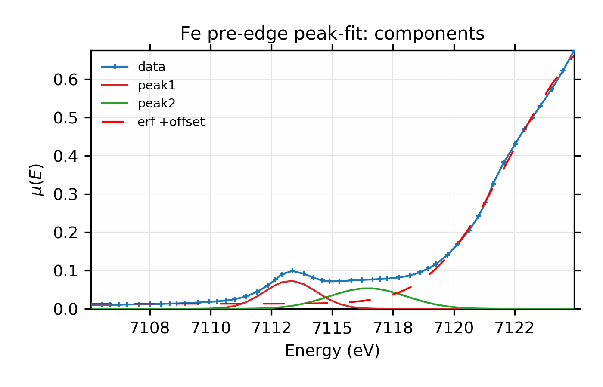
	    
    Fit and individual components.

.. subfigend::
    :width: 0.45
    :label: fig-fit2combined
	    
    Fit to Fe K-edge pre-edge and edge with 2 Gaussian functions
    
and we see the fit is pretty good.

Looking more closely, however, there is a hint in the data and the residual
that we may have missed a third peak at around E = 7122 eV.  We can add
this by simply adding another peak function to the ``make_models()``
function::

    def make_model(pars, data, components=False):
        """make model of spectra: 3 peak functions, 1 erf function, offset"""
        p1 = gaussian(data.e, pars.amp1, pars.cen1, pars.wid1)
        p2 = gaussian(data.e, pars.amp2, pars.cen2, pars.wid2)
        p3 = gaussian(data.e, pars.amp3, pars.cen3, pars.wid3)

        e1 = pars.off + pars.erf_amp * erf( pars.erf_wid*(data.e - pars.erf_cen))
        sum = p1 + p2 + p3 + e1
        if components:
            return sum, p1, p2, p3, e1
        endif
        return sum
    enddef

and 3 more fitting parameters to the parameter group:

.. code-block:: python

    params = param_group(
        ...
        cen3 = param(7122.0, vary=True, min=7120, max=7124),
        amp3 = param(0.5,    vary=True, min=0),
        wid3 = param(1.2,    vary=True, min=0.05),
        ...)

The fit now has 13 variables, and gives a report like this::

    [[Fit Statistics]]
        # function evals   = 504
        # data points      = 51
        # variables        = 13
        chi-square         = 0.00010278
        reduced chi-square = 2.7046e-06
        Akaike info crit   = -642.85
        Bayesian info crit = -617.74
    [[Variables]]
        amp1:      0.08005336 +/- 0.005009 (6.26%) (init= 0.25)
        amp2:      0.38406912 +/- 0.017093 (4.45%) (init= 0.25)
        amp3:      0.11105163 +/- 0.016357 (14.73%) (init= 0.5)
        cen1:      7113.23457 +/- 0.023040 (0.00%) (init= 7113.25)
        cen2:      7115.41657 +/- 0.136728 (0.00%) (init= 7116)
        cen3:      7122.30049 +/- 0.039190 (0.00%) (init= 7122)
        erf_amp:   0.47613623 +/- 0.022176 (4.66%) (init= 0.5)
        erf_cen:   7123.37448 +/- 0.215089 (0.00%) (init= 7123.5)
        erf_wid:   0.23023512 +/- 0.009484 (4.12%) (init= 0.5)
        off:       0.48707800 +/- 0.022211 (4.56%) (init= 0.5)
        wid1:      0.70260153 +/- 0.030309 (4.31%) (init= 0.6)
        wid2:      2.68190137 +/- 0.091739 (3.42%) (init= 1.2)
        wid3:      0.86847656 +/- 0.056876 (6.55%) (init= 1.2)

Adding the third peak here reduced :math:`\chi^2` by a factor of 10, from
0.001276 to 0.000103, and so seems to be a significant improvement.
Reduced chi-square also dropped by an order of magnitude and both the
Akaike and Bayesian information criteria dropped by more than 100.  The
values for the energy center and amplitude for the error function have both
moved significantly, as can be seen in the plots for this fit:

.. subfigstart::

.. _fig-fit3:

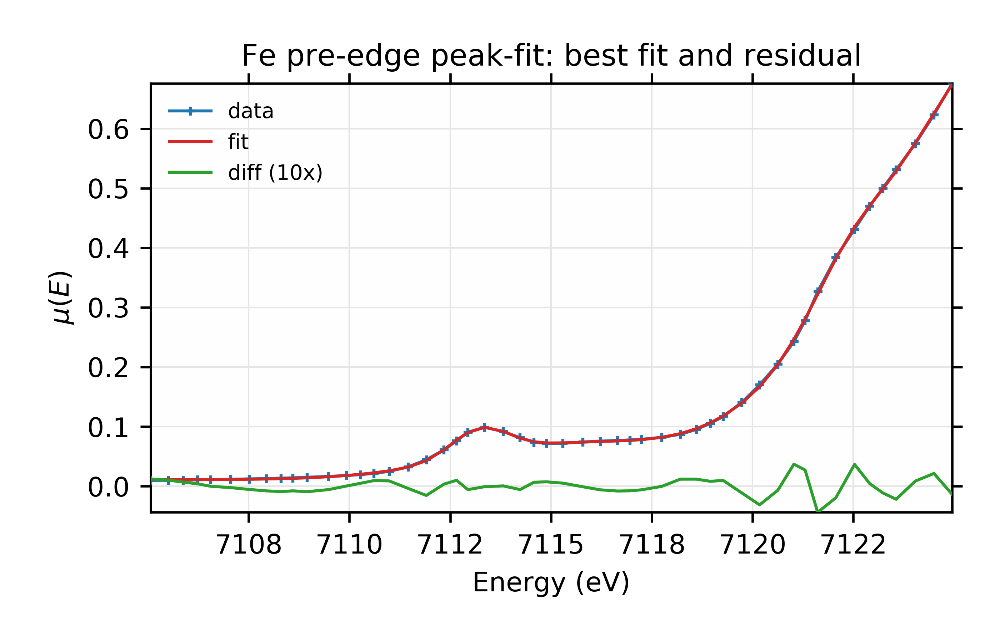

    Data, fit, and residual.

.. _fig-fit3b:

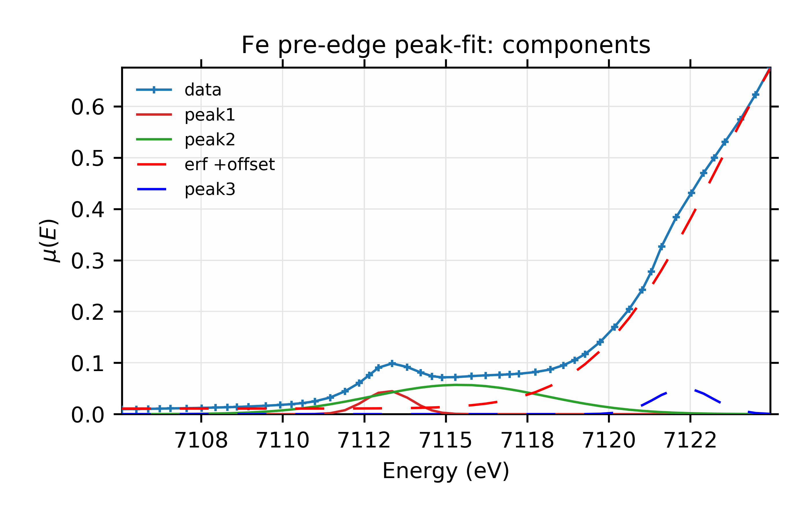

    Fit with individual components.

.. subfigend::
   :width: 0.45
   :label: fig-fit3comp
    
    Fit to Fe K-edge pre-edge and edge with 3 Gaussian functions
    and an Error function.

Finally for this example, we can replace the Gaussian peak shapes with
other functional forms.   To use the Voigt function shown in the previous
section, we simply change ``make_models()`` to use::

    p1 = pars.amp1 * voigt(data.e, pars.cen1, pars.wid1)
    p2 = pars.amp2 * voigt(data.e, pars.cen2, pars.wid2)
    p3 = pars.amp3 * voigt(data.e, pars.cen3, pars.wid3)

The fit report now reads::

    [[Fit Statistics]]
        # function evals   = 476
        # data points      = 51
        # variables        = 13
        chi-square         = 9.2875e-05
        reduced chi-square = 2.4441e-06
        Akaike info crit   = -648.02
        Bayesian info crit = -622.91
    [[Variables]]
        amp1:      0.14657959 +/- 0.012760 (8.71%) (init= 0.25)
        amp2:      0.44536523 +/- 0.035916 (8.06%) (init= 0.25)
        amp3:      0.19354556 +/- 0.032364 (16.72%) (init= 0.5)
        cen1:      7113.23780 +/- 0.020989 (0.00%) (init= 7113.25)
        cen2:      7115.91312 +/- 0.134712 (0.00%) (init= 7116)
        cen3:      7122.32066 +/- 0.037577 (0.00%) (init= 7122)
        erf_amp:   0.48986689 +/- 0.023086 (4.71%) (init= 0.5)
        erf_cen:   7123.58055 +/- 0.227490 (0.00%) (init= 7123.5)
        erf_wid:   0.22831037 +/- 0.008305 (3.64%) (init= 0.5)
        off:       0.49735544 +/- 0.023143 (4.65%) (init= 0.5)
        wid1:      0.52826663 +/- 0.027231 (5.15%) (init= 0.6)
        wid2:      1.67565399 +/- 0.093190 (5.56%) (init= 1.2)
        wid3:      0.64297551 +/- 0.047200 (7.34%) (init= 1.2)

and we see that the already very low :math:`\chi^2` reduces by another 10%,
and improvements of the two information criteria.  which suggests a real
improvement.  For completeness, the plots from this fit look like this:

.. subfigstart::
   
.. _fig-fit4:

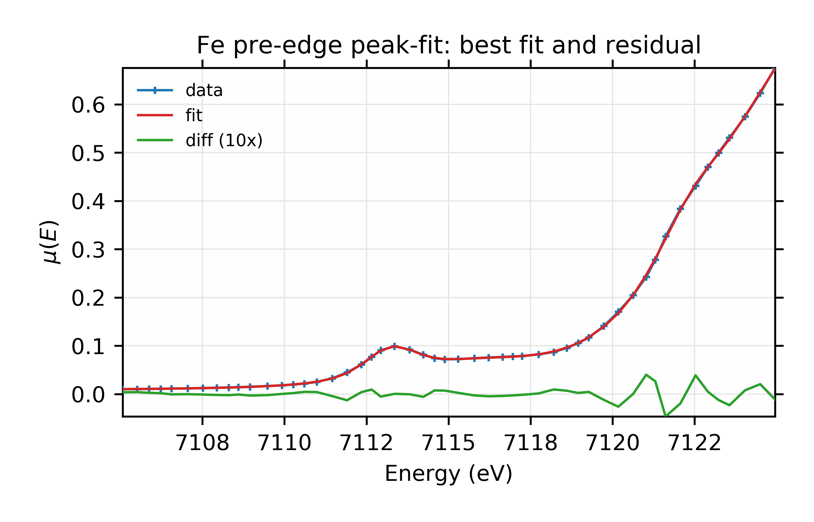

    Data, fit, and residual.

.. _fig-fit4b:

.. figure::  ../_images/fit_example2c2.png
    :target: ../_images/fit_example2c2.png
    :width: 100%
    :align: center

    Fit with individual components.

.. subfigend::
    :width: 0.45
    :label: fig-fit4comp
    
    Fit to Fe K-edge pre-edge and edge with 3 Voigt functions
    and an Error function.

It's difficult to see a dramatic difference in fit quality for this data,
but the ability to explore fitting with different lineshapes like this is
still a useful test of the robustness of the fit.

.. _fit_example3_sec:

Example 3: Fitting XANES Spectra as a Linear Combination of Other Spectra
==========================================================================

This example is quite a bit simpler than the previous one, though worth an
explicit example.  Here, we fit a XANES spectra as a linear combination of
two other spectra.  This approach is often used to compare an unknown
spectra with a large selection of candidate model spectra, taking the
result with lowest misfit statistics as the most likely results.  Though
this method should be used with some caution, it is a standard and very
simple approach to XANES analysis.

The example here is borrowed from Bruce Ravel's data and tutorials, and
based on the work published by :cite:`Lengke2006`, The goal here is not
to repeat the whole of that analysis, but to present the mechanics of the
fitting approach.  Essentially, we're asserting that a particular measured
spectrum is made of a linear combination of 2 or more other spectra.  We
have a set of candidate model spectra, and we're going to try to determine
both which of those model spectra combine to match the measured one.  Here
we will simply assert that all the spectra are aligned in the ordinate and
that they are normalized in some reproducible way so that there are
essentially no artefacts or systematic problems in the 'x' or 'y' values of
the data.

For the example here, the spectra are held in individual ASCII data files,
which we'll call *unknown.dat* for the unknown spectrum and *s1.dat*,
*s2.dat*, ..., *s6.dat* for the spectra on 6 different standards. It is
not important for the discussion here what these spectra represent, but
they are XANES data taken at the Au L3 edge on various Au compounds.

A visual inspection of the spectra (see :numref:`fig-fit5`)
suggests that *s2* is probably a major component of the unknown, though the
peak around 11950 eV is a feature that only *s1* has, so it too may be an
important component.

.. subfigstart::

.. _fig-fit5:

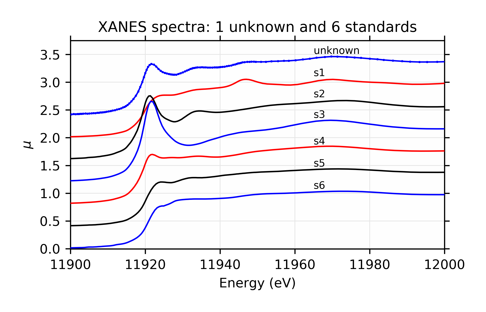

    Components used for linear combinations.

.. _fig-fit5b:

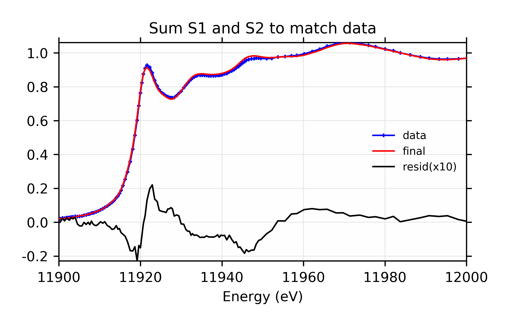

    Fit and residual with components *s1* and *s2*.
    
.. subfigend::
    :width: 0.45
    :label: fig-fit5comp
 
    Linear Combination Fit of gold XANES in cyanobacteria, after
    :cite:`Lengke2006`. 

To quantitatively fit these spectra, we read in all the data, and then
create a single group *dat* that will contain all the data we need.  It
turns out (and a common issue for XAFS data), the scans here do not have
identical energy values, so we both select a limited energy range, and
interpolate the standards onto the energy array of the unknown, and put all
these spectra into a single group:

.. literalinclude:: ../../examples/fitting/doc_example3/ReadData.lar

The initial fit to the unknown spectrum with spectra *s1* and *s2* looks
like this:

.. literalinclude:: ../../examples/fitting/doc_example3/fit1.lar

Here, we actually define a weight for all 6 spectra, but force 4 of them to
be 0.  For a two component fit, this would not be necessary, but we'll be
expanding this shortly.  We place bounds of [0, 1] on all the parameters,
and we use a constraint to ensure that the parameters add to 1.0.   Also
note that we define an uncertainty in the data that we use to scale the
``data - model`` returned by the fit.   This is somewhat arbitrarily chosen
to be 0.001, that is 0.1% of the typical data value.  The
results of this fit are::

    [[Fit Statistics]]
        # function evals   = 7
        # data points      = 160
        # variables        = 1
        chi-square         = 9339.1
        reduced chi-square = 58.736
        Akaike info crit   = 652.69
        Bayesian info crit = 655.76
    [[Variables]]
        amp1:   0.47066003 +/- 0.004708 (1.00%) (init= 0.5)
        amp2:   0.52933996 +/- 0.004708 (0.89%)  == '1 - amp1'
        amp3:   0 (fixed)
        amp4:   0 (fixed)
        amp5:   0 (fixed)
        amp6:   0 (fixed)

and the result for this fit is shown in :numref:`fig-fit5`.  This
demonstrates the use of simple constraints for Parameters in fits: we've
used an algebraic expression to ensure that the weights for the two
components in the fit add to 1.

The fit here is not perfect, and we suspect there may be another standard
as a component to the fit.  But at this point, we have several candidate
spectra, and a pretty good starting fit, so the main questions are

  1. How do we know when one fit is better than another?
  2. Which combination gives the best results?

To answer the first question, we'll assert that "improved reduced
chi-square" is the best way to decide which of a series of fits is best.
To answer the second question, we'll work through all the possibilities.
Now, we set up a more complicated script to do 5 separate fits so that we
can compare the results.   This makes use of some of the more advanced
scripting features of larch:

.. literalinclude:: ../../examples/fitting/doc_example3/fit2.lar
   :language: python

There are several points worth noting here:

 a) We make a new copy of the Parameter Group for each fit -- this way we
    can (with some care) switch back and forth between fitting models.  Note
    that we add the non-Parameter ``note`` member to this group that give a
    brief description of the fit.  Of course, we could add anything else we
    wanted.

 b) We set ``amp1.vary`` and ``amp2.vary`` to ``True`` and set one of the
    other amplitude parameter's expression to ``1 - amp1 - amp2`` to impose
    the desired constraint.

 c) The loop over Parameter groups runs the fit for each set of
    Parameters, and checks for the lowest value of ``chi_reduced``,
    ``aic``, and ``bic``.

The output of running this gives::

    chi_reduced |  A I C  |  B I C | Notes
    ------------+---------+--------+----------------------------
         58.7   |  652.7  |  655.8 |  2 components:  s1, s2
         40.2   |  592.9  |  599.1 |  3 components:  s1, s2, s3
         37.2   |  580.6  |  586.7 |  3 components:  s1, s2, s4
         32.1   |  557.2  |  563.4 |  3 components:  s1, s2, s5
         37.2   |  580.6  |  586.8 |  3 components:  s1, s2, s6
    ------------+---------+--------+----------------------------
    Best Fit:   3 components:  s1, s2, s5
    [[Fit Statistics]]
        # function evals   = 12
        # data points      = 160
        # variables        = 2
        chi-square         = 5078.3
        reduced chi-square = 32.141
        Akaike info crit   = 557.21
        Bayesian info crit = 563.36
    [[Variables]]
        amp1:   0.27866516 +/- 0.017035 (6.11%) (init= 0.4)
        amp2:   0.53207041 +/- 0.003491 (0.66%) (init= 0.4)
        amp3:   0 (fixed)
        amp4:   0 (fixed)
        amp5:   0.18926442 +/- 0.016438 (8.69%)  == '1 - amp1 - amp2'
        amp6:   0 (fixed)
    [[Correlations]] (unreported correlations are <  0.100)
        C(amp1, amp2)                = -0.270

and the output plots for the best model look like this:

.. subfigstart::
   
.. _fig-fit6:

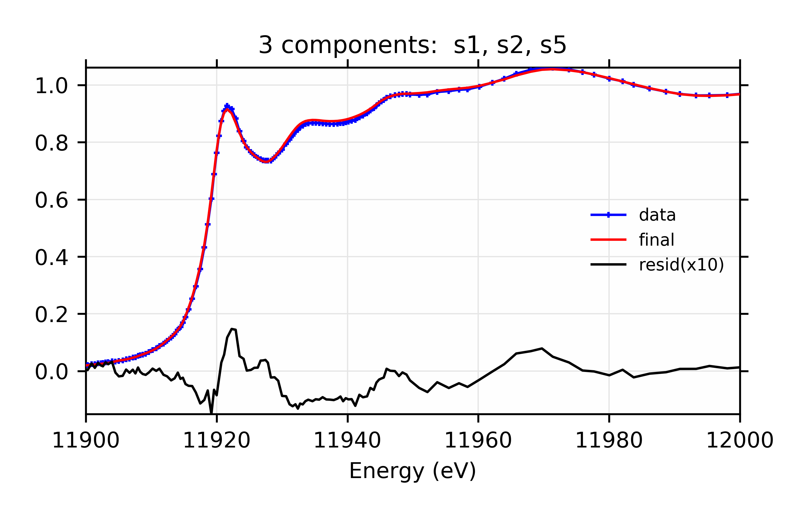

    Linear combination fit and residual.

.. _fig-fit6b:

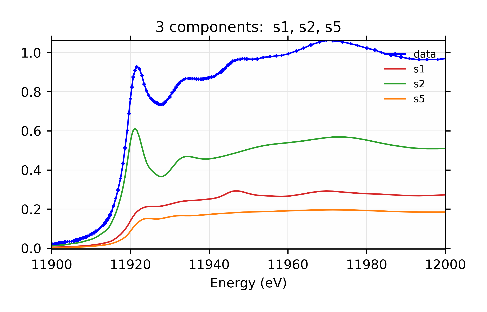

    Weighted contribution from individual components.

.. subfigend::
    :width: 0.45
    :label: fig-fit6comp

    Linear Combination XANES Fit of gold components in cyanobacteria with
    species *s1*, *s2*, and *s5*.

Of course, we aren't necessarily done here as we haven't exhausted all
possible combinations of components.  Included in the examples
(*examples/fitting/doc_examples3/fit3.lar*), but not reprinted here, is a
script that runs through all possible combinations of 3 and 4 components,
though still assuming that *s1* and *s2* are components.

The output gives this::

    chi_reduced |  A I C  |  B I C | Notes
    ------------+---------+--------+----------------------------
         58.7   |  652.7  |  655.8 |  2 component fit:  s1, s2
         40.2   |  592.9  |  599.1 |  3 component fit:  s1, s2, s3
         37.2   |  580.6  |  586.7 |  3 component fit:  s1, s2, s4
         32.1   |  557.2  |  563.4 |  3 component fit:  s1, s2, s5
         37.2   |  580.6  |  586.8 |  3 component fit:  s1, s2, s6
         59.2   |  656.0  |  665.2 |  4 component fit:  s1, s2, s3, s4
         14.7   |  433.3  |  442.5 |  4 component fit:  s1, s2, s3, s5
         13.3   |  417.6  |  426.8 |  4 component fit:  s1, s2, s3, s6
         30.1   |  547.8  |  557.1 |  4 component fit:  s1, s2, s4, s5
         32.4   |  559.2  |  568.5 |  4 component fit:  s1, s2, s5, s6
         34.3   |  568.8  |  578.0 |  4 component fit:  s1, s2, s4, s6
    ------------+---------+--------+----------------------------
    Best Fit:   4 component fit:  s1, s2, s3, s6
    [[Fit Statistics]]
        # function evals   = 37
        # data points      = 160
        # variables        = 3
        chi-square         = 2095.2
        reduced chi-square = 13.345
        Akaike info crit   = 417.56
        Bayesian info crit = 426.78
    [[Variables]]
        amp1:   0.32788267 +/- 0.009491 (2.89%) (init= 0.4)
        amp2:   0.46501286 +/- 0.005624 (1.21%) (init= 0.4)
        amp3:   0.06384062 +/- 0.003749 (5.87%) (init= 0)
        amp4:   0 (fixed)
        amp5:   0 (fixed)
        amp6:   0.14326383 +/- 0.008029 (5.60%)  == '1 - amp1 - amp2 - amp3'
    [[Correlations]] (unreported correlations are <  0.100)
        C(amp2, amp3)                = -0.890
        C(amp1, amp2)                = -0.340

You might notice that, whereas the 3 component fit favored adding *s5*, the
four component fit favors *s3* and *s6*.  You might further notice that the
four component fit with *s3* and *s5* has reduced chi-square of 14.7, only
slightly worse than the best value.  For completeness, the parameters for
that are::

    larch> ret6 = minimize(resid, pars[6], args=(data,))
    larch> print fit_report(ret6)

    [[Fit Statistics]]
        # function evals   = 7
        # data points      = 160
        # variables        = 3
        chi-square         = 2312.1
        reduced chi-square = 14.727
        Akaike info crit   = 433.32
        Bayesian info crit = 442.55
    [[Variables]]
        amp1:   0.30304286 +/- 0.011667 (3.85%) (init= 0.3030429)
        amp2:   0.45835749 +/- 0.005874 (1.28%) (init= 0.4583575)
        amp3:   0.05429199 +/- 0.003961 (7.30%) (init= 0.05429198)
        amp4:   0 (fixed)
        amp5:   0.18430763 +/- 0.011132 (6.04%)  == '1 - amp1 - amp2 - amp3'
        amp6:   0 (fixed)
    [[Correlations]] (unreported correlations are <  0.100)
        C(amp2, amp3)                = -0.916
        C(amp1, amp2)                = -0.247
        C(amp1, amp3)                =  0.152

The plots resulting from both sets of Parameters are shown:

.. subfigstart::
   
.. _fig-fit7:

.. figure::  ../_images/fit_example3d1.png
    :target: ../_images/fit_example3d1.png
    :width: 100%
    :align: center

    Data, fit, and residual.

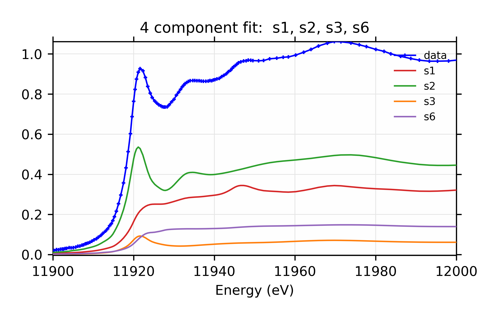

    Weighted contribution from individual components.
	    
.. subfigend::
    :width: 0.45
    :label: fig-fit7comp
	    
    Linear Combination XANES Fit of gold components in cyanobacteria
    with species *s1*, *s2*, *s3*, and *s6*.

.. subfigstart::

.. _fig-fit8:

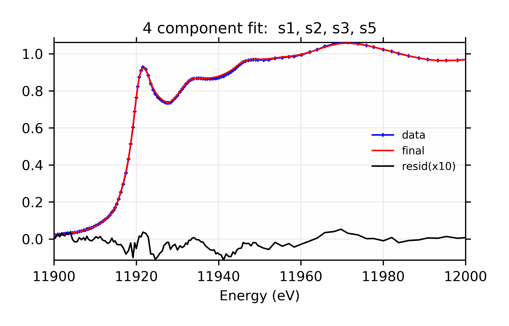

    Linear Combination XANES Fit of gold components in cyanobacteria
    with species *s1*, *s2*, *s3*, and *s5*. Data, fit, and residual.

.. _fig-fit8b:

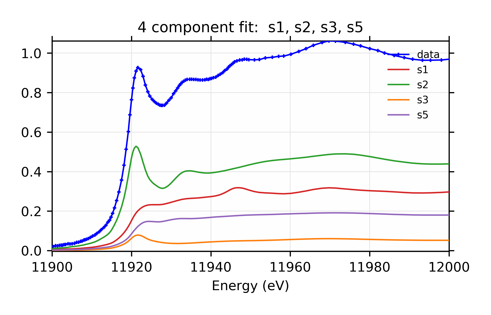
	    
    Weighted contribution from individual components.
    
.. subfigend::
    :width: 0.45
    :label: fig-fit8comp

    Linear Combination XANES Fit of gold components in cyanobacteria
    with species *s1*, *s2*, *s3*, and *s5*.

From the plots alone, it is difficult to tell which of these fits is
better, and it is probably best to say that these are both good fits.  This
implies that component *s3* is important even if at a very small fraction,
and that either component *s5* or *s6* (which aren't that different
spectroscopically or chemically (see :numref:`fig-fit5`) is present.
Of course, the analysis here is not meant to be definitive, and there are
many more checks that could be done.  To be clear, :cite:`Lengke2006`
looked at many more unknown spectra, and also adjusted the energy ranges of
the fits, and concludedd that *s1*, *s2*, *s3*, and *s5* were the best
components, with concentrations of the components very similar to the ones
found here.
