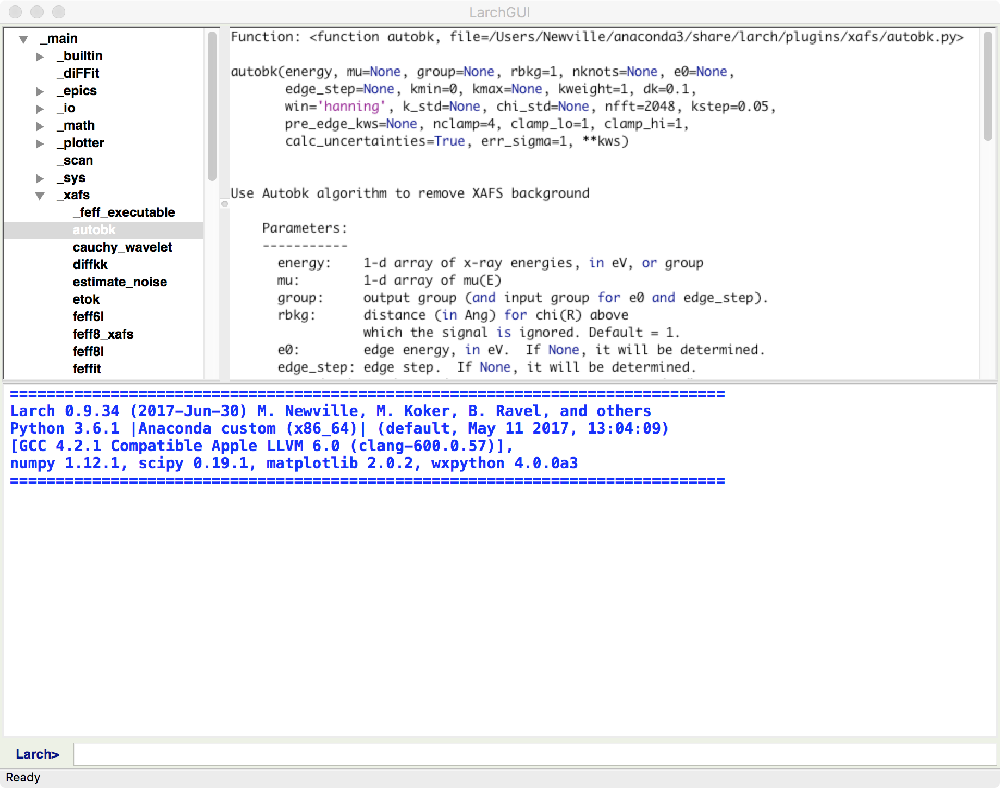
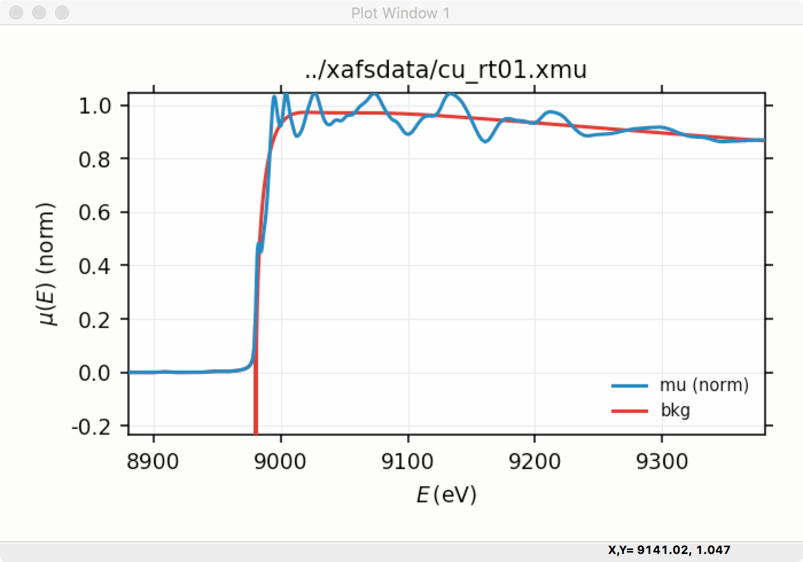
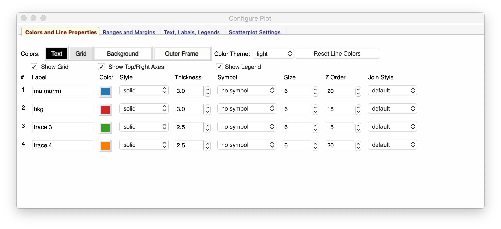

.. _guis-chapter:

=====================
Larch GUIs
=====================

.. _wxmplot:  https://newville.github.io/wxmplot
.. _matplotlib: https://matplotlib.org/
.. _lmfit:    https://lmfit.github.io/lmfit-py
.. _scipy: https://scipy.org/
.. _numpy: https://numpy.scipy.org/
.. _h5py: https://code.google.com/p/h5py/
.. _Dioptas: https://github.com/Dioptas/Dioptas

.. module:: guis
   :synopsis: Graphical User Interfaces

Larch provides several Graphical User Interfaces for manipulating, viewing,
and processing of X-ray spectroscopy, scattering, and imaging data.  Many
of the GUI displays are interrelated, so that they can bring up the other
windows for displaying, interacting, and processing data.  The main GUIs
for Larch are

  * :ref:`XAS Viewer <xasviewer_app>`: Visualization and Analysis of  XAS data.
  * :ref:`GSE_Mapviewer <mapviewer_app>`: visualization and Analysis of XRF and XRD maps.
  * :ref:`larch_gui <larchgui_app>`: simple command-line + data browser for Larch.

.. _larchcli_app:

Larch Command-Line Application
==================================

The basic `larch` program gives a simple shell interface to an interactive Larch session, using the
Larch macro language.  With it you can read, visualize, and manipulate data and run any of the
Larch functions to process, analyze, and plot data.

.. _larchgui_app:

Basic Larch GUI
==========================

The simplest Graphical Interface to Larch provides a basic interactive
Larch session, showing data and methods and commands using the Larch DSL
entered into the session.

.. _larchgui_fig:

   Basic Larch Ehanced Shell GUI

This Graphical Interface in :numref:`larchgui_fig` shows a command-line interface at
the bottom of the screen.  In this window, you can copy or type Larch commands --
that is commands in the Larch language.  When you hit Enter or Return, the command
will be executed.  The history of the commands and any outputs written by the
command will be displayed in the output panel taking up most of the bottom half of
the main window.  The top part of the window shows a Data Browser which allows you
to browse through the various groups for modules and datasets, and examine their
contents and view function documentation and so on.

This Graphical User Interface is deliberately basic, giving a low-level
interface to Larch commands and data, and is mainly intended for scripting
analysis and debugging.  From the File Menu you can read in data from text
column files (using one of :func:`_io.read_ascii`, :func:`_io.read_xdi`, or
:func:`_io.read_gsexdi` as appropriate) or from Athena Project files (using
:func:`_io.read_athena` and :func:`_io.extract_athenagroup`).  You can also
load and run a text file of commands or save the commands run in a session
to a file.

The main Larch GUI also provides simple launchers for several of the main
Larch Applications, including XAS Viewer.

From the Larch GUI, one can browse and act on data.  This includes the
ability make Simple plot of 1-D data, using `wxmplot`_.  This wraps
`matplotlib`_, and gives a fully interactive with point selection,
rubber-band zoom, and a configuration frame (right) for the user to select
colors and line properties, and so forth.

.. _fig_gui_plottera:

   Basic Plot

   Plot Configuration Window

Example plots and plot configuration.
