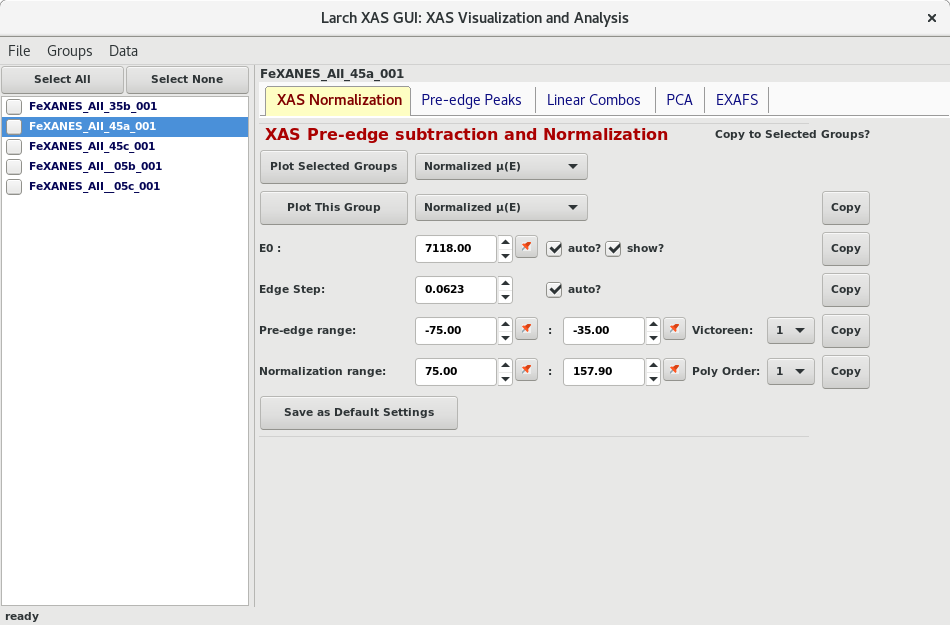
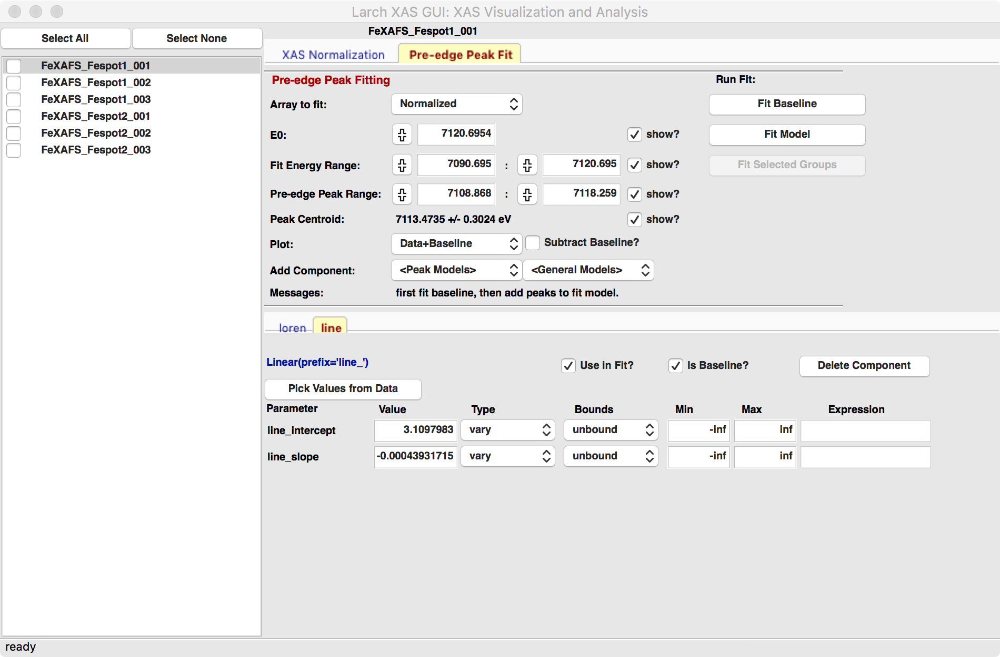
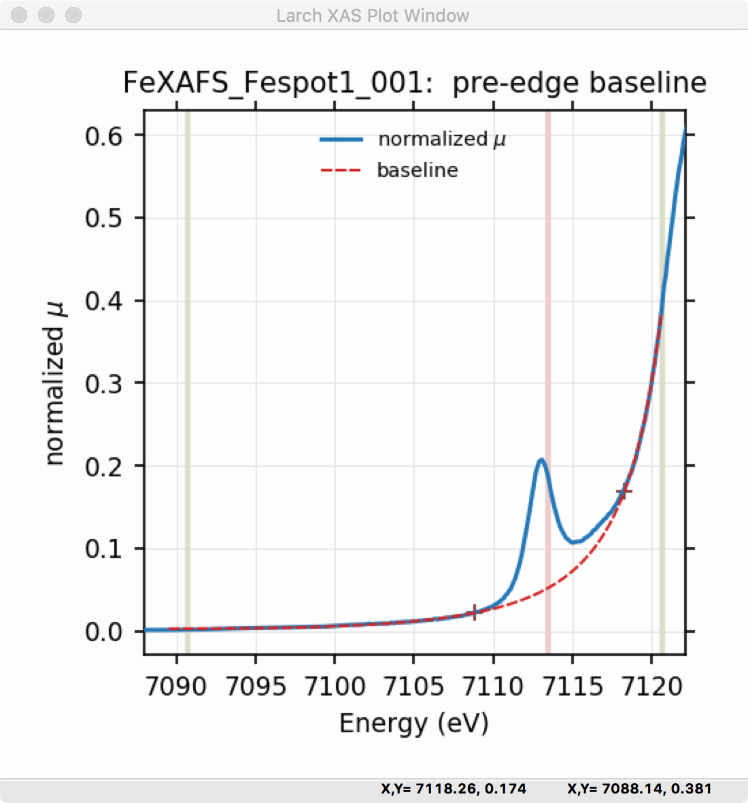
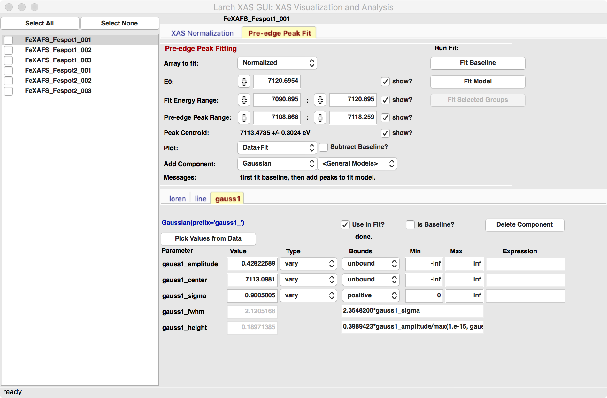
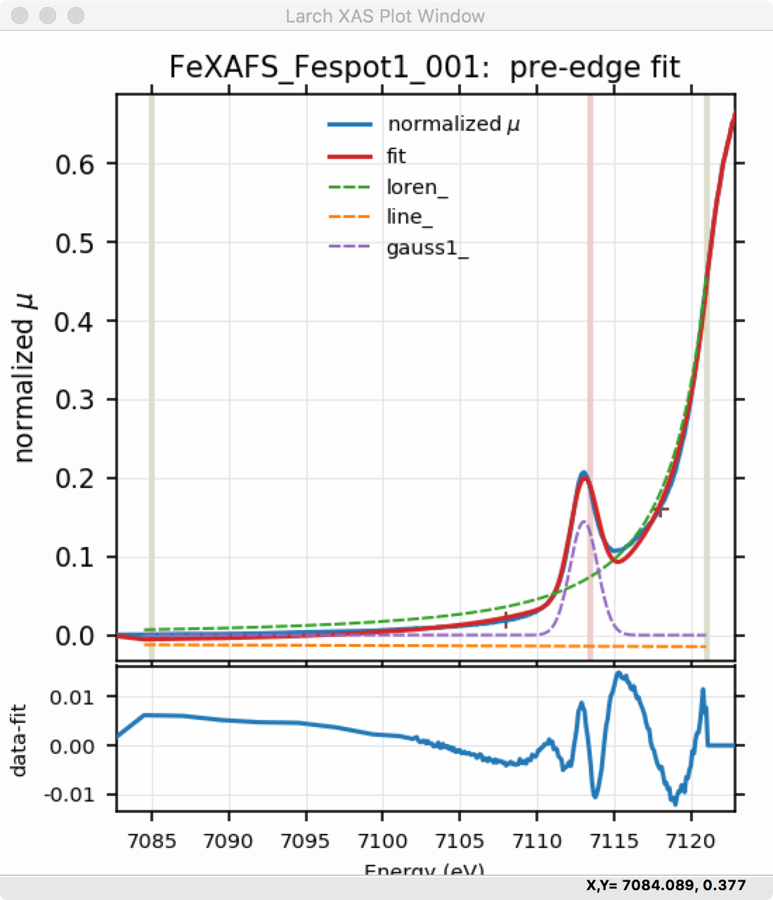

.. _guis-xas_viewer:

.. _lmfit:    http://lmfit.github.io/lmfit-py

.. |pin| image:: ../_images/pin_icon.png
    :width: 18pt
    :height: 18pt

XAS_Viewer
=======================

The XAS_Viewer GUI uses Larch to read and display XAFS spectra.  This
application is still in active development, with more features planned with
special emphasis on helping users with XANES analysis.  Current features
(as of June, 2018, Larch version 0.9.38) include:

   * read XAFS spectra from simple data column files or Athena Project Files.
   * XAFS pre-edge removal and normalization.
   * visualization of normalization steps.
   * data merging
   * data deglitching, and energy recalibration
   * data smoothing, rebinning, and deconvolution.
   * over-absorption corrections (for XANES)
   * linear combination analysis of spectra.
   * pre-edge peak fitting.
   * saving of data to Athena Project files.
   * saving of data to CSV files.

The XAS Viewer GUI includes a simple form for basic pre-edge subtraction,
and normalization of XAFS spectra. :numref:`fig_xasviewer_1` shows the
main window for the XAS Viewer program.  The left-hand portion contains a
list of files (or data groups) that have been read into the program either
from individual ASCII column files or Athena Project files.  Clicking on
the file or group name makes that "the current data group", while checking
the boxes next to each name will select multiple files or group.  Buttons
at the top of the list of files can be used to "Select All" or "Select
None".  In addition, right-clicking on the file list will pop up a menu
that allows more detailed selecting of data sets.

.. _fig_xasviewer_1:

    XAS_Viewer showing the File/Group list on the left-hand side and the
    the XAFS pre-edge subtraction and normalization panel on the right.

The right-hand portion of the XAS Viewer window shows multiple forms for
more specialized XAFS data processing tasks, each on a separate Notebook
tab.  These will be covered in more detail in sections below. The main
panel is for pre-edge subtraction and Normalization
(:ref:`xasviewer_preedge`), with other available tabs for fitting pre-edge
peaks (:ref:`xasviewer_peakfit`), Linear Combinaton Analysis
(:ref:`xasviewer_lincombo`), Principal Component Analysis
(:ref:`xasviewer_pca`), and EXAFS Analysis (:ref:`xasviewer_exafs_bkg` and
:ref:`xasviewer_exafs_fft`).

There are a few important general notes to mention about XAS Viewer before
going into more detail about how to use it.  First, XAS Viewer is still
very new and in active development.  If you find problems with it or
unexpected or missing functionality, please let us know.  Second, XAS
Viewer has many features and functionality in common with Athena and
Sixpack.  This is partly intentional, as we expect that XAS Viewer may be a
useful alternative to these that may be better supported and maintained,
especially on macOS. That also means that if you find things that you think
are missing or different from how Athena or Sixpack work, let us know.

As a GUI, XAS Viewer is intended to make data processing analysis easy and
intuitive. As a Larch application it is also intended to enable more
complex analysis, batch processing, and scripting of analysis.  To do this,
essentially all the real processing work in XAS Viewer is done through the
Larch Buffer (as shown in :ref:`guis-larch_gui`) which records the commands
that it executes.  If, at any point you want to know exactly what XAS
Viewer is "really doing", you can open the Larch Buffer and see.  You can
also copy the code from the Larch buffer to reproduce the analysis steps,
or modify into procedures for batch processing.

XAS Viewer will display many different datasets as 2-d line plots.  As with
all such plots made with Larch (see :ref:`plotting-chapter`), these are
highly interactive, customizable, and can produce publication-quality
images.  Larch plots can be zoomed in an out, and configured to change the
colors, linestyles, margins, text for labels, and more. From any plot
window you can use Ctrl-C to copy the image to the clipboard, Ctrl-S to
Save the image (as PNG) to a file, or Ctrl-P to print the image. Ctrl-K
will bring up a window to configure the colors, text, and so on.  These and
a few other common options are available from the File and Options menu.

In particular for XAS Viewer, clicking on the legend for any labeled curve
on a plot will toggle whether that curve is displayed.  This allows us to
draw plot components as you can turn them on or off interactively.  Also,
note that many of the entries for numbers on the form panels in XAS Viewer
have a button with a 'pin' icon |pin|.  Clicking anywhere on the plot
window will remember the energy value of the last point clicked, and show
the value in the middle section of the status bar, just below the plot
itself. Clicking on any of these 'pin' buttons will insert that "most
recent energy" value into the corresponding field.

.. _xasviewer_io:

Reading Data into XAS Viewer
~~~~~~~~~~~~~~~~~~~~~~~~~~~~~~~~~

Data groups can be read from plain ASCII data files using a GUI form to
help build :math:`\mu(E)`, or from Athena Project files, as shown in
:numref:`fig_xasviewer_2a` and :numref:`fig_xasviewer_2b`.  Multiple data
groups can be read in, compared, and merged.  These datasets can then be
exported to Athena Project files, or to CSV files.

.. subfigstart::

.. _fig_xasviewer_2a:

.. figure:: ../_images/DataImporter.png
    :target: ../_images/DataImporter.png
    :width: 60%
    :align: center

    ASCII data file importer.

.. _fig_xasviewer_2b:

.. figure:: ../_images/AthenaImporter.png
    :target: ../_images/AthenaImporter.png
    :width: 100%
    :align: center

    Athena Project importer.

.. subfigend::
    :width: 0.48
    :alt: data importers
    :label: fig_xasviewer_2

When reading in raw data, the data importer shown in
:numref:`fig_xasviewer_2a` will help you build XAFS :math:`\mu(E)` from the
various columns in your data file. This form wraps some of the routines
described in Chapter :ref:`data-io_chapter`.  Currently, this form is
somewhat limited in being able to process all data formats, but should be
useful for many data sets.  If you have trouble reading in your data with
XAS Viewer, contact us and we will try to help.

.. _xasviewer_preedge:

Pre-edge subtraction and Normalization
~~~~~~~~~~~~~~~~~~~~~~~~~~~~~~~~~~~~~~~~~~~

As above, :numref:`fig_xasviewer_1` shows the main window for the XAS
Viewer program with the right hand side showing the "XAS Normalization"
Panel.  This panel helps you do pre-edge subtraction and normalization of
XAFS data using the :func:`pre_edge` function.   This processing step is
important for getting normalized XAFS spectra that is used for further
analysis of both XANES and EXAFS.

From the form, you can plot the data for the current selected group in
several ways: Raw :math:`\mu(E)`, normalized :math:`\mu(E)`, the derivative
:math:`d\mu(E)/dE`, flattened :math:`\mu(E)`, or the raw :math:`\mu(E)`
with the pre-edge line and post-edge normalization curve.  You can also set
the parameters like :math:`E_0` and the edge step and ranges for the
pre-edge line and normalization curve.  Consult with :func:`pre_edge`
function for more details on these parameters.  You can also plot several
selected groups together, and copy processing parameters from one group to
another.

.. _xasviewer_peakfit:

Pre-edge peak fitting
~~~~~~~~~~~~~~~~~~~~~~~~~~~~~~~~~~~~~~

The "Pre-edge Peak Fit" tab (show in :numref:`fig_xasviewer_3a`) provides a
form for fitting pre-edge peaks to line shapes such as Gaussian, Lorentzian,
or Voigt functions.  This provides an easy-to-use wrapper around `lmfit`_
and the :func:`minimize` function for curve-fitting with the ability to
constrain fitting Parameters.

To do fitting of pre-edge peaks with the interface, one begins by fitting a
"baseline" to account for the main absorption edge.  This baseline is
modeled as a Lorentzian curve plus a line.  Fitting a baseline requires
identifying energy ranges for both the main spectrum to be fitted and the
pre-edge peaks -- the part of the spectrum where the baseline should *not*
be fitted.  This is illustrated in :numref:`fig_xasviewer_3a` and
:numref:`fig_xasviewer_3b`.  Note that there are separate ranges for the
"fit range" and the "pre-edge peak" range (illustrated with grey lines and
blue '+' signs on the plot).  The "pre-edge peak" range should be inside
the fit range.

Clicking "Fit baseline" will fit a baseline function and display the
results.  The initial fit may have poorly guessed ranges for the pre-edge
peaks and fit range and may require some adjustment.

.. subfigstart::

.. _fig_xasviewer_3a:

    Pre-edge peak Window of XAS_Viewer, showing how select regions of
    pre-edge peaks for fitting a baseline.

.. _fig_xasviewer_3b:

    Plot of pre-edge peaks with baseline.  Note that the grey vertical
    lines show the fit range, the blue crosses show the pre-edge peak
    range, and the pink line shows the centroid of the pre-edge peaks after
    removal of the baseline.

.. subfigend::
    :width: 0.48
    :alt: pre-edge peak baseline
    :label: fig_xasviewer_3

Once the pre-edge baseline is satisfactory, you can add functions to model
the pre-edge peaks themselves.  Select one of the "Peak Models" (typically
Gaussian, Lorentzian, or Voigt), which will show a new tab in the "model
components area" in the lower part of the form.  Note that the baseline
will consist of a Lorentzian and linear model component, so that there will
be at least 3 tabs for the 3 or more components of the pre-edge peak model.
This is shown in :numref:`fig_xasviewer_4a`, which shows the form for 1
Gaussian peak, and the baseline.  You can include multiple peaks by
repeatedly selecting the peak type from the drop-down menu.

After selecting a peak type, click on the "Pick Values from Data" button,
and then pick two points on the plot to help give initial ranges for that
peak.  The points you pick do not have to be very accurate, and the initial
values selected for the `amplitude`, `center`, and `sigma` parameters can
be modified.  Note that you can place bounds on any of these parameters --
it is probably a good idea to enforce the `amplitude` and `sigma` to be
positive.  If using multiple peaks, it is often helpful to give realistic
energy bounds for the `center` of each peak, so that they do not overlap.

.. subfigstart::

.. _fig_xasviewer_4a:

    Pre-edge peak Window of XAS_Viewer, showing how select regions of
    pre-edge peaks for fitting a baseline.

.. _fig_xasviewer_4b:

.. figure:: ../_images/XAS_Viewer_plot_1gaussian.png
    :target: ../_images/XAS_Viewer_plot_1gaussian.png
    :width: 60%
    :align: center

    Pre-edge peak Window of XAS_Viewer, showing how select regions of
    pre-edge peaks for fitting a baseline.

.. subfigend::
    :width: 0.49
    :alt: pre-edge peak fit
    :label: fig_xasviewer_4

Upon doing a fit, the plot is updated to show the data, best-fit, and each
of the components used in the fit (:numref:`fig_xasviewer_4b`). Fit
statistics and best-fit parameter values, their uncertainties, and
correlations are shown as a report in a separate window, with an example
shown in :numref:`fig_xasviewer_5a`.  Note that for peaks such as Gaussian,
Lorentzian, and Voigt, not only are `amplitude` (that is, area under the
peak), `sigma`, and `center` shown but so are `fwhm` (full width of peak at
half the maximum height) and `height` (the maximum height of the peak).

.. _fig_xasviewer_5:

.. subfigstart::

.. _fig_xasviewer_5a:

.. figure:: ../_images/XAS_Viewer_prepeak_fitresult.png
    :target: ../_images/XAS_Viewer_prepeak_fitresult.png
    :width: 75%
    :align: left

    Fit result frame for Pre-edge peak fit.

.. _fig_xasviewer_5b:

    Pre-edge Peak fit with residual.

.. subfigend::
    :width: 0.49
    :alt: pre-edge peak results
    :label: fig_xasviewer_5

Though the plot of the fit in :numref:`fig_xasviewer_4b` looks good,
plotting the fit along with the residual (by selecting "Data+Residual" in
the drop-down menu of "Plot:" choices) as shown in
:numref:`fig_xasviewer_5b` reveals a systematic mis-fit.  That is, the
`data-fit` for this model clearly shows some spectral structure beyond just
the noise in the data.  Adding a second Gaussian (and maybe even a third)
will greatly help this fit.  To do that, add another Gaussian peak
component to the fit model using the drop-down menu of "Add component:",
select initial values for that Gaussian, and re-fit the model.  We'll leave
that as an exercise for the reader.

Fit results can be saved in two different ways, using the "PreEdge Peaks"
menu.  First, the model to set up the fit can be saved to a `.modl` file
and then re-read later and used for other fits. This model file can also be
read in and used with the `lmfit`_ python module for complete scripting
control.  Secondly, a fit can be *exported* to an ASCII file that will
include the text of the fit report and columns including data, best-fit,
and each of the components of the model.

.. _xasviewer_lincombo:

Linear Combination Analysis
~~~~~~~~~~~~~~~~~~~~~~~~~~~~~~~~~~~~~~

Linear Combination Analysis is useful for modeling a XANES spectrum as a
combination of other spectra.

.. _xasviewer_pca:

Principal Component and Non-negative Factor Analysis
~~~~~~~~~~~~~~~~~~~~~~~~~~~~~~~~~~~~~~~~~~~~~~~~~~~~~~~

Principal Component Analysis (PCA) is one of a family of numerical
techniques to reduce the number of variable components in a set of data.
There are many related techniques and procedures, and quite a bit of
nomeclature and jargon around the methods.

In essence, all these methods are aimed at taking a large set of similar
data and trying to determine how many independent components make up that
larger dataset.    That is, the only question PCA and related methods can
ever really answer is::

    how many indepedent spectra make up my collection of spectra?

It is important to note that PCA cannot tell you what those independent
spectra represent or even what they look like.  However, you can also use
the results of PCA to ask::

    is this *other* spectrum made up of the same components as make up my collection?

.. _xasviewer_exafs_bkg:

EXAFS Processing: Background Subtraction
~~~~~~~~~~~~~~~~~~~~~~~~~~~~~~~~~~~~~~~~~~~~~~~~~~~~~~~~~~~~~~~~~~~~~

.. _xasviewer_exafs_fft:

EXAFS Processing:  Fourier Transforms
~~~~~~~~~~~~~~~~~~~~~~~~~~~~~~~~~~~~~~~~~~~~~~~~~~~~~~~~~~~~~~~~~~~~~
