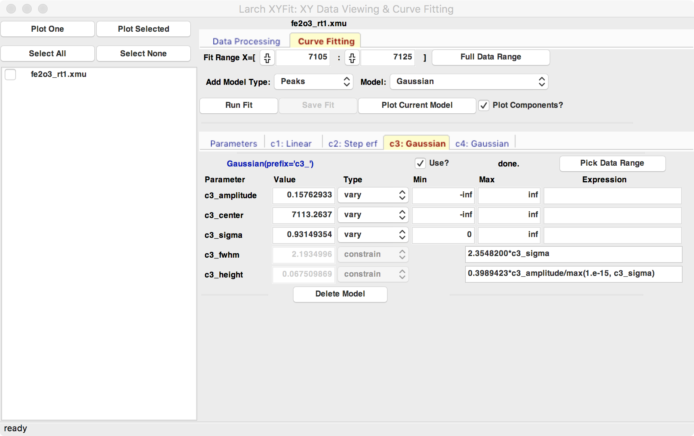
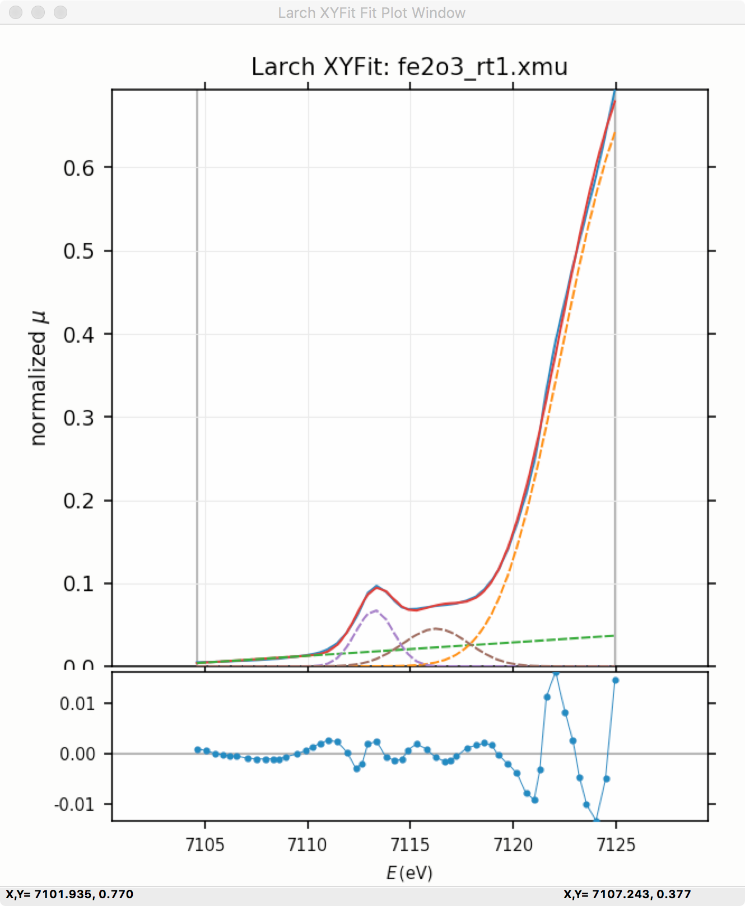

.. _guis-xyfit:

XYFit
=======================

The XYFit GUI uses Larch to read and display XAFS spectra and other
simple 1-D datasets held in column data files.  XYFIT also provides a
GUI for curve-fitting of 1-D data sets.

.. _lmfit:    http://lmfit.github.io/lmfit-py

This GUI also includes an easy-to-use wrapper around `lmfit`_ for flexible
curve-fitting with the ability to constrain fitting Parameters.
