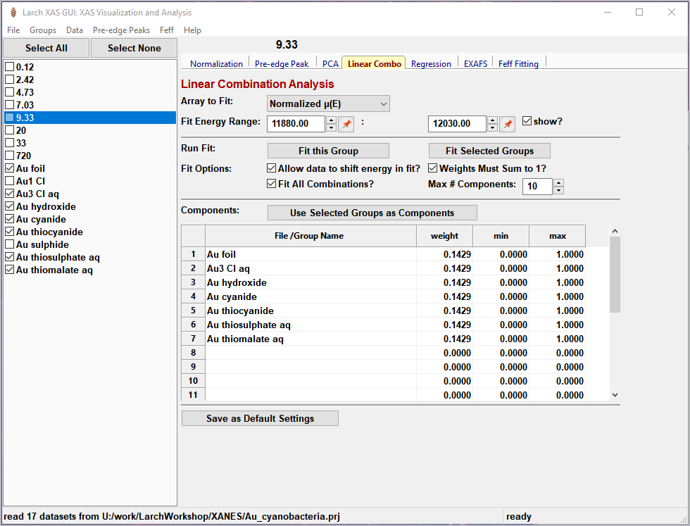
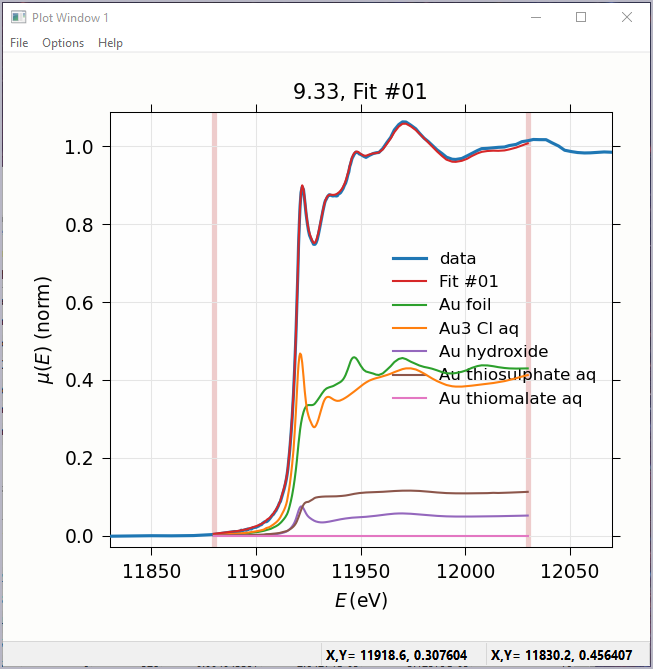
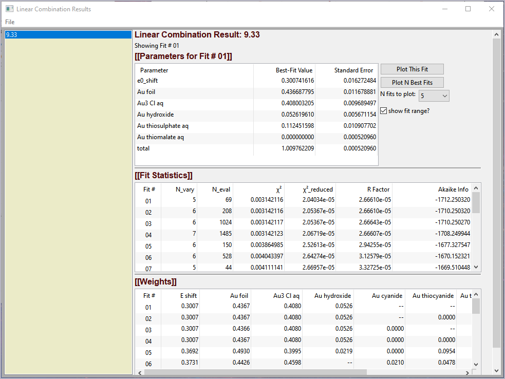
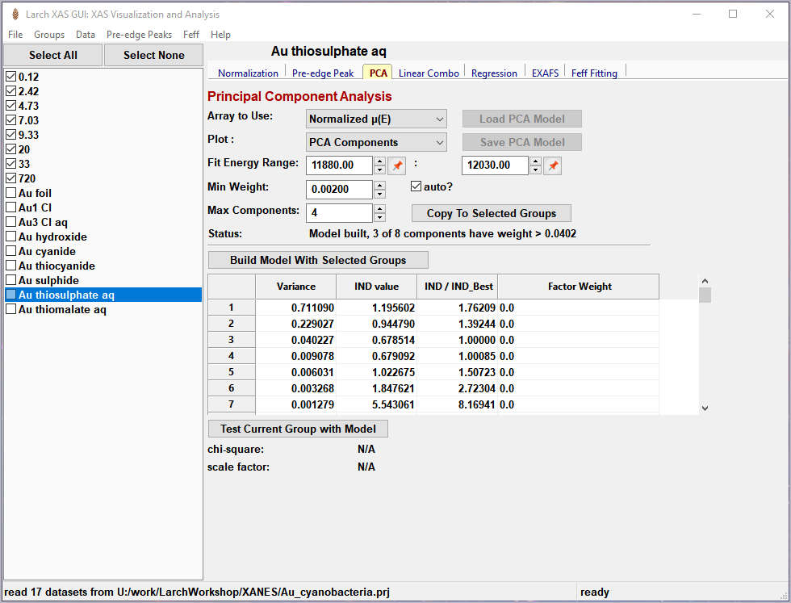
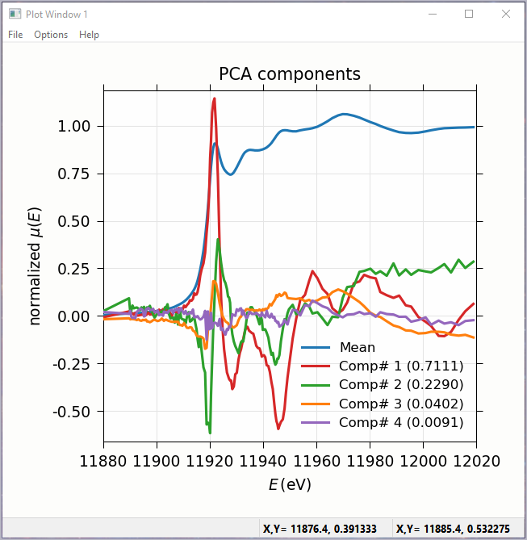
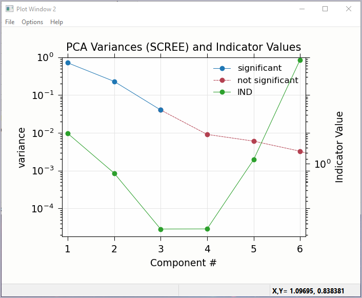
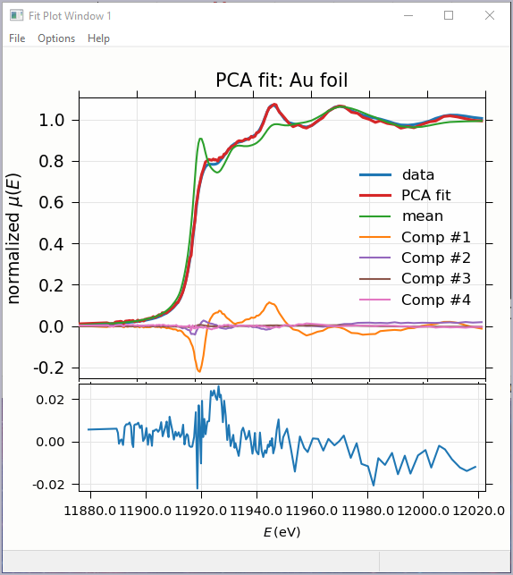

.. include:: ../_config.rst

.. _lmfit:    https://lmfit.github.io/lmfit-py/

.. |pin| image:: ../_images/pin_icon.png
    :width: 18pt
    :height: 18pt

.. _larix_lincombo:

Linear Combination Analysis
~~~~~~~~~~~~~~~~~~~~~~~~~~~~~~~~~~~~~~

Linear Combination Analysis is useful for modeling a XANES spectrum as a
combination of other spectra.  In this approach, one asserts that an
unknown spectrum should be a linear combination of spectra of
well-characterized samples or "standards".  With the results from a
spectral fit, one can then conclude what fraction of atomic environments
correspond to those of each standard.  For this to work well, the XANES
data needs to be normalized consistently.

To use this in Larix, one selects a set of spectra for the "standards"
and "builds a model" from the selected groups for the standards, and then
fits one or more spectra from unknown samples to get the fractional weight
for each sample.  Options include:

   * allowing a single energy shift between unknown spectrum and the set
     of standards.
   * trying all combination of standards.
   * forcing all weights to add to 1.0

.. _fig_larix_9a:

    Linear Combination Fitting, main panel

.. _fig_larix_9b:

    Linear Combination Fitting, plot of result

.. _fig_larix_9c:

    Linear Combination Fitting, results panel

.. _larix_pca:

Principal Component and Non-negative Factor Analysis
~~~~~~~~~~~~~~~~~~~~~~~~~~~~~~~~~~~~~~~~~~~~~~~~~~~~~~~

Principal Component Analysis (PCA) is one of a family of numerical
techniques to reduce the number of variable components in a set of data.
There are many related techniques and procedures, and quite a bit of
nomenclature and jargon around the methods.

In essence, all these methods are aimed at taking a large set of similar
data and trying to determine how many independent components make up that
larger dataset.    That is, the only question PCA and related methods can
ever really answer is::

    how many independent spectra make up my collection of spectra?

It is important to note that PCA cannot tell you what those independent
spectra represent or even what they look like.  However, you can also use
the results of PCA to ask::

    is this *other* spectrum made up of the same components as make up my collection?

.. _fig_larix_10a:

    Principal Component Analysis, main panel

.. _fig_larix_10b:

    Principal Component Analysis, Plot of spectral components.

.. _fig_larix_10c:

    Principal Component Analysis, Plot of IND statistic and scree-like plot
    of the importance of each component.

.. _fig_larix_10d:

    Principal Component Analysis, Plot of target transformation -- using
    components to best match an unknown spectra.

.. _larix_regression:

Linear Regression with LASSO and PLS to predict external variable
~~~~~~~~~~~~~~~~~~~~~~~~~~~~~~~~~~~~~~~~~~~~~~~~~~~~~~~~~~~~~~~~~~~~~~

Linear
