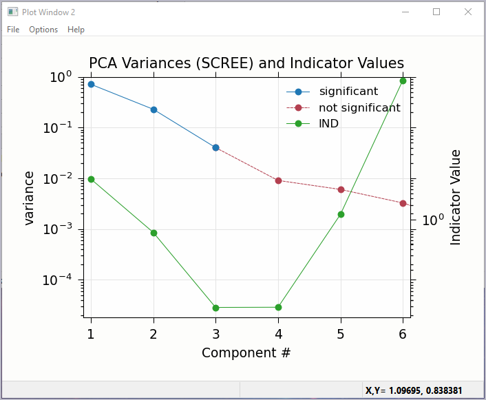

..include:: ../_config.rst

.. _lmfit:    https://lmfit.github.io/lmfit-py/

.. |pin| image:: ../_images/pin_icon.png
    :width: 18pt
    :height: 18pt

.. _larix_peakfit:

Pre-edge peak fitting
~~~~~~~~~~~~~~~~~~~~~~~~~~~~~~~~~~~~~~

The "Pre-edge Peak Fit" tab (show in :numref:`fig_larix_3a`) provides a
form for fitting pre-edge peaks to line shapes such as Gaussian, Lorentzian,
or Voigt functions.  This provides an easy-to-use wrapper around `lmfit`_
and the :func:`minimize` function for curve-fitting with the ability to
constrain fitting Parameters.

Fitting of pre-edge peaks with this panel is a two step process.

First, one fits a "baseline" curve to account for the main absorption edge.
This baseline is modeled as a Lorentzian curve plus a line which should be
a reasonable enough approximation of the main absorption edge (say,
:math:`4p`) so that its tail represents the background of the main edge
underneath the pre-edge peaks.

Fitting the baseline requires identifying energy ranges for both the main
spectrum to be fitted and the pre-edge peaks -- the part of the spectrum
which should be ignored when fitting the baseline.  This is illustrated in
:numref:`fig_larix_3a` and :numref:`fig_larix_3b`.  Note that there
are separate ranges for the "fit range" and the "pre-edge peak" range
(illustrated with grey lines and blue circles on the plot).  The "pre-edge
peak" range should be inside the fit range so that the baseline can fit
part of the pre-edge region, at energies below the pre-edge peaks, and part
of the main absorption edge region above the pre-edge peaks.

Clicking "Fit baseline" will fit a baseline function and display the plot
as shown below.  The initial fit may have poorly guessed ranges for the
pre-edge peaks and fit range and may require some adjustment.  As mentioned
above, clicking on the plot will select an energy that can then be
transferred to any of the bounds energy using the corresponding pin icon
|pin| on the form.

.. subfigstart::

.. _fig_larix_3a:

.. figure:: ../_images/Larix_prepeaks_baseline_form.png
    :target: ../_images/Larix_prepeaks_baseline_form.png
    :width: 70%
    :align: center

    Pre-edge peak Panel of Larix, showing how select regions of
    pre-edge peaks for fitting a baseline.

.. _fig_larix_3b:

.. figure:: ../_images/Larix_prepeaks_baseline_plot.png
    :target: ../_images/Larix_prepeaks_baseline_plot.png
    :width: 60%
    :align: center

    Plot of pre-edge peaks with baseline.  The grey vertical lines show the
    fit range and blue circles show the boundaries of the pre-edge peak
    range ignored in the baseline fit. The pink line shows the centroid of
    the pre-edge peaks after removal of the baseline.

.. subfigend::
    :width: 0.45
    :label: fig-larix3

We will allow the baseline to be refined when fitting the peaks, so it does
not need to be modeled perfectly, but it is helpful to get a decent fit to
the baseline.  Once this baseline is satisfactorily modeled, you can add
functions to model the pre-edge peaks themselves.  Selecting one of the
"Peak Models" (typically Gaussian, Lorentzian, or Voigt) will show a new
tab in the "model components area" in the lower part of the form.  Since
the baseline consists of a Lorentzian curve and a line, there will now be 3
tabs for the 3 components of the pre-edge peak model.  The background peak
and the background line will have tabs labeled `bp_` and `bl_`,
respectively, and the added Gaussian curve will be labeled `gauss1_`, as
shown in :numref:`fig_larix_4a`, which shows the form with 1 Gaussian
peak, and the two-component baseline.  You can add more peaks by repeatedly
selecting the peak type from the drop-down menu labeled *Add Component*.

Each of the tab for each functional component of the model will include a
table of the Parameters for that peak.  For example, a line will have an
*intercept* and a *slope* parameter, and most peak functions will have an
*amplitude*, *center*, and *sigma* parameters (and perhaps more).  Each of
these parameters will have a name and a value, and also have a Type
drop-down list to allow it to *vary* or stay *fixed* in the fit.  You can
also set it to be *constrained* by a simple mathematical expression of
other parameter values.  If varied, you can also set bounds on the
parameter values by using the Bounds drop-down list (to select *positive*,
*negative*, or *custom*) and/or set Min and Max values.

After selecting a functional form for the peak, clicking on the "Pick
Values from Data" button, and then clicking two points on the plot near the
peak of interest will fill in the form with initial values for the
parameters for that peak.  This is shown in :numref:`fig_larix_4a`
which has values filled in from the "two click method", and in
:numref:`fig_larix_4b` which shows the initial Gaussian peak.  The
points you pick do not have to be very accurate, and the initial values
selected for the `amplitude`, `center`, and `sigma` parameters can be
modified.  You can also set bounds on any of these parameters -- it is
probably a good idea to enforce the `amplitude` and `sigma` to be positive,
for example.  If using multiple peaks, it is often helpful to give
realistic energy bounds for the `center` of each peak, so that the peaks
don't try to exchange.

.. subfigstart::

.. _fig_larix_4a:

.. figure:: ../_images/Larix_prepeaks_1gaussian_form.png
    :target: ../_images/Larix_prepeaks_1gaussian_form.png
    :width: 100%
    :align: center

    Pre-edge peak Window of Larix, showing 3 components of a Gaussian
    and a baseline that includes a line and Lorentzian.

.. _fig_larix_4b:

.. figure:: ../_images/Larix_prepeaks_1gaussian_plot.png
    :target: ../_images/Larix_prepeaks_1gaussian_plot.png
    :width: 60%
    :align: center

    Plot of initial Gaussian guessed from the "two click method" for
    modeling pre-edge peaks.

.. subfigend::
    :width: 0.45
    :label: fig-larix4

Once the model function is defined and initial parameters values set,
clicking the Fit Model button will perform the fit. This will bring up
a Fit Result form shown in :numref:`fig_larix_5a` and an
initial plot of the data and fit as shown in :numref:`fig_larix_5b`.

The Fit Result panel contains goodness-of-fit statistics and parameter
values and uncertainties (or standard error).  At the top portion of the
form, you can save a model to be read in and used later or export the data
and fit components to a simple column-based data file.  You can also view
the fit goodness-of-fit statistics for the fit.  There are also some
options and a button for the plot of data and fit.

In the lower portion of the form, you can read the values and uncertainties
for the fitting parameters and for a number of *derived* parameters,
including `fit_centroid` that is the (area-weighted) centroid of the
functions that comprise the pre-edge peaks (not including the baseline) and
the full-width-at-half-maximum and height of each of the peaks (note that
`amplitude` represents the area of the unit-normalized peak and `height`
represents the maximum height for a peak).  You can click on the button
labeled "Update Model with these Values" to put these best-fit values back
into the starting values on the main form.  In addition, clicking on any
variable parameter to show it correlations with other variables.  Note that
the baseline parameters *are* refined (by default) in the fit to the
pre-edge peaks.

.. subfigstart::

.. _fig_larix_5a:

.. figure:: ../_images/Larix_prepeaks_fitresult1_form.png
    :target: ../_images/Larix_prepeaks_fitresult1_form.png
    :width: 75%
    :align: left

    Fit result frame for Pre-edge peak fit for a fit with 1 Gaussian.

.. _fig_larix_5b:

.. figure:: ../_images/Larix_prepeaks_fitresult1_plot.png
    :target: ../_images/Larix_prepeaks_fitresult1_plot.png
    :width: 60%
    :align: center

    Pre-edge Peak data and best-fit with 1 Gaussian and baseline.

.. subfigend::
    :width: 0.45
    :label: fig-larix5

Though the plot of the fit in :numref:`fig_larix_5b` does not look too
bad, we can see the fit is not perfect. Checking the "Plot with residual?"
box we get the plot in :numref:`fig_larix_6` that shows the data and fit
and also the residual.  From this, we can see systematic oscillations in
the fit residual that is well above the noise level and suggests that
another peak may be needed to explain this data.  This is not too
surprising here -- there are obviously two peaks in the pre-edge -- but it
is does illustrate a useful way to determine when it is useful to add more
peaks.

.. _fig_larix_6:

.. figure:: ../_images/Larix_prepeaks_fitresult1_residual_plot.png
    :target: ../_images/Larix_prepeaks_fitresult1_residual_plot.png
    :width: 55%
    :align: center

    Pre-edge Peak plot of data, fit and residual.

Adding a second Gaussian (and maybe even a third) will greatly help this
fit.  If we add another Gaussian peak component to the fit model using the
drop-down menu of "Add component:", select initial values for that second
Gaussian before, and re-run the fit, we'll see the Fit Results form and
plot as shown in :numref:`fig_larix_7a` and :numref:`fig_larix_7b`.

.. subfigstart::

.. _fig_larix_7a:

.. figure:: ../_images/Larix_prepeaks_fitresult2_form.png
    :target: ../_images/Larix_prepeaks_fitresult2_form.png
    :width: 95%
    :align: left

    Fit result frame for Pre-edge peak fit for a fit with 2 Gaussians.

.. _fig_larix_7b:

.. figure:: ../_images/Larix_prepeaks_fitresult2_plot.png
    :target: ../_images/Larix_prepeaks_fitresult2_plot.png
    :width: 95%
    :align: center

    Pre-edge Peak data and best-fit with 2 Gaussians and baseline.

.. subfigend::
   :width: 0.48
   :alt: pre-edge peak results2
   :label: fig_larix_7

As mentioned above, fit results can be saved in two different ways, using
the "PreEdge Peaks" menu.  First, the model to set up the fit can be saved
to a `.modl` file and then re-read later and used for other fits. This
model file can also be read in and used with the `lmfit`_ python module for
complete scripting control.  Secondly, a fit can be *exported* to an ASCII
file that will include the text of the fit report and columns including
data, best-fit, and each of the components of the model.

To continue with the analysis of the data in this example,
:numref:`fig_larix_7b` shows that the fit residual still has
significant structure, indicating that either another peak should be
included or that the Gaussian peak shape is not a good model for these
peaks.  In fact, using 2 Voigt functions significantly improves the fit, as
shown in :numref:`fig_larix_8a`, with reduced :math:`\chi^2` dropping
from 4.4e-6 to 3.2e-6 and similar improvements in the AIC and BIC
statistics.  To do this, the two Gaussian peaks were deleted and two Voigt
peaks added, with initial values selected with the "two click method".

The fit of the pre-edge peaks is visibly improved but a systematic
variation in the residual is still seen at the high energy side of the
pre-edge peaks.  Adding a third Voigt function at around 7117 eV improves
the fit even more as shown in :numref:`fig_larix_8b`.  As shown, the
scale of the residual is now 0.001, ten times better than the scale of the
fit with 1 peak shown in :numref:`fig_larix_6`, and shows much less
systematic structure.  In addition, all the fit statistics are improved
despite now using 14 variables: reduced :math:`\chi^2` becomes from 5.1e-7,
AIC is -1957 and BIC is -1917.

.. subfigstart::

.. _fig_larix_8a:

.. figure:: ../_images/Larix_prepeaks_fitresult3_plot.png
    :target: ../_images/Larix_prepeaks_fitresult3_plot.png
    :width: 95%
    :align: left

    Fit result frame for Pre-edge peak fit
    for a fit with 2 Voigt functions
    plus the baseline.

.. _fig_larix_8b:

.. figure:: ../_images/Larix_prepeaks_fitresult4_plot.png
    :target: ../_images/Larix_prepeaks_fitresult4_plot.png
    :width: 95%
    :align: center

    Pre-edge Peak data and best-fit for a fit with 3 Voigt functions plus
    the baseline.

.. subfigend::
   :width: 0.48
   :alt: pre-edge peak results3
   :label: fig_larix_8

.. _larix_lincombo:

Linear Combination Analysis
~~~~~~~~~~~~~~~~~~~~~~~~~~~~~~~~~~~~~~

Linear Combination Analysis is useful for modeling a XANES spectrum as a
combination of other spectra.  In this approach, one asserts that an
unknown spectrum should be a linear combination of spectra of
well-characterized samples or "standards".  With the results from a
spectral fit, one can then conclude what fraction of atomic environments
correspond to those of each standard.  For this to work well, the XANES
data needs to be normalized consistently.

To use this in Larix, one selects a set of spectra for the "standards"
and "builds a model" from the selected groups for the standards, and then
fits one or more spectra from unknown samples to get the fractional weight
for each sample.  Options include:

   * allowing a single energy shift between unknown spectrum and the set
     of standards.
   * trying all combination of standards.
   * forcing all weights to add to 1.0

.. _fig_larix_9a:

.. figure:: ../_images/Larix_LCF_main.png
    :target: ../_images/Larix_LCF_main.png
    :width: 75%
    :align: center

    Linear Combination Fitting, main panel

.. _fig_larix_9b:

.. figure:: ../_images/Larix_LCF_plot.png
    :target: ../_images/Larix_LCF_plot.png
    :width: 75%
    :align: center

    Linear Combination Fitting, plot of result

.. _fig_larix_9c:

.. figure:: ../_images/Larix_LCF_results.png
    :target: ../_images/Larix_LCF_results.png
    :width: 75%
    :align: center

    Linear Combination Fitting, results panel

.. _larix_pca:

Principal Component and Non-negative Factor Analysis
~~~~~~~~~~~~~~~~~~~~~~~~~~~~~~~~~~~~~~~~~~~~~~~~~~~~~~~

Principal Component Analysis (PCA) is one of a family of numerical
techniques to reduce the number of variable components in a set of data.
There are many related techniques and procedures, and quite a bit of
nomenclature and jargon around the methods.

In essence, all these methods are aimed at taking a large set of similar
data and trying to determine how many independent components make up that
larger dataset.    That is, the only question PCA and related methods can
ever really answer is::

    how many independent spectra make up my collection of spectra?

It is important to note that PCA cannot tell you what those independent
spectra represent or even what they look like.  However, you can also use
the results of PCA to ask::

    is this *other* spectrum made up of the same components as make up my collection?

.. _fig_larix_10a:

.. figure:: ../_images/Larix_PCAmain_page.png
    :target: ../_images/Larix_PCAmain_page.png
    :width: 75%
    :align: center

    Principal Component Analysis, main panel

.. _fig_larix_10b:

.. figure:: ../_images/Larix_PCA_compplot.png
    :target: ../_images/Larix_PCA_compplot.png
    :width: 75%
    :align: center

    Principal Component Analysis, Plot of spectral components.

.. _fig_larix_10c:

    Principal Component Analysis, Plot of IND statistic and scree-like plot
    of the importance of each component.

.. _fig_larix_10d:

.. figure:: ../_images/Larix_PCA_targetplot.png
    :target: ../_images/Larix_PCA_targetplot.png
    :width: 75%
    :align: center

    Principal Component Analysis, Plot of target transformation -- using
    components to best match an unknown spectra.

.. _larix_regression:

Linear Regression with LASSO and PLS to predict external variable
~~~~~~~~~~~~~~~~~~~~~~~~~~~~~~~~~~~~~~~~~~~~~~~~~~~~~~~~~~~~~~~~~~~~~

.. _larix_exafs_bkg:

EXAFS Processing: Background Subtraction
~~~~~~~~~~~~~~~~~~~~~~~~~~~~~~~~~~~~~~~~~~~~~~~~~~~~~~~~~~~~~~~~~~~~~

.. _larix_exafs_fft:

EXAFS Processing:  Fourier Transforms
~~~~~~~~~~~~~~~~~~~~~~~~~~~~~~~~~~~~~~~~~~~~~~~~~~~~~~~~~~~~~~~~~~~~~

.. _larix_feffit:

Fitting EXAFS data to Feff Paths
~~~~~~~~~~~~~~~~~~~~~~~~~~~~~~~~~~~~~~~~~~~
