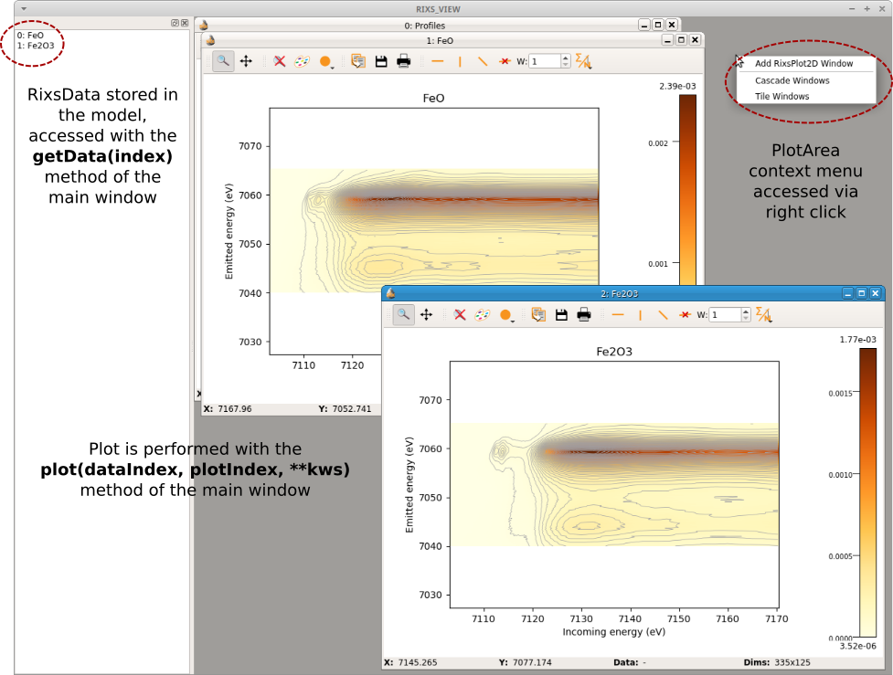
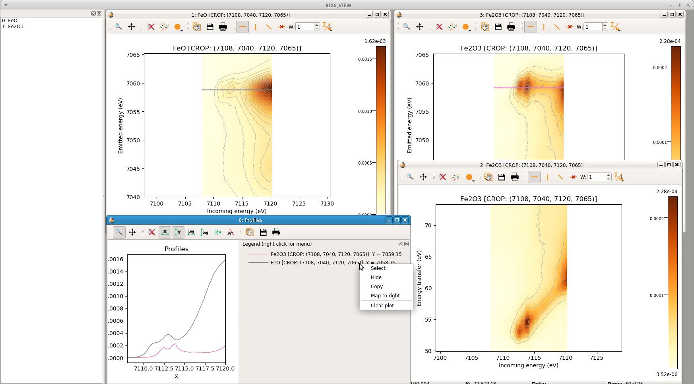

.. _SILX: https://www.silx.org
.. _IPython: https://ipython.org/

.. _qtrixs-chapter:

QtRIXS
======

The QtRIXS GUI is still under active development, this means that its design
will evolve/change in the future and bugs are probably present in the code.
*Any help is welcome!*

The GUI follows the Qt model/view paradigm and it is heavily based on `SILX`_
library. At the current status (July 2019), the GUI is not fully functional,
thus it comes with a command line interface (CLI), that is, the graphical part
must be instantiated from a Python shell. For a better experience, working
within `IPython`_ is recommended.

The CLI interface is based on a simple list model, that is, the

Reading RIXS data
-----------------

RIXS data are stored in the :class:`larch.qtrixs.rixsdata.RixsData`. This
is a relatively simple Python object with few attributes mapping the data,
and methods to grid the original (X, Y, Z) arrays to RIXS maps. Usually the
data are converted from ASCII collected at the beamline and stored in a
HDF5 file, following a simple format
(c.f. :func:`larch.io.rixs_aps_gsecars.get_rixs_13ide`). After that,
reading in the `RixsData` object is as simple as::

    from larch.io.rixsdata import RixsData
    my_rixs1 = RixsData()
    my_rixs1.load_from_h5('filename_rixs.h5')

Plotting RIXS data
-------------------

Once the data are read in the `RixsData` object, can be added to the model
where are stored in a list and easily retrieved or plotted using their
index. Here an example to load a couple of planes and show them::

    from larch.qtrixs.plotrixs import RixsMainWindow
    main_win = RixsMainWindow()
    main_win.show()
    data1 = RixsData()
    data1.load_from_h5('FeRIXS_FeO_rixs.h5')  # change with your data
    data2 = RixsData()
    data2.load_from_h5('FeRIXS_Fe2O3_rixs.h5')  # change with your data
    #: load the data in the model -> will show in the view widget on the left
    main_win.addData(data1)
    main_win.addData(data2)
    #: plot the rixs planes in two separate windows
    main_win.plot(0, 1, rixs_et=False, crop=False)  #: data[0] in plot[1]
    main_win.plot(1, 2, rixs_et=False, crop=False)  #: data[1] in plot[2] (new plot window is created)

The output of this script is shown in :numref:`fig_qtrixs_main`

.. _fig_qtrixs_main:

    QtRIXS main window showing two RIXS data objects loaded in the model and
    plotted in the plot area.

Dock (= dragable) information widgets for selecting regions of interest on
the plot and getting the coordinates can be added to the main window simply
by::

    main_win.addRixsDOIDockWidget(1)  #: the argument is the index of the plot
    main_win.addRixsDOIDockWidget(2)  #: another info box for plot 2

The result is shown in :numref:`fig_qtrixs_cursors`.

.. _fig_qtrixs_cursors:

.. figure:: _images/qtrixs_cursors.png
    :target: _images/qtrixs_cursors.png
    :width: 55%
    :align: center

    Main window with added two widgets for getting information on the
    regions of interest.

The data can also be cropped or plotted in energy transfer::

    crop_area = (7108, 7040, 7120, 7065)
    main_win.plot(0, 1, crop=crop_area, nlevels=10)  #: it is possible to change the number of contours lines for a better visualization
    main_win.plot(1, 2, crop=crop_area, nlevels=10)
    main_win.plot(1, 3, crop=crop_area, rixs_et=True, nlevels=10)

To take line cuts with a given width (in pixels), it is possible to use the
toolbar on each RIXS plot. This will push the corresponding cut to a common
plot window called `Profiles`. From that window is possible to save the
profiles to ASCII files and then process them independently. The profiles
toolbar works correctly for horizontal and vertical cuts only. For taking a
diagonal cut in energy transfer (i.e., HERFD-XAS) the best is to simply take an
horizontal cut in emitted energy. If the profiles window gets busy of many
curves, the plot can be simply be cleaned by popping the context menu with
right click on the legends. This is shown in :numref:`fig_qtrixs_profiles`.

.. _fig_qtrixs_profiles:

    Cropped plots, plot in energy transfer and line cuts to visualize the
    profiles of the spectra. A context menu is available to clean, highlight or
    move one line to right axis of the plot.
