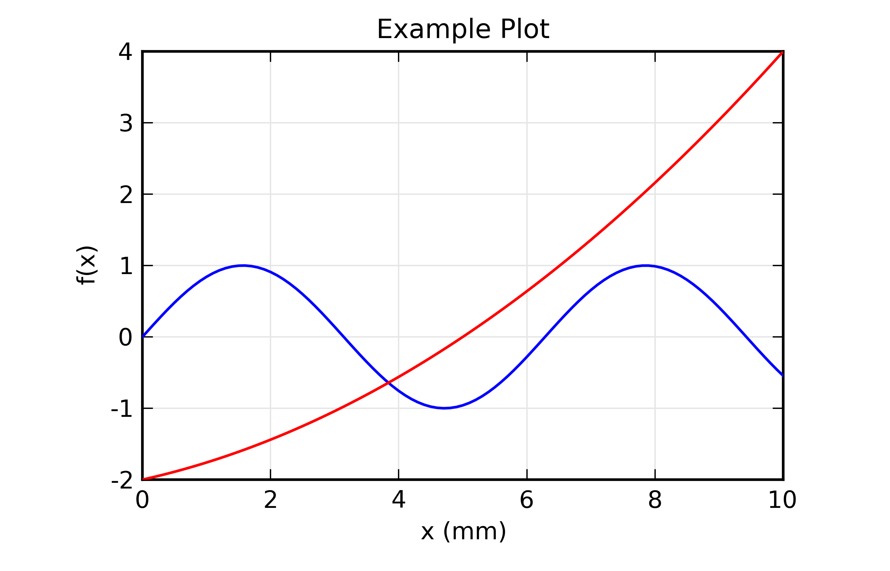

=======================================================
Tutorial: Plotting and Displaying Data
=======================================================

Plotting and Visualizing data are vital to any scientific analysis package,
and Larch provides several methods for data visualization.  These are
largely built on two types of data display.  The first is the line plot
(sometimes calld an xy plot), which shows traces of a set of functions
y(x).  The second type of data display supported is the 2-dimensional image
display, in which a grey scale or false color map shows an image
representing a 2-dimensional array of intensity.

Though not as fancy as many dedicated plotting and graphics packages, Larch
attempts to provide satisfying and graphical displays of data, and the
basic plots made with Larch can be high enough quality to include in
publications.  In addition, both line plots and image display provide
interactive features such as zooming in and out, changing properties such
as colors and labels.  Finally, copying and saving images of the graphics
is easy and can be done either with keyboard commands such as Ctrl-C or
from dropdown menus on the graphic elements.

Line Plots
==============

Larch provides a few functions for making line plots, with the principle
function being called :func:`plot`.  The :func:`plot` function takes two
arrays: `x`, the abscissa array, and `y`, the ordinate array.  It also
accepts a very large number of optional arguments for setting properties
like color, line style, labels, and so on.  Most of these properties can
also be set after the plot is displayed through the graphical display of
the plot itself.

Multiple plot windows can be shown simultaneously and you can easily
control which one to draw to.

.. method:: plot(x, y,  **kws)

   :param x:     array of x values
   :param y:     array of y values -- same size as x

   Plot y(x) given 1-dimensional x and y arrays -- these must be of the
   same size.   Each x, y pair displayed  is called a *trace*.  

   There are many options for a plot, all specified by the keyword/value
   parameters described in the   :ref:`Table of Plot Arguments <plotopt_table>` below.

.. method:: newplot(x, y, **kws)

   This is essentially the same a :func:`plot`, but with the option  `new=True`.
   The rest of the arguments are as listed in  :ref:`Table of Plot Arguments <plotopt_table>`.

.. method:: scatterplot(x, y, **kws)

   A scatterplot differs from a line plot in that the set of x, y values
   are not assumed to be in any particular order, and so are not connected
   with a line.  Arguments are very similar to those for :func:`plot`, and
   are listed in  :ref:`Table of Plot Arguments <plotopt_table>`.

.. method:: update_trace(x, y, trace=1, win=1, side='left')

   updates an existing trace.

   :param x:     array of x values
   :param y:     array of y values
   :param win:   integer index of window for plot (1 is the first window)
   :param trace: integer index for the trace (1 is the first trace)
   :param side:  which y axis to use ('left' or 'right').

   This function is particularly useful for data to be plotted is changing
   and you wish to update traces from a previous :func:`plot` with new
   data without completely redrawing the entire plot.  Using this method
   is substantially faster than replotting, and should be used for dynamic
   plots, such as plottting the progress of some function during a fit.
   Note that you cannot change properties such as color here -- these will
   be inherited from the existing trace.  In that sense, most of the
   properties of the trace and of the plot as a whole remain unchanged, it
   just happens that the data for the trace has been replaced.

.. _plotopt_table:

**Table of Plot Arguments** These arguments apply for the :meth:`plot`, :meth:`newplot`, and
:meth:`scatterplot` methods.  Except where noted, the arguments are available for :meth:`plot` and
:meth:`newplot`.  In addition, the :meth:`scatterplot` method uses many of the same arguments for the
same meaning, as indicated by the right-most column.

  +-------------+------------+---------+------------------------------------------------+-------------+
  | argument    |   type     | default | meaning                                        | scatterplot?|
  +=============+============+=========+================================================+=============+
  | title       | string     | None    | Plot title                                     |  yes        |
  +-------------+------------+---------+------------------------------------------------+-------------+
  | ylabel      | string     | None    | abscissa label                                 |  yes        |
  +-------------+------------+---------+------------------------------------------------+-------------+
  | y2label     | string     | None    | right-hand abscissa label                      |  yes        |
  +-------------+------------+---------+------------------------------------------------+-------------+
  | label       | string     | None    | trace label (defaults to 'trace N')            |  yes        |
  +-------------+------------+---------+------------------------------------------------+-------------+
  | win         | integer    | 1       | index of plot window to use (1, 2, ..., 16)    |  yes        |
  +-------------+------------+---------+------------------------------------------------+-------------+
  | side        | left/right | left    | side for y-axis and label                      |  yes        |
  +-------------+------------+---------+------------------------------------------------+-------------+
  | grid        | None/bool  | None    | to show grid lines                             |  yes        |
  +-------------+------------+---------+------------------------------------------------+-------------+
  | color       | string     | blue    | color to use for trace                         |  yes        |
  +-------------+------------+---------+------------------------------------------------+-------------+
  | use_dates   | bool       | False   | to show dates in xlabel (:meth:`plot` only)    |  no         |
  +-------------+------------+---------+------------------------------------------------+-------------+
  | linewidth   | int        | 2       | linewidth for trace                            |  no         |
  +-------------+------------+---------+------------------------------------------------+-------------+
  | style       | string     | solid   | line-style for trace (solid, dashed, ...)      |  no         |
  +-------------+------------+---------+------------------------------------------------+-------------+
  | drawstyle   | string     | line    | style connecting points of trace               |  no         |
  +-------------+------------+---------+------------------------------------------------+-------------+
  | marker      | string     | None    | symbol to show for each point (+, o, ....)     |  no         |
  +-------------+------------+---------+------------------------------------------------+-------------+
  | markersize  | int        | 8       | size of marker shown for each point            |  no         |
  +-------------+------------+---------+------------------------------------------------+-------------+
  | dy          | array      | None    | uncertainties for y values; error bars         |  no         |
  +-------------+------------+---------+------------------------------------------------+-------------+
  | ylog_scale  | bool       | False   | draw y axis with log(base 10) scale            |  no         |
  +-------------+------------+---------+------------------------------------------------+-------------+
  | xmin        | float      | None    | minimum displayed x value                      |  yes        |
  +-------------+------------+---------+------------------------------------------------+-------------+
  | xmax        | float      | None    | maximum displayed x value                      |  yes        |
  +-------------+------------+---------+------------------------------------------------+-------------+
  | ymin        | float      | None    | minimum displayed y value                      |  yes        |
  +-------------+------------+---------+------------------------------------------------+-------------+
  | ymax        | float      | None    | maximum displayed y value                      |  yes        |
  +-------------+------------+---------+------------------------------------------------+-------------+
  | autoscale   | bool       | True    | whether to automatically set plot limits       |  no         |
  +-------------+------------+---------+------------------------------------------------+-------------+
  | draw_legend | None/bool  | None    | whether to display legend (None: leave as is)  |  no         |
  +-------------+------------+---------+------------------------------------------------+-------------+
  | refresh     | bool       | True    | whether to refresh display                     |  no         |
  +-------------+------------+---------+------------------------------------------------+-------------+
  |             | **arguments that apply only for** :meth:`scatterplot`                 |             |
  +-------------+------------+---------+------------------------------------------------+-------------+
  | size        | int        | 10      | size of marker                                 |  yes        |
  +-------------+------------+---------+------------------------------------------------+-------------+
  | edgecolor   | string     | black   | edge color of marker                           |  yes        |
  +-------------+------------+---------+------------------------------------------------+-------------+
  | selectcolor | string     | red     | color for selected points                      |  yes        |
  +-------------+------------+---------+------------------------------------------------+-------------+

  For each plot window, the configuration for the plot (title, labels, grid
  displays, etc) and the properties of each trace (color, linewidth, ...)
  are preserved for the duration of that window.   A few specific notes:

   1. The title, label, and grid arguments to :func:`plot` default to ``None``,
   which means to use the previously used value.

   2. The *use_dates* option is not very rich, and simply turns x-values that
   are Unix timestamps into x labels showing the dates.

   3. While the default is to auto-scale the plot from the data ranges,
   specifying any of the limits will override the corresponding limit(s).

   4. The *color* argument can be any color name ("blue", "red", "black", etc),
   standard X11 color names ("cadetblue3", "darkgreen", etc), or an RGB hex
   color string of the form "#RRGGBB".

   5. Valid *style* arguments are 'solid', 'dashed', 'dotted', or 'dash-dot' ,
   with 'solid' as the default.

   6. Valid *marker* arguments are '+', 'o', 'x', '^', 'v', '>', '<', '|', '_',
   'square', 'diamond', 'thin diamond', 'hexagon', 'pentagon', 'tripod 1', or
   'tripod 2'.

   7. Valid *drawstyles* are None (which connects points with a straight line),
   'steps-pre', 'steps-mid', or 'steps-post', which give a step between the
   points, either just after a point ('steps-pre'), midway between them
   ('steps-mid') or just before each point ('steps-post').   Note that if displaying
   discrete values as a function of time, left-to-right, and want to show a
   transition to a new value as a sudden step, you want 'steps-post'.

 Again, most of these values can be configured interactively from the  plot window.

Plot Examples
~~~~~~~~~~~~~~

Here a a few example plots, to whet your appetite::

    x = linspace(0, 10, 101)
    y1 = sin(x)
    y2 = -2 +0.2*x + (0.2*x)**2 
    newplot(x, y1)

will make this plot:

.. image:: ../images/plot_basic1.png

Adding a second curve, and setting some labels::
  
     plot(x, y2, xlabel='x (mm)', ylabel='f(x)', title='Example Plot')

will make this plot:

Using the Plot Windows
~~~~~~~~~~~~~~~~~~~~~~~~~~

From the main plot window, you can perform several tasks:

**Getting Cursor Position**:

From the plot window you can click the left button of your mouse, and see
the X, Y coordinates of where you clicked displayed in the status bar at
the bottom of the plot window.   You can also read the values from the
variables :data:`_plotter.plot1_x`  and :data:`_plotter.plot1_y`, for plot
window 1, and :data:`_plotter.plot2_x`  and on for other plot windows.

**Zooming in and out**:

Left-clicking on the plot window and then dragging the mouse around with
the button still pressed will draw a rectangular box around part of the
plot window.  Releasing the mouse will zoom in on the portion of the plot
set by the rectangle. You can zoom in multiple times. 

To unzoom, press Ctrl-Z (Apple-Z on Mac OS X), which will go back to the
previous zoom rectangle.  You can also right-click on the plot, which will
bring up a window from which you can zoom out 1 level at a time, or all
the way back to fully zoomed out.

**Copy to Clipboard**:

To copy the plot image (just the main plot image, not all the Window
decorations such as menus and status bar) to the sysem clipboard, type
Ctrl-C (Apple-C for Mac OS X users).  You can then paste this into other
applications such as rich text documents and slide presentation tools.

**Save image to PNG**:

To save a copy of the plot image, use Ctrl-S (Apple-S for Mac OS X users).
This will bring up a 'save file' dialog box for writing a PNG file of the
plot.

**Print image**:

On many systems, you should be able to print directly from the Plot
Window, using Ctrl-P (Apple-P for Mac OS X users).   This may not work on
all systems.

**Configuring the Plot**:

 
From the Plot Window, either Ctrl-K (Apple-K for Mac OS X users) or
Options->'Configure Plot' (or right-click to bring up a popup menu, then
select Configure) will bring up the plot configuration window, which looks
like this:

.. image:: ../images/plot_config.png

From here you can set the titles, labels, and styles, colors, symbols, and
so on for the line traces.

Using TeX-like commands for labels and titles
~~~~~~~~~~~~~~~~~~~~~~~~~~~~~~~~~~~~~~~~~~~~~~~~~~~~~~

The titles and labels for plot elements can be simple strings or use a
subset of TeX markup to give fine control over typesetting greek letters,
mathematical symbols and formulae.   A simple example would be::

    plot(k, chi, xlabel = ' $ k \rm(\AA^{-1}) $ ', ylabel = '$ \chi(k) $ ')

This will render the x and y labels as (for the pedantic, these renderings
below may be only approximate):

   :math:`k \rm(\AA^{-1})`   

   :math:`\chi(k)`

That is, strings can contain TeX-like markup between dollar signs ('$').
This does not actually use TeX (so you don't need TeX installed). This
ability to render TeX is due entirely to the matplotlib library used, and
further details about using TeX for markup, including a list of symbols,
commands to change fonts, and examples, can be found at
http://matplotlib.sourceforge.net/users/mathtext.html

When using the Plot Configuration window to enter a TeX-like string, the
text control box will be given a yellow background color (instead of the
normal white color) if there is an error in rendering your TeX string. 

Image Display
===============

.. method:: imshow(dat,  **kws)

   :param dat:  2-d array of some intensity

   Imshow displays a grey-scale or false-color image from a 2-d array of intensities.
