==============================================
XAFS: Fitting XAFS to Feff Paths
==============================================

Fitting XAFS data with structural models based on Feff calculations is a
primary motivation for Larch.  In this section, we describe how to set up a
fitting model to fit a set of FEFF calculations to XAFS data.  Many parts
of the documentation so far have touched on important aspects of this
process, and those sections will be referenced here.

The Feffit Strategy for Modeling EXAFS Data
~~~~~~~~~~~~~~~~~~~~~~~~~~~~~~~~~~~~~~~~~~~~~

The basic approach to modeling EXAFS data in Larch (see
:cite:`feffit`) is to create a model EXAFS :math:`\chi(k)` as a
sum of scattering path<s that will be compared to experimentally derived
:math:`\chi(k)`. The model will consist of a set of FEFF Scattering Paths
representing the photo-electron scattering from different sets of atoms.
As discussed in :ref:`xafs-feffpaths_sec`, these FEFF Paths have a fixed
set of physically meaningful parameters than can be modified to alter the
predicted contribution to :math:`\chi(k)`.  Any of these values can be
defined as algebraic expressions of Larch Parameters defined by
:func:`_math.param`.  The actual fit uses the same fitting infrastructure
as to :func:`_math.minimize` to refine the values of the variable
parameters in the model so as to best match the experimental data.  Because
:math:`\chi(k)` has known properties and :math:`k` dependencies, it is
common to weight and Fourier transform (as described in :ref:`xafs-ft_sec`)
for the analysis.  In general term, the the refinement process will compare
experimental and model :math:`\chi(k)` after a *Transformation*.

The model for :math:`\chi(k)` used to compare to data is

.. math::

  \chi(k) = \sum_{j} \chi_{j}(k, p_j)

where :math:`\chi_j` is the EXAFS contribution for a FEFF Path, as given in
:ref:`xafs-exafsequation_sec` for path :math:`j`, where :math:`p_j` is the
set of adjustable Path Parameters (:math:`S_0^2`, :math:`E_0`,
:math:`\delta{R}`, :math:`\sigma^2`, and so on) listed as ``Adjustable`` in
the :ref:`Table of Feff Path Parameters <xafs-pathparams_table>`.

The number of FEFF Paths used in the sum can be unlimited, and they do not
need to originate from a single run of FEFF.  This can be important in
modeling even moderately complex structures as a single run of FEFF is
limited to having exactly one absorbing atom in a cluster of atoms and
therefore cannot be used to model multi-site systems without multiple runs.

Because a large number of FEFF Paths could be used to model an XAFS
spectrum, and because each Feff Path has up to 8 adjustable parameters,
there is the potential of having a very large number of parameters for a
fit.  In principle, However, there is a limited amount of information in an
XAFS spectrum.  A simple estimate of how many parameters could be
independently measured is given from information theory of Shannon and
Nyquist as

.. math::

    N_{\rm ind} \approx  \frac{2 \Delta k \Delta R}{\pi} + 1

where :math:`\Delta k` and :math:`\Delta R` are the :math:`k` and :math:`R`
range of the usable data under consideration.  :cite:`Stern93`
argues convincingly that the '+1' here should be '+2', but we'll remain
conservative and keep the '+1', and use this value not only for fit
statistics but to limit the maximum number of free variables allowed in a
fit.  In general, this greatly limits the number of parameters thar can be
successfully used in a fit.  It should be noted that this limitation is
inherent in XAFS (and many other techniques that rely on oscillatory
signals), and not a consequence of using Fourier transforms in the
analysis.

Because of this fundamental information limit, it is usual to purposely
limit the spectra being analyzed.  Of course, one usually limits how far
out in energy to measure a signal based on the strength of the signal
compared to some noise level.  This limits the :math:`k` range of useful
data.  In addition, the number of scattering paths that contribute to the
XAFS diverges very quickly with :math:`R`.  For any :math:`R` interval
then, the finite :math:`k` range sets an upper limit on the number of
parameters available for describing the atomic partial pair distribution
function that gives spectral weight in that interval.  The distance to
which a structural model can determined from real XAFS data is therefore
limited to 5 or so Angstroms.  Because of these inherent limitations, it is
generally preferrable to analyze XAFS data by limiting the :math:`R` range
of the analysis by using Fourier transforms to convert :math:`\chi(k)` to
:math:`\chi(R)`.  The :func:`feffit` function allows several choices of
data transformations, including doing 0 (:math:`k`, unfiltered), 1
(:math:`R`, or Fourier transformed), or 2 (math:`q`, or Fourier filtered)
Fourier transforms.   Fitting in unfiltred :math:`k` space is generally not
recommended.

Fit statistics and goodness-of-fit meassures for :func:`feffit`
~~~~~~~~~~~~~~~~~~~~~~~~~~~~~~~~~~~~~~~~~~~~~~~~~~~~~~~~~~~~~~~~~

The fit done by :func:`feffit` is conceptually very similar to the fits
described in :ref:`fitting-minimize-sec`.   Therefore, many of the
statistics discussed in :ref:`fitting-results-sec` are also generated for
:func:`feffit`. In view of the limited amount of information, some of the
traditional statistical definitions need to be carefully examid, and
possibly altered slightly.   For example, the typical :math:`\chi^2`
statistic (as given in :ref:`fitting-overview-sec`) is

.. math::

    \chi^2 = \sum_{i=1}^{N} \big[\frac{y_i - f(x_i, \vec{\beta})}{\epsilon_i} \big]^2

seems simple enough, but actually raises several questions, as we have to
decide what each of the terms here is.  As above, we'll typically analyze
data in :math:`R` space after a Fourier transform, so that the "data"
:math:`y` actually represents the real and imaginary components of
:math:`\chi(R)`, and the "model" :math:`f` will also be the Fourier
transform of the parameterized model for :math:`\chi(k)`.

Perhaps the largest questions are ones that are often dismissed as trivial
in standard statistics discussions:

Perhaps surprisingly, the first question is: what is :math:`N`?  The
:math:`\chi(k)` data can be measured (or sampled) on an arbitrarily fine
grid, and a Fourier transform can use an arbitrary number of points.  Thus,
the number of points for both :math:`\chi(k)` and :math:`\chi(R)` can
easily be changed without actually changing the quality or quantity of the
real data.  The best number to use for the sum over the number of data
points is then :math:`N_{\rm ind}` defined above.  Of course, we generally
oversample the data, so the value for :math:`\chi^2` used and reported is

.. math::
    \chi^2 = \frac{N_{\rm ind}}{N}\sum_{i=1}^{N} \big[\frac{y_i - f(x_i, \vec{\beta})}{\epsilon_i} \big]^2

where the sum can be over an arbitrary number of samples of :math:`\chi(k)`
or :math:`\chi(R)`, but the actual range of the data sets :math:`N_{\rm
ind}`.

A second consideration is what to use for :math:`\epsilon`, the uncertainty
in the "data".  Of course, the uncertainty in the data, :math:`\epsilon`,
depends on the details of the data transformation (for example, whether
fitting in :math:`R` or :math:`q` space).  Estimating the noise level in
any given spectrum is not at all trivial, and should generally involve a
proper statistical treatment of the data.  For an individual spectrum, what
can be done easily and automatically is to estimate the noise level
assuming that the data is dominated by noise that is independent of
:math:`R`: white noise.  The function :func:`estimate_noise` does this
:cite:`NewvilleBoyanov`, and the estimate derived from this method is
used unless you specify a value for ``epsilon_k`` the noise level in
:math:`\chi(k)`.  Though usually :math:`\epsilon` is taken to be a scalar
value, it can be specfied as an array (of the same length as
:math:`\chi(k)`) if more accurate measures for the uncertainty of the data
is available.

It turns out that :math:`\chi^2` is almost always too big, and reduced
:math:`chi^2` (that is, :math:`\chi^2/(p - N_{\rm ind})` where :math:`p` is
the number of fitted parameters) is far greater than 1.  This is partly due
to a poor assessment of the uncertainty in the data, and partly due to
imperfections in the calculations that go into the model.  Together, these
are often called "systematic errors" in the EXAFS literature.  Because of
this issue, an alternative statistic :math:`\cal{R}` is often used as a
supplement to :math:`\chi^2` for EXAFS.  The :math:`\cal{R}` factor is
defined as

.. math::

    {\cal{R}} = \frac{\sum_{i=1}^{N} \big[{y_i - f(x_i, \vec{\beta})}\big]^2}{\sum_{i=1}^{N} {y_i^2}}

which is to say, the misfit scaled by the magnitude of the data.

The Feffit functions in Larch
~~~~~~~~~~~~~~~~~~~~~~~~~~~~~~~~~~

The function :func:`feffit` is the principle function to do the fit of a
set of Feff paths to XAFS spectra.  This essentially runs
:func:`_math.minimize` with a parameter group holding all the variable and
constrained parameters, and with a built-in objective function to calculate
the fit residual.  This objective function defines the residual as the
difference of model and experimental :math:`\chi(k)` for a list of
*Datasets*.  Here, a *Feffit Dataset* is an important concept that will
allow us to easily extend modeling to multiple data sets.

While conceptually fairly simple, the approach is quite general and
flexible, and the level of flexibility can sometimes be daunting.  A
*Feffit Dataset* has three principle components.  First, it has an
experimental data, :math:`\chi(k)`.  Second, it has a list of Feff paths --
that will be used to calculate the model :math:`\chi(k)` (using the same
calculation as used by :func:`ff2chi`).  Third, it has a *Feffit Transform*
group which holds the Fourier transform and fitting ranges to select how
the data and model are to be compared.  Since the fit is done with a single
group holding all the parameters, it is important that the Path Parameters
for all Feff Paths used in the fits should be written in terms of variable
parameters in a single parameter group.

There are then 3 principle functions for setting up and executing
:func:`feffit`:

  1. :func:`feffit_transform` is used to create a Transform group,
     which holds the set of Fourier transform parameters, fitting ranges,
     and *space* in which the data and sum of paths are to be compared.

  2. :func:`feffit_dataset` is used to create a Dataset group, which
     consists of the three components described above:

     a. a group holding experimental data (arrays holding ``k`` and ``chi``).
     b. a list of Feff paths.
     c. a Transform group.

  3. Finally, :func:`feffit` is run with a parameter group containing
     the variable and constrained Parameters for the fit, and a dataset
     or list of datasets groups.

:func:`feffit_transform` and the Feffit Transform Group
~~~~~~~~~~~~~~~~~~~~~~~~~~~~~~~~~~~~~~~~~~~~~~~~~~~~~~~~~~~~

..  function:: feffit_transform(fitspace='r', kmin=0, kmax=20, kweight=2, ...)

    create and return Feffit Transform group to be used in a Feffit dataset.

    :param fitspace: name of FT type for fit: one of ('k', 'r', 'q', 'w'), default 'r'.
    :param kmin:     starting *k* for FT Window (0).
    :param kmax:     ending *k* for FT Window (20).
    :param dk:       tapering parameter for FT Window (4).
    :param dk2:      second tapering parameter for FT Window (None).
    :param window:   name of window type ('kaiser').
    :param nfft:     value to use for :math:`N_{\rm fft}` (2048).
    :param kstep:    value to use for :math:`\delta{k}` (0.05).
    :param kweight:  exponent(s) for weighting spectra by :math:`k^{\rm kweight}` (2).
    :param rmin:     starting *R* for Fit Range and/or reverse FT Window (0).
    :param rmax:     ending *R* for Fit Range and/or reverse FT Window (10).
    :param dr:       tapering parameter for reverse FT Window 0.
    :param rwindow:  name of window type for reverse FT Window ('kaiser').
    :returns:        a Feffit Transform group

The parameters stored in the returned Feffit Transform Group will be used
to control how the fit is performed, including Fourier transform parameters
and fit space for a fit.  All the arguments passed in will be stored as
variables of the same name in the Feffit Transform group.  Additional
variables may be stored in this group as well.

The returned Feffit Transform Group will have members listed in
:ref:`Feffit Transform Group Members <xafs-feffit_transform_table>`.

.. index:: Feffit Transform Group Members
.. _xafs-feffit_transform_table:

    Table of Feffit Transform Group Memebers Most of these parameters
    follow the conventions for :func:`xftf` in section on :ref:`Fourier
    Transforms for XAFS <xafs-ft_sec>`.

    ================= =====================================================================
     member name        description
    ================= =====================================================================
      fitspace          space used for fitting -- one of ``'k'``, ``'r'``, ``'q'``, or ``'w'`` (``'r'``)
      kmin              starting :math:`k` for FT Window (0).
      kmax              ending :math:`k` for FT Window  (20).
      kweight           exponent(s) for weighting spectra by :math:`k^{\rm kweight}` (2).
      dk                tapering parameter for FT Window  (4).
      dk2               second tapering parameter for FT Window (``None`` -- equal to ``dk``).
      window            name of window type for FT (``'kaiser'``).
      kstep             value to use for :math:`\delta{k}` (0.05).
      nfft              value to use for :math:`N_{\rm fft}` (2048).
      rmin              starting :math:`R` for back FT Window (0).
      rmax              ending :math:`R` for back FT Window (10).
      dr                tapering parameter for back FT Window (0).
      dr2               second tapering parameter for back FT Window (``None`` -- equal to ``dr``).
      rwindow           name of window type for back FT (``'hanning'``).
    ================= =====================================================================

As an important note, ``kweight`` can either be a single integer value, or
a list or tuple of integers.  Supplying more than one value will have the
effect of having **all** the kweights used in the fit.  If multiple
:math:`k` weights are provided, they can be in any order -- ``kweight=(1,
2, 3)`` will produce the same result as ``kweight=(3, 1, 2)``.  Some
functions (such as generating output arrays for plotting) may need to
assume 1 :math:`k` weight -- these will take the first one listed.

:func:`feffit_dataset`
~~~~~~~~~~~~~~~~~~~~~~~~~~~

..  function:: feffit_dataset(data=None, pathlist=[], transform=None)

    create a Feffit Dataset group.

    :param data:      group containing experimental EXAFS (needs arrays ``k`` and ``chi``).
    :param pathlist:  list of FeffPath groups, as created from :func:`feffpath`.
    :param transform: Feffit Transform group.
    :returns:         a Feffit Dataset group.

    A Dataset group is pretty simple, initially consisting of sub-groups ``data``,
    ``pathlist``, and ``transform``, though each of these can be complex.

    The value for ``data`` must be a group containing arrays ``k`` and
    ``chi`` (as determined :func:`_xafs.autobk` or some other procedure).
    If it contains a value (scalar or array) ``epsilon_k``, that will be
    used as the uncertainty in :math:`\chi(k)` for weighting the fit.
    Otherwise, the uncertainty in :math:`\chi(k)` will be estimated
    automatically, and stored in this dataset.

    The ``pathlist`` is a list of Feff Paths, each of which can have its
    Path Parameters written in terms of fit parameters (see the final
    example in the previous section).  This list of paths will be sent to
    :func:`ff2chi` to calculate the model :math:`\chi` to compare to the
    experimental data.   Finally, ``transform`` is a Feffit transform group,
    as defined above.

    A Dataset will also have a few other components, including:

      ================= ==========================================================
       component name        description
      ================= ==========================================================
         epsilon_k        estimated noise in the :math:`\chi(k)` data.
         epsilon_r        estimated noise in the :math:`\chi(R)` data.
         n_idp            estimated number of independent points in the data.
         model            a group for the model :math:`\chi` spectrum.
      ================= ==========================================================

   The ``model`` component will be set after a fit, and will contain the
   standard set of arrays for :math:`\chi(k)` and :math:`\chi(R)` for the
   fitting model, and can be directly compared to the arrays for the
   experimental data.

:func:`feffit`
~~~~~~~~~~~~~~~~~~~~~~~~~~~

..  function:: feffit(paramgroup, datasets, rmax_out=10, path_outputs=True)

    execute a Feffit fit.

    :param paramgroup:  group containing parameters for fit
    :param datasets:   Feffit Dataset group or list of Feffit Dataset group.
    :param rmax_out:   maximum :math:`R` value to calculate output arrays.
    :param path_output:  Flag to set whether all Path outputs should be written.
    :returns:         a fit results group.

    The ``paramgroup`` is a group containing all fitting parameters for the
    model.  The ``datasets`` argument can be either a single Feffit Dataset
    as created by :func:`feffit_dataset` or a list of them.  If
    ``path_outputs==True``, all Feff Paths in the fit will be separately
    Fourier transformed.

    When the fit is completed, the returned value will be a group
    containing three objects:

      1. ``datasets``: an array of FeffitDataSet groups used in the fit.

      2. ``params``: This will be identical to the input parameter group.

      3. ``fit``: an object which points to the low-level fit.

    In addition, the output statistics listed below in :ref:`Table of
    Feffit Output Statistics <xafs-feffit_stats_table>`.  will be written
    the ``paramgroup`` group.  Since each varied and constrained parameter
    will also have best-values and estimated uncertainties, this allows the
    parameter group to be considered the principle group for a particular
    fit -- it holds the variable parameters and statistical results needed
    to compare two fits.

    On output, a new sub-group called ``model`` will be created for each
    Feffit Dataset. This will parallel the ``data`` group, in the sense
    that it will have output arrays listed in the :ref:`Table of Feffit
    Output Arrays <xafs-feffit_arrays_table>`.

    If ``path_outputs==True``, all Feff Paths in the fit will be separately
    Fourier transformed., with the result being put in the corresponding
    FeffPath group.

    A final note on the outputs of :func:`feffit`: the ``param`` sub-group in
    the output is truly identical to the input ``paramgroup``.  It is not a
    copy but points to the same group of values (see
    :ref:`tutor-objectids_sec`).

.. index:: Feffit Output Statistics
.. _xafs-feffit_stats_table:

    Table of Feffit Output Statistics.  These values will be written to the
    ``paramgroup`` group. Listed here are the group component name and a
    description of its content.  Many of these are described in more detail
    in :ref:`fitting-results-sec`

        ================= =====================================================================
         component name     description
        ================= =====================================================================
           chi_reduced      reduced chi-square statistic.
           chi_square       chi-square statistic.
           covar            covariance matrix.
           covar_vars       list of variable names for rows and columns of covariance matrix.
           errorbars        Flag whether error bars could be calculated.
           fit_details      group with additional fit details.
           message          output message from fit.
           nfree            number of degrees of freedom in fit.
           nvarys           number of variables in fit.
        ================= =====================================================================

.. index:: Feffit Output Arrays
.. _xafs-feffit_arrays_table:

    Table of Feffit Output Arrays.  The following arrays will be written
    into the ``data`` and ``model`` sub-group for each dataset. The arrays
    will be created using the Path Parameters used in the most recent fit
    and the Feffit Transform group.  Many of these arrays have names
    following the conventions for :func:`xftf` in section on :ref:`Fourier
    Transforms for XAFS <xafs-ft_sec>`.

        ================= =====================================================================
         array name        description
        ================= =====================================================================
            k                  wavenumber array of :math:`k`.
            chi                :math:`\chi(k)`.
            kwin               window :math:`\Omega(k)` (length of input chi(k)).
            r                  uniform array of :math:`R`, out to ``rmax_out``.
            chir               complex array of :math:`\tilde\chi(R)`.
            chir_mag           magnitude of :math:`\tilde\chi(R)`.
            chir_pha           phase of :math:`\tilde\chi(R)`.
            chir_re            real part of :math:`\tilde\chi(R)`.
            chir_im            imaginary part of :math:`\tilde\chi(R)`.
        ================= =====================================================================

:func:`feffit_report`
~~~~~~~~~~~~~~~~~~~~~~~~~~~

..  function:: feffit_report(fit_result)

    return a printable report from a Feffit fit.

    :param fit_result:  output group from :func:`feffit`.

Example 1: Simple fit with 1 Path
~~~~~~~~~~~~~~~~~~~~~~~~~~~~~~~~~~~

We start with a fairly minimal example, fitting spectra read from a data
file with a single Feff Path.

.. literalinclude:: ../../examples/feffit/doc_feffit1.lar

This simply follows the essential steps:

 1. A group of parameters ``pars`` is defined.  Note that you can include
 upper and/or lower bounds and mix the use of :func:`_math.guess` and
 :func:`_math.param`.

 2. A Feff Path is defined with :func:`feffpath`, as discussed in the
 previous section. Here we assign each of the Path Parameters to the name
 of one of the fitting parameters.  More complex expressions and relations
 can be used, but for this example, we're keeping it simple.

 3. A Feffit Transform is created with :func:`feffit_transform`, which
 essentially sets the Fourier transform parameters and fit ranges.

 4. A Feffit Dataset is created with :func:`feffit_dataset`.  To begin the
 fit, this includes a ``data`` group, a ``transform`` group, and a
 ``pathlist``,  which is a list of FeffPaths.

 5. The fit is run with :func:`feffit`, and the output group is saved.
 This output group is used by :func:`feffit_report` to generate a fit
 report (shown below).

 6. Plots are made from the dataset, using rather long-winded :func:`plot`
 commands.

running this example prints out the following report:

.. literalinclude:: ../../examples/feffit/doc_feffit1.out

and generates the plots shown below

.. subfigstart::

.. _fig-feffit1a:

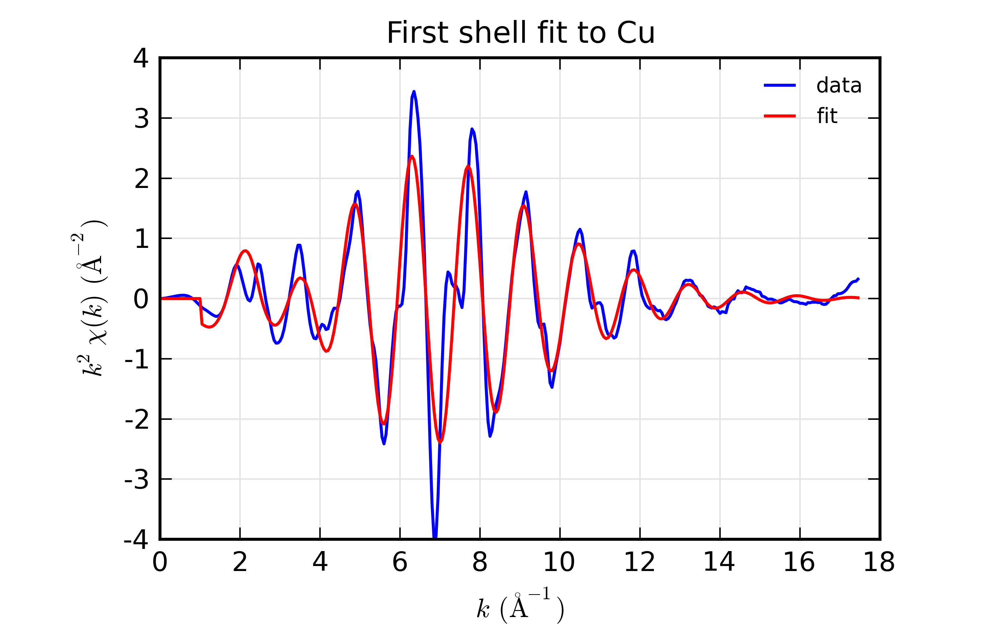

    Results for Feffit for a simple 1-shell fit to a spectrum from Cu
    metal.  Data and Fit in :math:`k` space

.. _fig-feffit1b:

.. figure::  ../_images/feffit_example2.png
    :target: ../_images/feffit_example2.png
    :width: 100%

.. subfigend::
    :width: .45
    :label: fig-feffit1

    Results for Feffit for a simple 1-shell fit to a spectrum from Cu
    metal.    Data and Fit in :math:`R` space

This is a pretty good fit to the first shell of Cu metal, and shows the
basic mechanics of fitting XAFS data to Feff Paths.  There are several
things that might be added to this for modeling more complex XAFS data,
including adding more paths to a fit, including multiple-scattering paths,
simultaneously modeling more than one data set, and building more complex
fitting models.  We'll get to these in the following examples.

But first, a small detour.  The plotting commands in the above example for
plotting :math:`\chi(k)` and :math:`\chi(R)` for data and model will be
useful for the other examples as well, so we'll create a slightly
generalized function to make such plots and put this and several other
plotting functions into a separate file, *doc_macros.lar*.  This will look
like this:

.. literalinclude:: ../../examples/feffit/doc_macros.lar

This defines several new plotting functions :func:`plot_chifit`,
:func:`plot_path_k`, and :func:`plot_path_r`, and so on which we'll find
useful in later examples.  Using the first of these, we can then replace
the plot commands in the script above with::

    run('doc_macros.lar')
    plot_chifit(dset, title='First shell fit to Cu')

and get reproducible plots without having to copy and paste the same code
fragment everywhere.  We'll use this in the examples below.

Example 2: Fit 1 dataset with 3 Paths
~~~~~~~~~~~~~~~~~~~~~~~~~~~~~~~~~~~~~~~~~~

We'll continue with the Cu data set, and add more paths to model further
shells.  This is fairly straightforward, but in the interest of space,
we'll limit the example here to 3 paths to model the first two shells of
copper.  This is a small step, but highlights a main concern with XAFS
analysis that we need to address.  This is the fact that there simply is
not enough freedom in the XAFS signal to measure all the possible
adjustable Path Parameters independently.  Thus we need to be able to apply
constraints to the Path Parameters.

Here, we use two of the most common types of constraints.  First, we apply
the same amplitude reduction factor and the same :math:`E_0` shift to all
Paths.  These may seem obvious for this example, but for more complicated
examples, either including shells of mixed species or Feff Paths generated
from different calculation, these become less obvious.

Second, we introduce a scale the change in distance by a single expansion
factor :math:`\alpha` (``alpha`` in the script), and using the built-in
value of half-path distance, ``reff``, and setting ``deltar =
'alpha*reff'`` for all Paths.  During the calculation of :math:`\chi(k)`
for each path that happens in the fitting process, the value of ``reff``
will be updated to the correct value for each path.  Thus, as the value of
``alpha`` varies in the fit, each path will use its proper value for
``reff``, so that each ``deltar`` will be different but not independent.
This ensures that all the path lengths change in a manner consistent with
one another.

.. literalinclude:: ../../examples/feffit/doc_feffit2.lar

Here we simply create ``path2`` and ``path3`` using nearly the same parameters
as for ``path1``.   Compared to the previous example, the other changes
are that the  :math:`R` range for the fit has been increased so that the
fit will try to fit the second shell, and that  ``sigma2`` is allowed to
vary independently for each path.

The output for this fit is a bit longer, being:

.. literalinclude:: ../../examples/feffit/doc_feffit2.out

With plots of data and fits as shown below.

.. subfigstart::

.. _fig-feffit2a:

.. figure::  ../_images/feffit_example3.png
    :target: ../_images/feffit_example3.png
    :width: 100%

.. _fig-feffit2b:

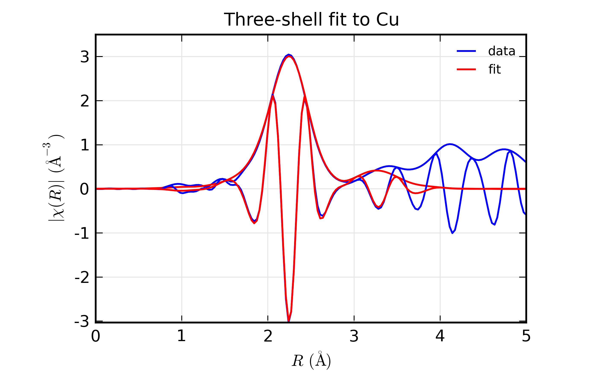

.. subfigend::
    :width: .45
    :label: fig-feffit2

    Results for Feffit for a 3-shell fit to a spectrum from Cu metal,
    constraining all path distances to expand with a single variable.

Here, we show both the magnitude and real part of :math:`\chi(R)`.  The fit
to the real part shows excellent agreement over the fit :math:`R` range of
[1.4, 3.4] :math:`\AA`.  It is often useful the contributions from the
individual paths.  With the macros defined above, this is pretty
straightforward, as we can just do::

    plot_modelpaths_k(dset, offset=-1)
    plot_modelpaths_r(dset, comp='re', offset=-1, xmax=6)

to generate the following plots of the contributions of the different paths:

.. subfigstart::

.. _fig-feffit3a:

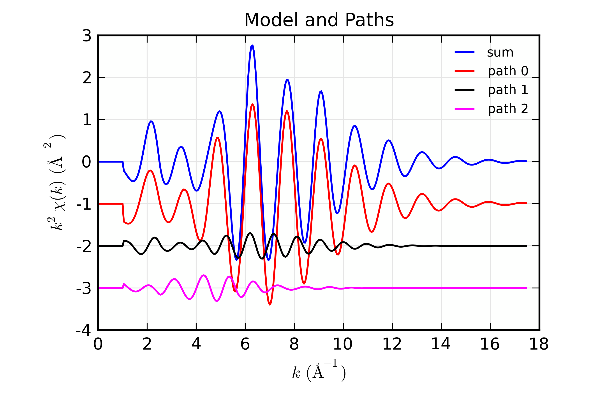

.. _fig-feffit3b:

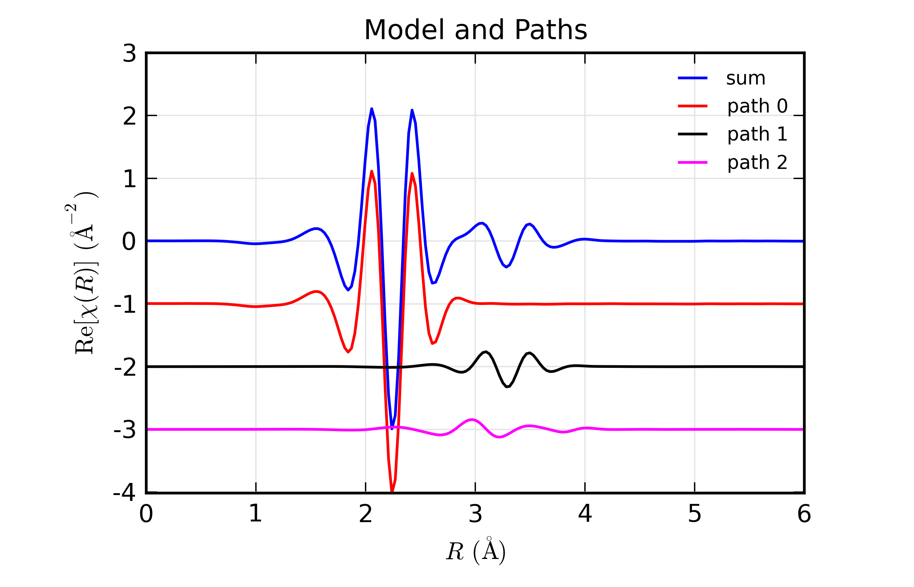

.. subfigend::
    :width: .45
    :label: fig-feffit3

    Path contributions to full mode for the 3-shell fit to Cu spectrum.

Example 3: Fit 3 datasets with 1 Path each
~~~~~~~~~~~~~~~~~~~~~~~~~~~~~~~~~~~~~~~~~~~~

We'll extend the above example by adding two more data sets.  Since the
three data sets have some things in common, we'll be able to use some a
smaller number of total variable parameters for all data sets than if we
had fit each of them individually.  This further allows us to reduce the
number of freely varying parameters in a model of XAFS data, and to better
measure the parameters that are varied.

Here, we'll use data on Cu metal measured at three different temperatures.
Since there is no phase change in the material over this temperature range,
the structure changes in small and predictable ways that lends itself to
simple parameterization.  In the interest of brevity, we'll only use one
path, but the example could easily be extended to include more paths.

In this example, we have three distinct datasets, so we'll have three lists
of paths.  Each of these will have a single path.  Since we're modeling
nearly the same structure, the three paths will use the same Feff.dat file
and have many parameters in common, but some parameters will be different
for each data set.  As with the previous example, we use the same amplitude
reduction factor :math:`E_0` shift to all data sets.  We allow distances to
vary, but constrain them so that the change is linear in the sample
temperature, as if there were a simple linear expansion in :math:`R`.  To
do this, we set ``deltar = 'dr_off + T*alpha*reff'``, where ``T`` is the
temperature for the dataset.  For :math:`\sigma^2` we'll use one of the
built-in models described in :ref:`Models for Calculating sigma2
<xafs-sigma2calcs_sec>`.  Here we'll use :func:`sigma2_eins`, but
:func:`sigma2_debye` can be used as well, and does a better job for
multiple-scattering paths in simple systems.  The model then uses 2
variable parameters for three temperature-dependent distances and 1
variable parameter for three temperature-dependent mean-square
displacements. The full script for the fit looks like this:

.. literalinclude:: ../../examples/feffit/doc_feffit3.lar

Here we read in 3 datasets for :math:`\mu(E)` data and do the background
subtraction on each of them.  We define 5 fitting parameters, including the
characteristic (here, Einstein) temperature which will determine the value of
:math:`\sigma^2`, and two parameters for the linear temperature dependence
of :math:`R`. The output for this fit is:

.. literalinclude:: ../../examples/feffit/doc_feffit3.out

Note that an uncertainty is estimated for the Path parameters, including
``sigma2``, which is calculated with the :func:`sigma2_eins` function.
Such derived uncertainties do reflect the uncertainties and correlations
between variables.  For example, a simplistic evaluation for the standard
error in one of the ``sigma2`` parameters using the estimated variance in
the ``theta`` might be done as follows::

    larch> _ave = sigma2_eins(10, pars.theta)
    larch> _dlo = sigma2_eins(10, pars.theta-pars.theta.stderr) - _ave
    larch> _dhi = sigma2_eins(10, pars.theta+pars.theta.stderr) - _ave
    larch> print "sigma2(T=10) = %.5f  (%+.5f, %+.5f)" % (_ave, _dlo, _dhi)
    sigma2(T=10) = 0.00328  (+0.00011, -0.00011)

This gives an estimate about 3 times larger than the estimate automatically
derived from the fit.  The reason for this is that the simple evaluation
ignores the correlation between parameters, which is taken into account in
the automatically derived uncertainties.  In this case, including this
correlation significantly reduces the estimated uncertainty.

The output plots for the fits to the three datasets are given below.

.. subfigstart::

.. _fig-feffit3temp10k:

.. figure::  ../_images/feffit_3temp1.png
    :target: ../_images/feffit_3temp1.png
    :width: 100%

    Fit to Cu :math:`\chi(k)` at 10 K

.. _fig-feffit3temp50k:

.. figure::  ../_images/feffit_3temp3.png
    :target: ../_images/feffit_3temp3.png
    :width: 100%

    Fit to Cu :math:`\chi(k)` at 50 K

.. _fig-feffit3temp150k:

.. figure::  ../_images/feffit_3temp5.png
    :target: ../_images/feffit_3temp5.png
    :width: 100%

    Fit to Cu :math:`\chi(k)` at 150 K

.. _fig-feffit3temp10r:

    Fit to Cu :math:`\chi(R)` at 10 K

.. _fig-feffit3temp50r:

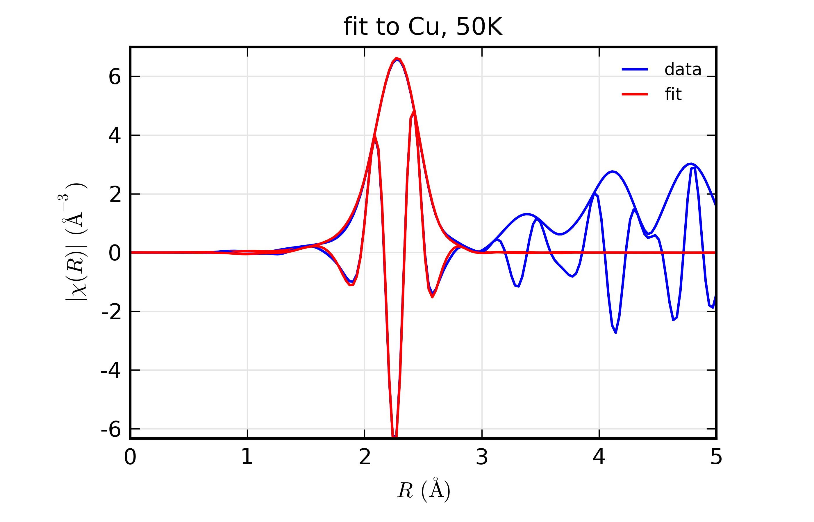

    Fit to Cu :math:`\chi(R)` at 50 K

.. _fig-feffit3temp150r:

.. figure::  ../_images/feffit_3temp6.png
    :target: ../_images/feffit_3temp6.png
    :width: 100%

    Fit to Cu :math:`\chi(R)` at 150 K

.. subfigend::
    :width: .32
    :label: fig-feffit3temps

    Fit to Cu metal at 10 K, 50 K, and 150 K, from simultaneous fit to all
    3 datasets with 5 variables used.

Again, in the interest of brevity and consistency through this chapter,
these example are deliberately simple and meant to be illustrative of the
capabilities and procedures and should not be viewed as limiting the types
of problems that can be modeled.

Example 4: Measuring Coordination number
~~~~~~~~~~~~~~~~~~~~~~~~~~~~~~~~~~~~~~~~~~~~~~~~~~~~

For this and the following example, we switch from Cu metal data to data on
a simple metal oxide, FeO.  The structure is a basic rock-salt structure,
and we'll model 2 paths for Fe-O and Fe-Fe in this structure.  While the
data is imperfect, we'll use it to illustrate a few points in modeling
EXAFS data.

For the examples above with Cu metal, we tacitly assumed that the
coordination number for the different paths was correct, and we adjusted an
:math:`S_0^2` parameter.  But, as with many analyses on real systems of
research interest, we'd like to fit the coordination number for the two
different paths here.  To do this, we set an :math:`S_0^2` parameter to a
fixed value, and also force ``degen`` (the number of equivalent paths in
the structure used to generate the Feff.dat files) to be 1 for each path.
Instead, we'll define parameters ``n1`` and ``n2``, and set the Fe-O path's
amplitude to be ``s02*n1`` and the Fe-Fe path's amplitude to be ``s02*n2``.
We'll allow ``n1`` and ``n2`` to vary in the fit, and also define variable
parameters for the other path parameters, including separate variables for
:math:`\Delta R` and :math:`\sigma^2`.  The script for this fit is below:

.. literalinclude:: ../../examples/feffit/doc_feffit4.lar

The most important point here is the definitions used in setting up the
amplitudes for the paths:  first, that we set ``degen`` to 1, and second
that we used the expression ``s02*n1`` and so forth for the value of the
Path's amplitude.   A secondary note is that we gave two different
k-weights to :func:`feffit_transform`, which causes both k-weights to be
used in the fit.

The resulting output is

.. literalinclude:: ../../examples/feffit/doc_feffit4.out

with plots:

.. subfigstart::

.. _fig-feffit-feo-a:

.. figure::  ../_images/feffit_feo_k.png
    :target: ../_images/feffit_feo_k.png
    :width: 100%

    Fits to 2-path fit to FeO EXAFS, :math:`k` space

.. _fig-feffit-feo-b:

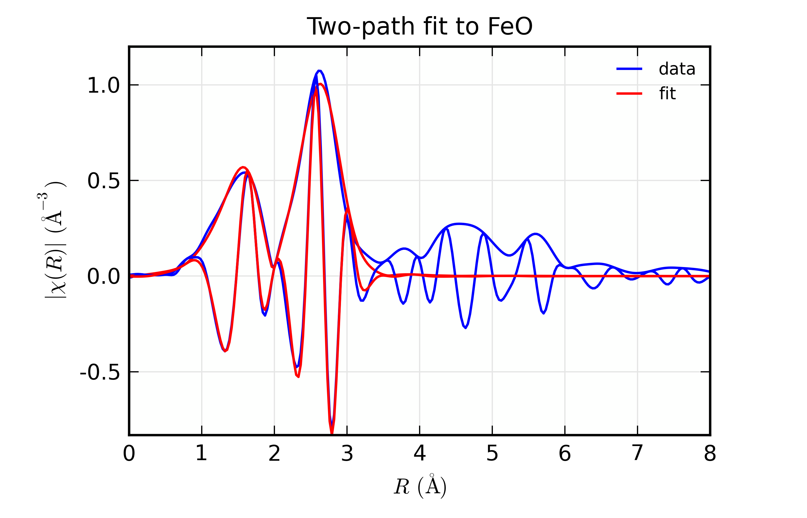

    Fits to 2-path fit to FeO EXAFS, :math:`R` space

.. subfigend::
    :width: .45
    :label: fig-feffit-feo

Example 5: Comparing Fits in different Fit Spaces
~~~~~~~~~~~~~~~~~~~~~~~~~~~~~~~~~~~~~~~~~~~~~~~~~~~~

We now turn to comparing fits in unfiltered k-space, R-space, and filter
k-space (or "q space").  This is partly to illustrate the preference for
using R- or q-space for fitting, and partly to demonstrate how one can run
similar fits and compare the results.  We'll use the FeO data from the
previous example.

To change fitting models and transform parameters, we'll make copies of the
parameter groups and dataset groups, make a few changes, and re-run the
fits.  For example, we can change the fitting space with (see
examples/feffit/doc_feffit5.lar)::

    larch> pars2 = copy(pars)   # copy parameters
    larch> dset2 = copy(dset)   # copy dataset
    larch> dset2.transform.fitspace = 'q'  # fit in backtransformed k-space

Now we can run :func:`feffit` with the new parameter group and Dataset
group, and compare the results either by plotting models from the different
copies of the dataset or by viewing the parameter values and fit statistics
with::

    larch> out2  = feffit(pars2, dset2)
    larch> print '*** R Space ***'
    larch> print feffit_report(out, with_paths=False, min_correl=0.5)
    larch> print '*** Q Space ***'
    larch> print feffit_report(out2, with_paths=False, min_correl=0.5)

which gives

.. literalinclude:: ../../examples/feffit/doc_feffit5_r.out

.. literalinclude:: ../../examples/feffit/doc_feffit5_q.out

We can see that the results are not very different -- the best fit values
and uncertainties for the varied parameters are quite close for the fit in
'R' space and 'Q' space.

Now, we can try the fit in unfiltered 'K' space::

    larch> pars3 = copy(pars)   # copy parameters
    larch> dset3 = copy(dset)   # copy dataset
    larch> dset3.transform.kweight = 2
    larch> dset3.transform.fitspace = 'k'
    larch> out3 = feffit(pars3, dset3)
    larch  print feffit_report(out3, with_paths=False, min_correl=0.5)

(we need to specify only one k-weight for a k-space fit) which gives:

.. literalinclude:: ../../examples/feffit/doc_feffit5_k.out

This has pretty similar best-fit values, but dramatically larger estimates
of the errors.  The spectrum is really very poorly fit in k-space because
we have not accounted for the higher R components.  Using R (and Q) space,
we're able to limit the R range used in determining the parameter values,
estimated uncertainties, and the goodness-of-fit statistics.  But since we
can't place these limits on what portion of the data is being compared to
the model spectra in unfiltered k-space fit, the uncertainties reflect the
fact that the full experimental spectrum is not well model.  This is why it
is recommended to not fit in unfiltered k space: the uncertainties in the
parameters is too large.

Finally, we can also fit simultaneously in 'k' and 'r' space by making use
of wavelet transforms (see Section :ref:`xafs-wavelet_sec`).  For this, we
specify both k and R ranges, and the fit is done on the wavelet
transform. This gives:

.. literalinclude:: ../../examples/feffit/doc_feffit5_w.out

As you can see, the results are all pretty similar.

Of course, for all these examples, we've changed only one thing between
these fits -- the fitting 'space'.  The process of copying the parameter
group and dataset, making modifications and re-doing fits can also include
changing what parametres are varied, and what constraints are placed
between parameters.

Example 6: Testing EXAFS sensitivity to :math:`Z`
~~~~~~~~~~~~~~~~~~~~~~~~~~~~~~~~~~~~~~~~~~~~~~~~~~~~

.. index:: Phase-corrected Fourier transforms

EXAFS is known to be sensitive to the atomic number :math:`Z` of the
scattering atom.  This is due to the :math:`Z` dependence of the scattering
amplitude and phase shift (:math:`f(k)` and :math:`\delta(k)` in the EXAFS
Equation of Section :ref:`xafs-exafsequation_sec`).  A rule-of-thumb that
is often stated is that EXAFS is sensitive to :math:`Z \pm 5`, or perhaps
pessimistically to *row of the Periodic Table*, but not as sensitive as
:math:`Z \pm 1`.  Occassionally, you may see work that claims very fine
:math:`Z` sensitivity, such as being able to distinguish N and O ligands.
In those works, XAFS results are typically used with chemical arguments
about steric effects or known bond distances.

.. index:: Phase-corrected Fourier transforms

In this section, we'll explore the :math:`Z` sensitivity of XAFS with real
data, by constructing Feff paths with different scatterers and trying to
fit data with these different scattering paths.  This makes a nice exercise
in how to manipulate Feff, how to fit XAFS data, and how to compare XAFS
fits.  Just to make it a little more complicated, we'll also explore the
idea of **Phase corrected** Fourier transforms and how they might be used
to better determine both :math:`R` and :math:`Z`.  The example script here
is a little more complex than what we've seen above, using many feature of
the Larch scripting language to do repeated fits and mathematically
manipulating the arrays of data.

.. _fig-znse-xafs:

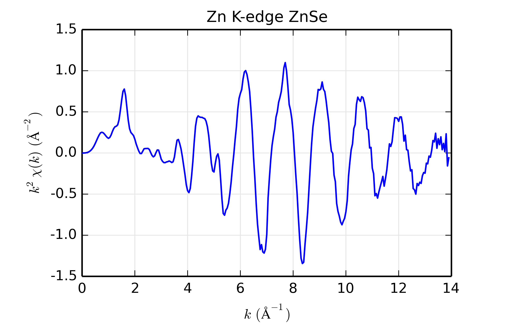

    Zn K-edge XAFS data for ZnSe.

For this example, we'll use Zn K-edge data of ZnSe, with :math:`\chi(k)`
data shown in :numref:`fig-znse-xafs`.  The data is pretty good but not
perfect, and is useful for the study here mainly because the structure is
simple, with a well-isolated and well-ordered shell of scatterers (the
cubic ZnS structure with 1 Zn site surrounded by 4 Se at 2.45
:math:`\rm\AA`).  While we're sure that the scatterer *should* be Se, we'll
try scatterers of Zn, Ge, Se, Br, and Rb, spanning a small but sufficient
range of :math:`Z`.

To construct the scattering paths, we'll modify a Feff input file.  To do
this, we start with a feff.inp file generated for crystalline ZnSe by the
ATOMS program, and add an IPOT to the list of atomic potentials (here the
line ``3    35    Br``), and then replace the IPOTs for 1 of the neighboring Se
atoms (that is, replacing a 2 with a 3, and changing the tag for
convenience).  The resulting feff.inp file for Br looks this:

.. literalinclude:: ../../examples/feffit/Feff_ZnSe/feff.inp

Afer running feff.inp, we collect the resulting ``feffNNNN.dat`` files --
either ``feff0001.dat`` or ``feff0002.dat`` will have the replaced scatterer,
the other will have Se as the scatterer.   Once we've collected all these
files for runs of Feff with feff.inp altered for each scatterer, we're ready
to do the fits.

The script to compare the fits will loop over these different scattering
paths, doing a fit for each path, and store the results.  This takes
advantage of several features of the Larch scripting capabilities,
including defining functions, and constructs like loops and dictionaries,
as well as mathematical manipulation of the resulting arrays for the phase
correction.  The full script is:

.. literalinclude:: ../../examples/feffit/doc_feffit6.lar

After reading in the data, the script builds Feff Paths, putting them into
a dictionary.  After define the fitting transform range, the script loops
over each of the scatterers, doing a simple first-shell fit with each.  The
the phase-corrected :math:`\chi(R)` is then calculated, and the peak value of
:math:`R` is found for this array.  Finally, results are printed out.

.. _xafs-feffit_znse_results:

    Table of ZnSe Results.  The results from fitting ZnSe XAFS data to
    scattering paths of Zn-Zn, Zn-Ge, Zn-Se, Zn-Br, and Zn-Rb.  All paths
    started at the nominal distance of 2.454 :math:`\rm\AA`.

   +-----------+-------------------+---------------+------------------+-------------+-------------+------------------------+
   |Scatterer  |reduced chi-square | :math:`S_0^2` | :math:`\sigma^2` | :math:`E_0` |  :math:`R`  |:math:`R_{\rm{ph cor}}` |
   +===========+===================+===============+==================+=============+=============+========================+
   |  Zn (30)  |  57.5             | 0.73(0.07)    | 0.0040(0.0006)   | -7.98(1.23) | 2.471(0.006)|  2.451                 |
   +-----------+-------------------+---------------+------------------+-------------+-------------+------------------------+
   |  Ge (32)  |  32.4             | 0.90(0.06)    | 0.0050(0.0005)   | -2.99(0.93) | 2.461(0.004)|  2.457                 |
   +-----------+-------------------+---------------+------------------+-------------+-------------+------------------------+
   |  Se (34)  |  12.7             | 0.89(0.04)    | 0.0059(0.0003)   | 0.09(0.58)  | 2.448(0.003)|  2.461                 |
   +-----------+-------------------+---------------+------------------+-------------+-------------+------------------------+
   |  Br (35)  |  16.7             | 1.08(0.06)    | 0.0070(0.0004)   | 1.71(0.79)  | 2.444(0.003)|  2.462                 |
   +-----------+-------------------+---------------+------------------+-------------+-------------+------------------------+
   |  Rb (37)  |  88.7             | 1.10(0.14)    | 0.0073(0.0009)   | 5.27(1.42)  | 2.425(0.007)|  2.467                 |
   +-----------+-------------------+---------------+------------------+-------------+-------------+------------------------+

The results of the fits are given in the :ref:`Table of ZnSe Results
<xafs-feffit_znse_results>`, with graphs below showing fits to the 5
different scatterers.  The dependence of the results on :math:`Z` of the
back-scattering atom is seen to be reasonably strong.  The values for reduced
chi-square definitely indicate that Zn-Se is the best fit, and the values for
the fitted parameters have rather clear correlations with :math:`Z` --
:math:`S_0^2`, :math:`\sigma^2`, and :math:`E_0` increase with :math:`Z`,
while :math:`R` decreases.  If anything, the :math:`Z \pm 5` rule-of-thumb
seems pessimistic, though the fits with Ge and Br look decent enough that it
would be easy to conclude that :math:`Z \pm 2` is reasonable.

As a curious side note, we note that :math:`S_0^2` *increases* with
:math:`Z`.  The scattering factor should also increase with :math:`Z`, which
might lead us to suspect a trend in the opposite direction.  The confounding
factor here is :math:`\sigma^2` -- if we fix :math:`\sigma^2` to 0.006 (by
changing ``vary=True`` to ``vary=False``) and re-run the fits, :math:`S_0^2`
has a slight negative dependence on :math:`Z`.

.. subfigstart::

.. _fig_znse_fit-zn:

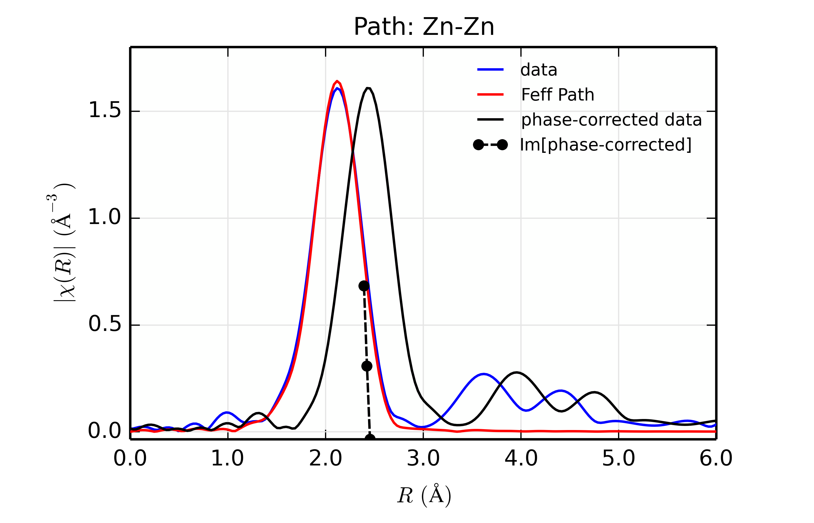

    Fit to ZnSe with Zn back-scatterer

.. _fig_znse_fit-ge:

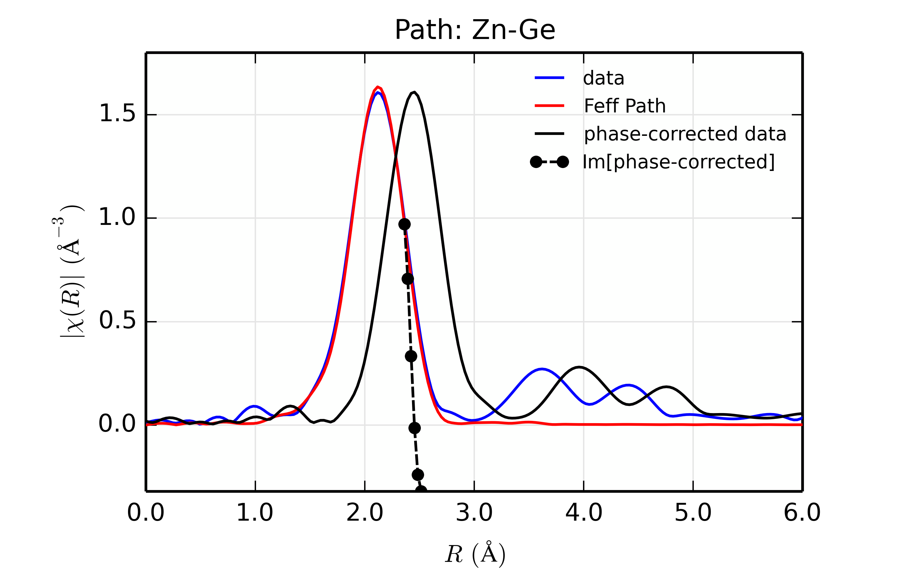

    Fit to ZnSe with Ge back-scatterer

.. _fig_znse_fit-se:

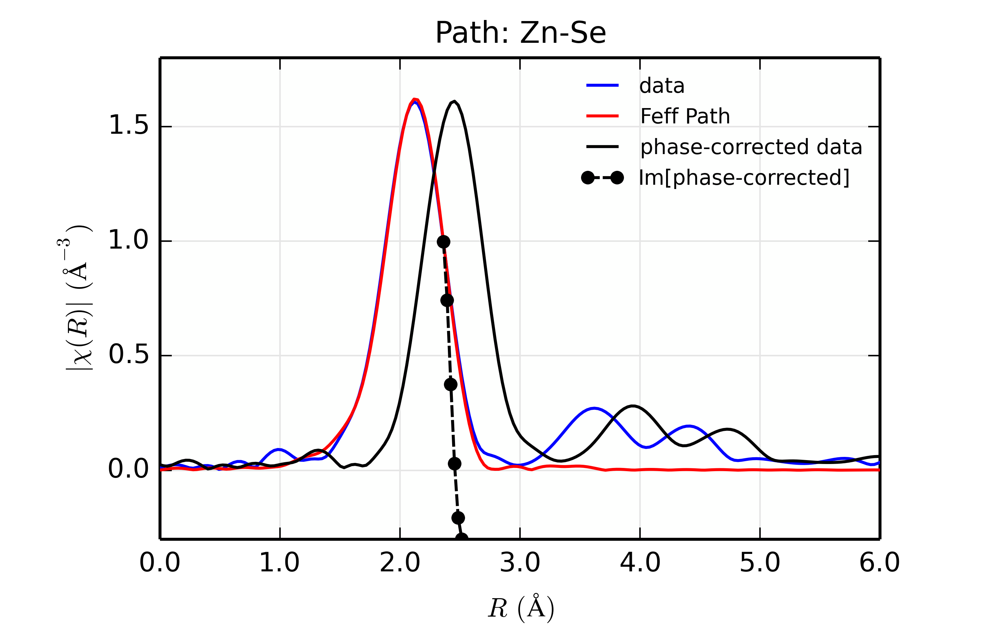

    Fit to ZnSe with Se back-scatterer

.. _fig_znse_fit-br:

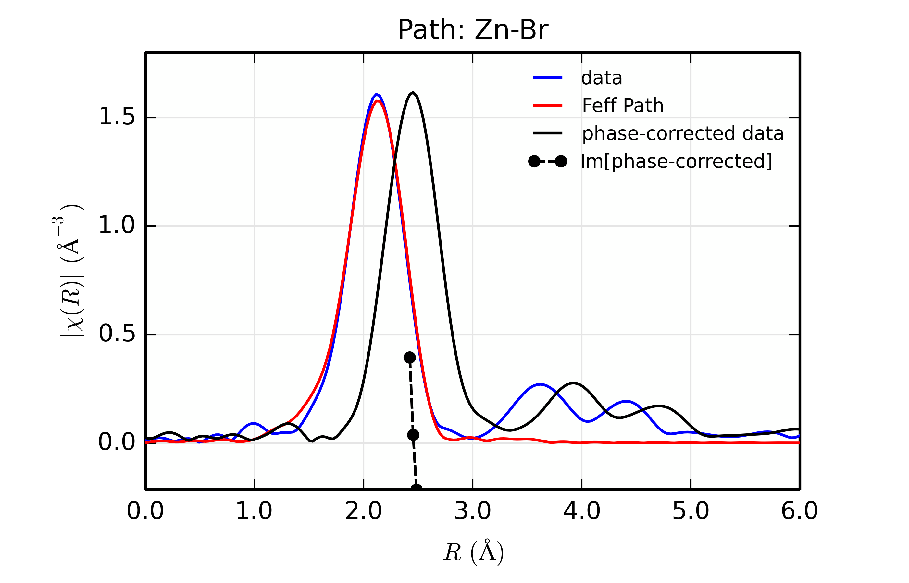

    Fit to ZnSe with Br back-scatterer

.. _fig_znse_fit-rb:

.. figure::  ../_images/Feffit_ZnSe_Rb.png
    :target: ../_images/Feffit_ZnSe_Rb.png
    :width: 100%

    Fit to ZnSe with Rb back-scatterer

.. subfigend::
    :width: .32
    :label: fig-feffit-znse2

.. index:: Phase-corrected Fourier transforms

The figures also show **phase-corrected** Fourier transforms using the total
scattering phase from the Feff calculation to correct the data.  This
correction is done in the ``phase_correct()`` procedure, where the data from
the *feffNNNN.dat* file (in the ``_feffdat`` group) is used to construct the
Feff phase shift (:math:`\delta(k)` in the EXAFS Equation of Section
:ref:`xafs-exafsequation_sec`), and apply it to the data.  Because this uses
complex math, we use the :func:`xftf_fast` function to the complex Fourier
transform and build the magnitude of the transform explicitly.

The phase corrected transforms are shown in black in
:numref:`fig_znse_fit-zn` through :numref:`fig_znse_fit-rb`, and show the
key benefit of these transforms -- the peak in the phase corrected
:math:`\chi(R)` peaks much closer to an :math:`R` that is the bond distance
(for Zn-Se, around 2.45 :math:`\rm\AA`), whereas the normal XAFS Fourier
transform peaks much lower.  This suggests a further test on whether the
bond distance and :math:`Z` of the scattering atom are correct.  That is,
in order for the phase-correction to give the correct interatomic distance,
the total phase-shift has to be correct, which means that the :math:`Z` for
the scatterer has to be correct (see the EXAFS Equation in Section
:ref:`xafs-exafsequation_sec`).  So, we can compare the refined distance
with the peak in the phase-corrected transform -- if they agree, it gives
good confidence that the scatterer is correct.

Since the spacing of points in :math:`R` is :math:`\sim 0.03\rm\AA`, using
the peak position may not be accurate enough.  Instead, we can use the
value where :math:`\rm Im[\chi(R)_{\rm{ph cor}}]` passes through zero (see
dashed lines in :numref:`fig_znse_fit-zn` through
:numref:`fig_znse_fit-rb`).  These values are reported in the :ref:`Table
of ZnSe Results <xafs-feffit_znse_results>` as :math:`R_{\rm{phcor}}`.

We see an interesting trend that while the refined distance *decreases* with
:math:`Z`, the value for :math:`R_{\rm{phcor}}` increases slightly.  The two
values cross between Ge and Se.  This is pretty good agreement, especially
considering we left out the :math:`\sigma^2` contribution to phase-shift in
the EXAFS equation from this phase correction, and applied the theoretical
phase-shift from Feff to the measured data.  The :math:`Z` dependence of
:math:`R_{\rm{phcor}}` is not as strong as the :math:`Z` dependence of
reduced chi-square, but this analysis also suggests that one can determine
:math:`Z \pm 3`, at least in this rather favorable case.

Again, this is an unusually favorable case -- a simple structure with a
single well-isolated coordination shell.  The phase-correction method will
**not** work at all on a mixed coordination shell, and is likely to give
larger errors for a highly-disordered system.  But, for simple,
well-characterized systems, the ability to do such analysis can be very
powerful, and give increased confidence in the refined structure.
