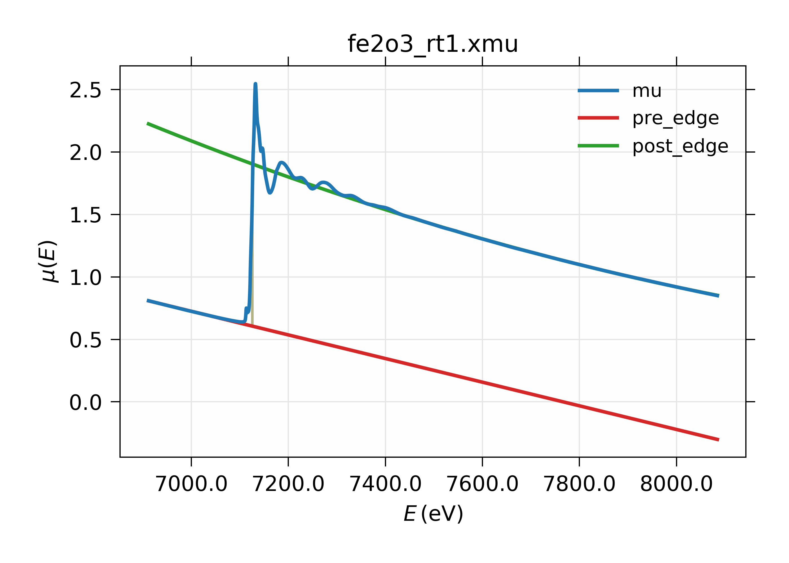

==============================================
XAFS: Pre-edge Subtraction and Normalization
==============================================

After reading in data and constructing :math:`\mu(E)`, the principle
pre-processing steps for XAFS analysis.  are pre-edge subtraction and
normalization.  Reading data and constructing :math:`\mu(E)` are handled by
internal larch functions, especially :func:`read_ascii`.  The main
XAFS-specific function for pre-edge subtraction and normalizaiton is
:func:`pre_edge`.

The :func:`pre_edge` function
=================================

..  function:: pre_edge(energy, mu, group=None, ...)

    Pre-edge subtraction and normalization.  This performs a number of steps:
       1. determine :math:`E_0` (if not supplied) from max of deriv(mu)
       2. fit a line of polymonial to the region below the edge
       3. fit a polymonial to the region above the edge
       4. extrapolate the two curves to :math:`E_0` to determine the edge jump

    :param energy:  1-d array of x-ray energies, in eV
    :param mu:      1-d array of :math:`\mu(E)`
    :param group:   output group
    :param e0:      edge energy, :math:`E_0` in eV.  If None, it will be determined here.
    :param step:    edge jump.  If None, it will be determined here.
    :param pre1:    low E range (relative to E0) for pre-edge fit
    :param pre2:    high E range (relative to E0) for pre-edge fit
    :param nvict:   energy exponent to use for pre-edg fit.  See Note below.
    :param norm1:   low E range (relative to E0) for post-edge fit
    :param norm2:   high E range (relative to E0) for post-edge fit
    :param nnorm:   number of terms in polynomial (that is, 1+degree) for
                    post-edge, normalization curve. Default=3 (quadratic)

    :returns:  None.

    Follows the First Argument Group convention, using group members named ``energy`` and ``mu``.
    The following data is put into the output group:

       ==============   ======================================================
        attribute        meaning
       ==============   ======================================================
        e0               energy origin
        edge_step        edge step
        norm             normalized mu(E)   (array)
        pre_edge         pre-edge curve (array)
        post_edge        post-edge, normalization curve  (array)
        pre_slope        slope of pre-edge line
        pre_offset       offset of pre-edge line
        nvict            value of nvict used
        nnorm            value of nnorm used
        norm_c0          constant of normalization polynomial
        norm_c1          linear coefficient of normalization polynomial
        norm_c2          quadratic coefficient of normalizaion polynomial
        norm_c*          higher power coefficents of normalization polynomial
       ==============   ======================================================

Notes:
   nvict gives an exponent to the energy term for the pre-edge fit.
   That is, a line :math:`(m E + b)` is fit to
   :math:`\mu(E) E^{nvict}`   over the pr-edge region, E= [E0+pre1, E0+pre2].

..  function:: find_e0(energy, mu=None, group=None, ...)

    Determine :math:`E_0`, the energy threshold of the absorption edge,
    from the arrays energy and mu for :math:`\mu(E)`.

    This finds the point with maximum derivative with some
    checks to avoid spurious glitches.

    :param energy:  array of x-ray energies, in eV
    :param   mu:    array of :math:`\mu(E)`
    :param group:   output group

    Follows the First Argument Group convention, using group members named ``energy`` and ``mu``.
    The value of ``e0`` will be written to the output group.

Pre-Edge Subtraction Example
=================================

A simple example of pre-edge subtraction::

    fname = 'fe2o3_rt1.xmu'
    dat = read_ascii(fname, labels='energy mu i0')

    pre_edge(dat, group=dat)

    show(dat)

    newplot(dat.energy, dat.mu, label=' $ \mu(E) $ ',
            xlabel='Energy (eV)',
            title='%s Pre-Edge ' % fname,
            show_legend=True)

    plot(dat.energy, dat.pre_edge, label='pre-edge line',
         color='black', style='dashed' )

    plot(dat.energy, dat.post_edge, label='normalization line',
         color='black', style='dotted' )

gives the following results:

.. _xafs_fig1:

    XAFS Pre-edge subtraction.

Over-absorption Corrections
=================================

For XAFS data measured in fluorescence, a common problem of
*over-absorption* in which too much of the total X-ray absorption
coefficient is from the absorbing element.  In such cases, the implicit
assumption in a fluorescence XAFS measurement that the fluorescence
intensity is proportional to the absorption coefficient of the element of
interest breaks down.  This is often referred to as *self-absorption* in
the older XAFS literature, but the term should be avoided as it is quite a
different effect from self-absorption in X-ray fluorescence analysis.  In
fact, the effect is more like *extinction* in that the fluorescence
probability approaches a constant, with no XAFS oscillations, as the total
absorption coefficient is dominated by the element of interest.
Over-absorption most stongly effects the XAFS oscillation amplitude, and so
coordination number and mean-square displacement parameters in the EXAFS,
and edge-position and pre-edge peak height for XANES.  Fortunately, the
effect can be corrected for small over-absorption.

For XANES, a common correction method from the FLUO program by D. Haskel
(:cite:ts:`fluo`) can be used.  The algorithm is contained in the
:func:`fluo_corr` function.

.. function:: fluo_corr(energy, mu, formula, elem, group=None, edge='K', anginp=45, angout=45, **pre_kws)

    calculate :math:`\mu(E)` corrected for over-absorption in fluorescence
    XAFS using the FLUO algorithm (suitabe for XANES, but questionable for
    EXAFS).

    :param energy:    1-d array of x-ray energies, in eV
    :param mu:        1-d array of :math:`\mu(E)`
    :param formula:   string for sample stoichiometry
    :param group:     output group
    :param elem:      atomic symbol ('Zn') or Z of absorbing element
    :param edge:      name of edge ('K', 'L3', ...) [default 'K']
    :param anginp:    input angle in degrees  [default 45]
    :param angout:    output angle in degrees [default 45]
    :param **pre_kws: additional keywords for :func:`pre_edge`.

    :returns:         None

    Follows the First Argument Group convention, using group members named
    ``energy`` and ``mu``.  The value of ``mu_corr`` and ``norm_corr`` will be written to the
    output group, containing :math:`\mu(E)` and normalized :math:`\mu(E)` corrected for over-absorption.
