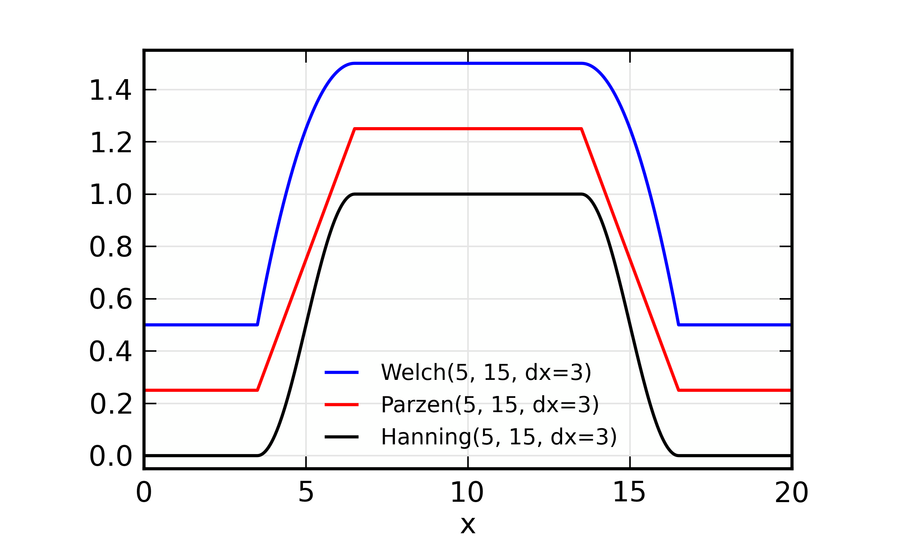
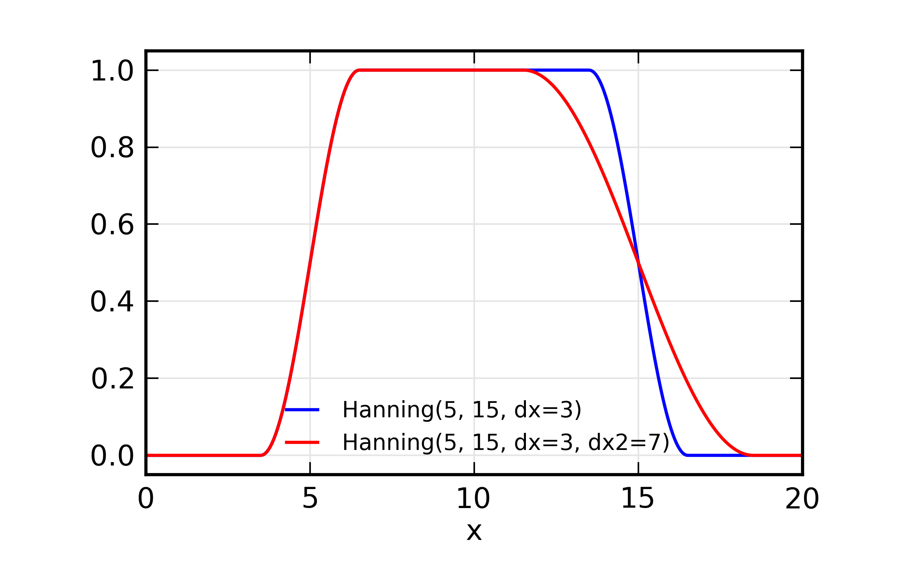
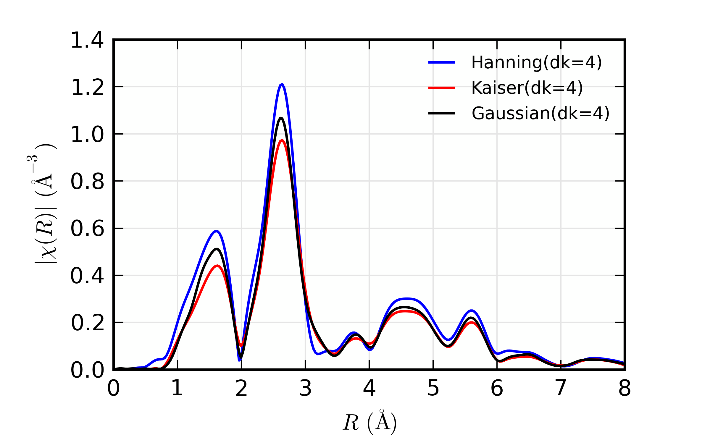

.. _xafs-ft_sec:

==============================================
XAFS: Fourier Transforms for XAFS
==============================================

Fourier transforms are central to understanding and using
XAFS. Consequently, many of the XAFS functions in Larch use XAFS Fourier
transforms as part of their processing, and many of the functions
parameters and arguments described here have names and meanings used
throughout the XAFS functionality of Larch.  For example, both
:func:`autobk` and :func:`feffit` rely on XAFS Fourier transforms, and use
the XAFS Fourier transform function described here.

Overview of XAFS Fourier transforms
~~~~~~~~~~~~~~~~~~~~~~~~~~~~~~~~~~~~~

The standard Fourier transform of a signal :math:`f(t)` can be written as

.. math::
   :nowrap:

   \begin{eqnarray*}
         {\tilde{f}}(\omega) &=& \frac{1}{\sqrt{2\pi}} \int_{-\infty}^{\infty}
       f(t) e^{-i{\omega}t} dt \\
       f(t) &=& \frac{1}{\sqrt{2\pi}} \int_{-\infty}^{\infty}
       {\tilde{f}}(\omega) e^{i{\omega}t} d{\omega} \\
   \end{eqnarray*}

where the symmetric normalization is one of the more common choices of
conventions.  This gives conjugate variables of :math:`\omega` and
:math:`t`. Because XAFS goes as

.. math::

  \chi(k) \sim \sin[2kR + \delta(k)]

the conjugate variables in XAFS are generally taken to be :math:`k` and
:math:`2R`.  The normalization of :math:`\tilde\chi(R)` from a Fourier
transform of :math:`\chi(k)` is a matter of convention, but we follow the
symmetric case above (with :math:`t` replaced by :math:`k` and
:math:`\omega` replaced by :math:`2R`, and of course :math:`f` by
:math:`\chi`).

But there are two more important issues to mention.  First, an XAFS Fourier
transform multiplies :math:`\chi(k)` by a power of :math:`k`, :math:`k^n`
and by a window function :math:`\Omega(k)` before doing the Fourier
transform.  The power-law weighting allow the oscillations in :math:`k` to
emphasize different portions of the spectra, or to give a uniform intensity
to the oscillations.  The window function acts to smooth the resulting
Fourier transform and remove ripple and ringing in it that would result
from a sudden truncation of :math:`\chi(k)` at the end of the data range.

The second important issue is that the continuous Fourier transform
described above is replaced by a discrete transform.  This better matches
the discrete sampling of energy and :math:`k` values of the data, and
allows Fast Fourier Transform techniques to be used.  It does change the
definitions of the transforms used somewhat. First, the :math:`\chi(k)`
data must be on *uniformly spaced* set of :math:`k` values.  The default
:math:`k` spacing used in Larch (including as output from :func:`autobk`)
is :math:`\delta k` = 0.05 :math:`\rm\AA^{-1}`.  Second, the array size for
:math:`\chi(k)` used in the Fourier transform should be a power of 2. The
default used in Larch is :math:`N_{\rm fft}` = 2048.   Together, these
allow :math:`\chi(k)` data to 102.4 :math:`\rm\AA^{-1}`.  Of course, real
data doesn't extend that far, so the array to be transformed is
*zero-padded* to the end of the range.  Since the spacing :math:`\delta R`
of the resulting discrete :math:`\chi(R)` is given as
:math:`\pi/{(N_{\rm fft} \delta k )}`, the extended range and zero-padding
will increase the density of points in :math:`\chi(R)`, smoothly
interpolating the values.   For :math:`N_{\rm fft}` = 2048 and
:math:`\delta k` =  0.05 :math:`\rm\AA^{-1}`, the :math:`R` spacing is
approximately :math:`\delta R` =  0.0307 :math:`\rm\AA`.

For the discrete Fourier transforms with samples of :math:`\chi(k)` at the
points :math:`k_n = n \, \delta k`, and samples of :math:`\chi(R)` at the
points :math:`R_m = m \, \delta R`, the definitions become:

.. math::
   :nowrap:

   \begin{eqnarray*}
   \tilde\chi(R_m) &=& \frac{i \delta k}{\sqrt{\pi N_{\rm fft}}} \,
   		       \sum_{n=1}^{N_{\rm fft}} \chi(k_n) \,
                       \Omega(k_n) \, k_n^w e^{2i\pi n m/N_{\rm fft}} \\
   \tilde\chi(k_n) &=& \frac{2 i \delta R}{\sqrt{\pi N_{\rm fft}}} \,
                       \sum_{m=1}^{N_{\rm fft}} \tilde\chi(R_m) \,
                       \Omega(R_m) \, e^{-2i\pi n m/N_{\rm fft}} \\
   \end{eqnarray*}

These normalizations preserve the symmetry properties of the Fourier
Transforms with conjugate variables :math:`k` and :math:`2R`.
Though the reverse transform converts the complex :math:`\chi(R)` to the
complex :math:`\chi(k)` on the same :math:`k` spacing as the starting
data, we often refer to the filtered :math:`\chi(k)` as *q* space.

A final complication in using Fourier transforms for XAFS is that the
measured :math:`\mu(E)` and :math:`\chi(k)` are a strictly real values,
while the Fourier transform inherently treats :math:`\chi(k)` and
:math:`\chi(R)` as complex values. This leads to an ambiguity about how to
construct the complex :math:`\tilde\chi(k)`.  In many formal treatments,
XAFS is written as the imaginary part of a complex function.  This might
lead one to assume that constructing :math:`\tilde\chi(k)` as :math:`0 +
i\chi(k)` would be the natural choice.  For historical reasons, Larch uses
the opposite convention, constructing :math:`\tilde\chi(k)` as
:math:`\chi(k) + 0i`.   As we'll see below, you can easily change this
convention.  The effect of this choice is minor unless one is
concerned about the differences of the real and imaginary parts of
:math:`\chi(R)` or one is intending to filter and back-transform the
:math:`\chi(R)` and compare the filtered and unfiltered data.

Forward XAFS Fourier transforms (:math:`k{\rightarrow}R`)
~~~~~~~~~~~~~~~~~~~~~~~~~~~~~~~~~~~~~~~~~~~~~~~~~~~~~~~~~~~~~

The forward Fourier transform converts :math:`\chi(k)` to :math:`\chi(R)`
and is of primary importance for XAFS analysis.  In Larch, this is
encapsulated in the :func:`xftf` function.

..  function:: xftf(k, chi=None, group=None, ...)

    perform a forward XAFS Fourier transform, from :math:`\chi(k)` to
    :math:`\chi(R)`, using common XAFS conventions.

    :param k:        1-d array of photo-electron wavenumber in :math:`\rm\AA^{-1}`
    :param chi:      1-d array of :math:`\chi`
    :param group:    output Group
    :param rmax_out: highest *R* for output data (10 :math:`\rm\AA`)
    :param kweight:  exponent for weighting spectra by :math:`k^{\rm kweight}`
    :param kmin:     starting *k* for FT Window
    :param kmax:     ending *k* for FT Window
    :param dk:       tapering parameter for FT Window
    :param dk2:      second tapering parameter for FT Window
    :param window:   name of window type
    :param nfft:     value to use for :math:`N_{\rm fft}` (2048).
    :param kstep:    value to use for :math:`\delta{k}` (0.05).

    :returns:  ``None`` -- outputs are written to supplied group.

    Follows the First Argument Group convention, using group members named ``k`` and ``chi``.
    The following data is put into the output group:

       ================= ===============================================================
        array name         meaning
       ================= ===============================================================
        kwin               window :math:`\Omega(k)` (length of input chi(k)).
	r                  uniform array of :math:`R`, out to ``rmax_out``.
	chir               complex array of :math:`\tilde\chi(R)`.
	chir_mag           magnitude of :math:`\tilde\chi(R)`.
	chir_pha           phase of :math:`\tilde\chi(R)`.
	chir_re            real part of :math:`\tilde\chi(R)`.
	chir_im            imaginary part of :math:`\tilde\chi(R)`.
       ================= ===============================================================

    It is expected that the input ``k`` be a uniformly spaced array of
    values with spacing ``kstep``, starting a 0.  If it is not, the ``k``
    and ``chi`` data will be linearly interpolated onto the proper grid.

    The FT window parameters are explained in more detail in the discussion of
    :func:`ftwindow`.

..  function:: xftf_fast(chi, nfft=2048, kstep=0.05)

    perform a forward XAFS Fourier transform, from :math:`\chi(k)` to
    :math:`\chi(R)`, using common XAFS conventions.  This version demands
    ``chi`` to include any weighting and windowing, and so to represent
    :math:`\chi(k)k^w\Omega(k)` on a uniform :math:`k` grid. It returns
    the complex array of :math:`\chi(R)`.

    :param chi:      1-d array of :math:`\chi` to be transformed
    :param nfft:     value to use for :math:`N_{\rm fft}` (2048).
    :param kstep:    value to use for :math:`\delta{k}` (0.05).

    :returns:  complex :math:`\chi(R)`.

Reverse XAFS Fourier transforms (:math:`R{\rightarrow}q`)
~~~~~~~~~~~~~~~~~~~~~~~~~~~~~~~~~~~~~~~~~~~~~~~~~~~~~~~~~~~~~

Reverse Fourier transforms convert :math:`\chi(R)` back to filtered
:math:`\chi(k)`.  We refer to the filtered :math:`k` space as :math:`q` to
emphasize the distinction between the two.  The filtered :math:`\chi(q)` is
complex.  By convention, the real part of :math:`\chi(q)` corresponds to
the explicitly real :math:`\chi(k)`.

..  function:: xftr(r, chir, group=None, ...)

    perform a reverse XAFS Fourier transform, from :math:`\chi(R)` to
    :math:`\chi(q)`.

    :param r:        1-d array of distance.
    :param chir:      1-d array of :math:`\chi(R)`
    :param group:    output Group
    :param qmax_out: highest *k* for output data (30 :math:`\rm\AA^{-1}`)
    :param rweight:  exponent for weighting spectra by :math:`r^{\rm rweight}` (0)
    :param rmin:     starting *R* for FT Window
    :param rmax:     ending *R* for FT Window
    :param dr:       tapering parameter for FT Window
    :param dr2:      second tapering parameter for FT Window
    :param window:   name of window type
    :param nfft:     value to use for :math:`N_{\rm fft}` (2048).
    :param kstep:    value to use for :math:`\delta{k}` (0.05).

    :returns:  ``None`` -- outputs are written to supplied group.

    Follows the First Argument Group convention, using group members named ``r`` and ``chir``.
    The following data is put into the output group:

       ================= ===============================================================
        array name         meaning
       ================= ===============================================================
        rwin               window :math:`\Omega(R)` (length of input chi(R)).
	q                  uniform array of :math:`k`, out to ``qmax_out``.
	chiq               complex array of :math:`\tilde\chi(k)`.
	chiq_mag           magnitude of :math:`\tilde\chi(k)`.
	chiq_pha           phase of :math:`\tilde\chi(k)`.
	chiq_re            real part of :math:`\tilde\chi(k)`.
	chiq_im            imaginary part of :math:`\tilde\chi(k)`.
       ================= ===============================================================

    In analogy with :func:`xftf`, it is expected that the input ``r`` be a
    uniformly spaced array of values starting a 0.

    The input ``chir`` array can be either the complex :math:`\chi(R)` array
    as output to ``Group.chir`` from :func:`xftf`, or one of the real or
    imaginary parts of the :math:`\chi(R)` as output to ``Group.chir_re`` or
    ``Group.chir_im``.

    The FT window parameters are explained in more detail in the discussion of
    :func:`ftwindow`.

..  function:: xftr_fast(chir, nfft=2048, kstep=0.05)

    perform a reverse XAFS Fourier transform, from :math:`\chi(R)` to
    :math:`\chi(q)`, using common XAFS conventions.  This version demands
    ``chir`` be  the complex :math:`\chi(R)` as created from :func:`xftf`.
    It returns the complex array of :math:`\chi(q)` without putting any
    values into a group.

    :param chir:     1-d array of :math:`\chi(R)` to be transformed
    :param nfft:     value to use for :math:`N_{\rm fft}` (2048).
    :param kstep:    value to use for :math:`\delta{k}` (0.05).

    :returns:  complex :math:`\chi(q)`.

:func:`ftwindow`: Generating Fourier transform windows
~~~~~~~~~~~~~~~~~~~~~~~~~~~~~~~~~~~~~~~~~~~~~~~~~~~~~~~~~~

As mentioned above, a Fourier transform window will smooth the resulting
Fourier transformed spectrum, removing ripple and ringing in it that would
result from a sudden truncation data at the end of it range.  There is an
extensive literature on such windows, and a lot of choices and parameters
available for constructing windows.  A sampling of windows is shown below.

..  function:: ftwindow(x, xmin=0, xmax=None, dk=1, ...)

    create a Fourier transform window array.

    :param x:        1-d array array to build window on.
    :param xmin:     starting *x* for FT Window
    :param xmax:     ending *x* for FT Window
    :param dx:       tapering parameter for FT Window
    :param dx2:      second tapering parameter for FT Window (=dx)
    :param window:   name of window type
    :returns:  1-d window array.

    Note that if ``dx`` is specified but ``dx2`` is not, ``dx2`` will
    generally take the same value as ``dx``.

    The window type must be one of those listed in the :ref:`Table of
    Fourier Transform Window Types <xafs-ftwin_table>`.

.. index:: Fourier Transform Window types
.. _xafs-ftwin_table:

    Table of Fourier Transform Window Types.

       =================== =========================================================
        window name          description
       =================== =========================================================
        hanning              cosine-squared taper
        parzen               linear taper
        welch                quadratic taper
	gaussian             Gaussian (normal) function window
	sine                 sine function window
	kaiser               Kaiser-Bessel function-derived window
       =================== =========================================================

In general, the window arrays have a value that gradually increases from 0
up to 1 at the low-k end, may stay with a value 1 over some central
portion, and then tapers down to 0 at the high-k end.  The meaning of the
``dx`` and ``dx2``, and even ``xmin``, and ``xmax`` varies a bit for the
different window types.  The Hanning, Parzen, and Welch windows share a
convention that the windows taper up from 0 to 1 between ``xmin-dx/2`` and
``xmin+dx/2``, and then taper down from 1 to 0 between ``xmax-dx2/2`` and
``xmax+dx2/2``.

The conventions for the Kaiser, Gaussian, and Sine window types is a bit
more complicated, and is best given explicitly.  In the formulas below,
``dx`` written as :math:`dx` and ``dx2`` as :math:`dx_2`.  We
define :math:`x_i = x_{\rm min} - dx/2`, :math:`x_f = x_{\rm max} +
dx_2/2`, and :math:`x_0 = (x_f + x_i)/2`, as the beginning, end, and
center of the widows.  For the Gaussian window, the form is:

.. math::

   \Omega(x) = \exp{\bigl[ -\frac{(x - x_0)^2}{2{dx}^2}\bigr]}

The form for the Sine window is

.. math::

   \Omega(x) = \sin{\bigl[ \frac{ \pi(x_f - x)}{x_f - x_i}\bigr]}

between :math:`x_i`  and  :math:`x_f`, and 0 outside this range.
The Kaiser-Bessel window is slightly more complicated:

.. math::
   :nowrap:

   \begin{eqnarray*}
      a       &=& \sqrt{\max{\bigl[0, 1 - \frac{4(x-x_0)^2}{(x_f-x_i)^2} \bigr] }} \\
     \Omega(x) &=& \frac{i_0(a dx) - 1}{i_0(dx) - 1} \\
   \end{eqnarray*}

where :math:`i_0` is the modified Bessel function of order 0.

Catalog of Fourier transform window
~~~~~~~~~~~~~~~~~~~~~~~~~~~~~~~~~~~~~

Here, we give a series of example windows, to illustrate the different
window types and the effect of the various parameters.  The meanings of
``xmin``, ``xmax``, ``dx`` and ``dx2`` are identical for the Hanning, Parzen and
Welch windows, and illustrated in the two following figures.

.. subfigstart::

.. _fig-xafsft1a:

.. figure::  ../_images/ftwin_example1.png
    :target: ../_images/ftwin_example1.png
    :width: 100%

.. _fig-xafsft1b:

.. figure::  ../_images/ftwin_example2.png
    :target: ../_images/ftwin_example2.png
    :width: 100%

.. subfigend::
    :width: .45
    :label: fig-xafsft1

    Fourier Transform window examples and illustration of parameter meaning
    for the Hanning, Parzen, and Welch windows.  Note that
    :math:`\Omega(x=x_{\rm min}) = \Omega(x=x_{\rm max}) = 0.5`, and that
    the meaning of ``dx`` is to control the taper over which the window
    changes from 0 to 1.  Here, ``xmin=5`` and ``xmax=15``.

Some more window functions:

.. subfigstart::

.. _fig-xafsft2a:

.. _fig-xafsft2b:

.. subfigend::
    :width: .45
    :label: fig-xafsft2

    Fourier Transform window examples and illustration of parameter
    meaning.  On the left, a comparison of Welch, Parzen, and Hanning with
    the same parameters is shown.  On the right, the effect of ``dx2`` is
    shown as a different amount of taper on the high- and low-``x`` end of
    the window.  As before, ``xmin=5`` and ``xmax=15``.

The Gaussian, Sine, and Kaiser-Bessel windows are illustrated next. These
go to 1 at the average of ``xmin`` and ``xmax``, but do not stay at 1 over
a central portion of the window -- they taper continuously.  The Gaussian
window is a simple Gaussian function, and is not truncated according to
``xmin`` and ``xmax``, and the ``dx`` parameter sets the width.  The Sine
and Kaiser-Bessel windows both go to zero at  ``xmin-dx/2`` and ``xmax +
dx/2``.  For very large values of ``dx``, the Kaiser-Bessel window
approaches a nearly Gaussian lineshape.

.. subfigstart::

.. _fig-xafsft3a:

.. figure::  ../_images/ftwin_example5.png
    :target: ../_images/ftwin_example5.png
    :width: 100%

.. _fig-xafsft3b:

.. figure::  ../_images/ftwin_example6.png
    :target: ../_images/ftwin_example6.png
    :width: 100%

.. subfigend::
    :width: .45
    :label: fig-xafsft3

    Fourier Transform windows. On the left, a comparison of Kaiser-Bessel,
    Sine, and Gaussian windows with the same parameters is shown.  On the
    right, the effect of ``dx`` is shown for the Kaiser-Bessel window, and
    a closer comparison to a Gaussian window is made.

Examples: Forward XAFS Fourier transforms
~~~~~~~~~~~~~~~~~~~~~~~~~~~~~~~~~~~~~~~~~~~~~~

Now we show some example Fourier transforms, illustrating the real and
imaginary parts of the :math:`\chi(R)` as well as the magnitude, the effect
of different windows types, and Fourier filtering to :math:`\chi(q)`.  We
use a single XAFS dataset from FeO for all these examples, with a
well-separated first and second shell.  The full scripts to generate the
figures shown here are included in the *examples/xafs/* folder.

We start with a comparison of a small value of ``dk`` and a larger value.
A script that runs :func:`xftf`, changing on ``dk`` would look like::

    xftf(dat1.k, dat1.chi, kmin=3, kmax=13, dk=1, window='hanning',
         kweight=kweight, group=dat1)

    dat2 = group(k=dat1.k, chi=dat1.chi) # make a copy of the group
    xftf(dat2.k, dat2.chi, kmin=3, kmax=13, dk=5, window='hanning',
         kweight=kweight, group=dat2)

would result in the following results:

.. subfigstart::

.. _fig-xafsft4a:

.. figure::  ../_images/xft_example1.png
    :target: ../_images/xft_example1.png
    :width: 100%

.. _fig-xafsft4b:

.. figure::  ../_images/xft_example2.png
    :target: ../_images/xft_example2.png
    :width: 100%

.. subfigend::
    :width: .45
    :label: fig-xafsft4

    Comparison of the effect of different values of ``dk`` on real XAFS
    Fourier transforms.  Increasing ``dk`` reduces peak heights and tends
    to broaden peaks, but the effects are rather small.

A script that runs :func:`xftf` with consistent parameters, but different
window types::

    xftf(dat1.k, dat1.chi, kmin=3, kmax=13, dk=4, window='hanning',
         kweight=kweight, group=dat1)

    dat2 = group(k=dat1.k, chi=dat1.chi) # make a copy of the group
    xftf(dat2.k, dat2.chi, kmin=3, kmax=13, dk=4, window='parzen',
         kweight=kweight, group=dat2)

    dat3 = group(k=dat1.k, chi=dat1.chi) #
    xftf(dat3.k, dat3.chi, kmin=3, kmax=13, dk=4, window='welch',
         kweight=kweight, group=dat3)

    dat4 = group(k=dat1.k, chi=dat1.chi) #
    xftf(dat4.k, dat4.chi, kmin=3, kmax=13, dk=4, window='kaiser',
         kweight=kweight, group=dat4)

    dat5 = group(k=dat1.k, chi=dat1.chi) #
    xftf(dat5.k, dat5.chi, kmin=3, kmax=13, dk=4, window='gaussian',
         kweight=kweight, group=dat5)

would result in the following results:

.. subfigstart::

.. _fig-xafsft_winsa:

.. figure::  ../_images/xft_example3.png
    :target: ../_images/xft_example3.png
    :width: 100%

.. _fig-xafsft_winsb:

.. subfigend::
    :width: .45
    :label: fig-xafsft-windows

    Comparison of the effect of different window types on real XAFS Fourier
    transforms.

We now turn our attention to the different components of the Fourier
transform.  As above, it is most common to plot the magnitude of the
Fourier transform.  But, as the transformed :math:`\chi(R)` is complex, it
can be instructive to plot the real and imaginary components, as shown
below::

    newplot(dat1.r, dat1.chir_mag, xmax=8, label='chir_mag',
            show_legend=True, legend_loc='ur', color='black',
            xlabel=r'$R \rm\, (\AA)$', ylabel=r'$\chi(R)\rm\,(\AA^{-3})$' )

    plot(dat1.r, dat1.chir_re, color='red', label='chir_re')
    plot(dat1.r, dat1.chir_im, color='blue', label='chir_im')

which results in

.. _fig-xafsft_ri:

.. figure:: ../_images/xft_example5.png
   :target: ../_images/xft_example5.png
   :width: 65%
   :align: center

   The real and imaginary components of the XAFS Fourier transform.

In fact, in the analysis discussed with :func:`feffit`, the real and
imaginary components are used, not simply the magnitude.

Examples: Reverse XAFS Fourier transforms, Fourier Filtering
~~~~~~~~~~~~~~~~~~~~~~~~~~~~~~~~~~~~~~~~~~~~~~~~~~~~~~~~~~~~~~~~

A reverse Fourier transform will convert data from :math:`\chi(R)` to
:math:`\chi(q)`.  This allows a limited range of frequencies (distances) to
be isolated and turned back into a :math:`\chi(k)` spectrum.  Here, we show
two different :math:`R` windows to filter either just the first shell of
the spectra, or the first two shells, and compare the resulting filtered
:math:`\chi(q)`.

.. subfigstart::

.. _fig-xafsft_filtera:

.. figure::  ../_images/xft_example6.png
    :target: ../_images/xft_example6.png
    :width: 100%

.. _fig-xafsft_filterb:

.. figure::  ../_images/xft_example7.png
    :target: ../_images/xft_example7.png
    :width: 100%

.. subfigend::
    :width: .45
    :label: fig-xafsft-filter

    Reverse XAFS Fourier transform, or Fourier filtering.  Here, one can
    see the effect of different window sizes on the Fourier filtered
    spectrum.  Including the first two peaks or shells reproduces most of
    the original spectrum, with only high-frequency components removed.

Note that it is ``chiq_re`` that is compared to the k-weighted ``chi``
array.
