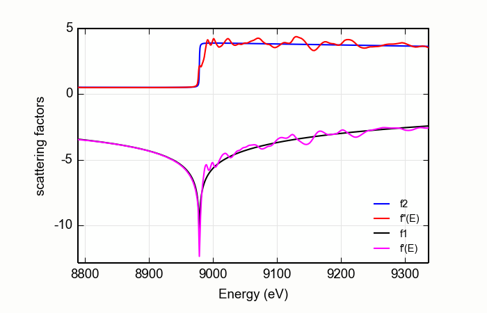
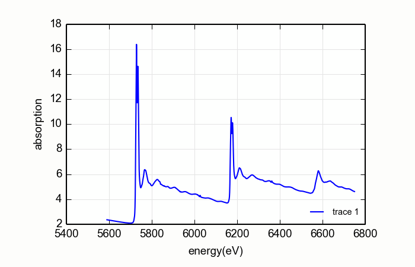
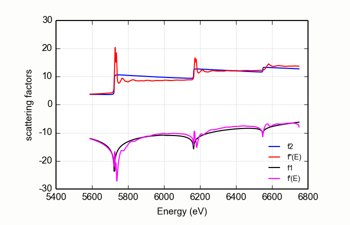
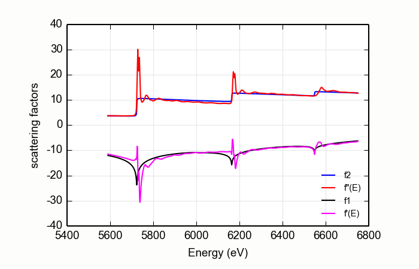

.. _xafs-diffkk_sec:

===========================================================
XAFS: Computing anomalous scattering factors from XAFS data
===========================================================

An input XAFS spectra is used to generate energy-dependent, anomalous
scattering factors.  This is used to improve upon the bare atom
anomalous scattering factors of :cite:`Cromer_Liberman`,
:cite:`Chantler`, and others near the absorption edge.

Since XAFS is sensitive to the atomic environment of the resonant atom
(through the variations of the absorption coefficient), the scattering
factors from the differential KK transform will also be sensitive to
the local atomic structure of the resonant atom.  These scattering
factors, which are sensitive to chemical state and atomic environment,
may be useful for many x-ray scattering and imaging experiments near
resonances.  The primary application is for the interpretation of
fixed-q absorption experiments, such diffraction anomalous
fine-structure (DAFS) or reflectively-EXAFS (sometimes known as
ReflEXAFS).

Overview of the diffKK implementation
~~~~~~~~~~~~~~~~~~~~~~~~~~~~~~~~~~~~~

This performs the same algorithm as the venerable DIFFKK program
described in :cite:`diffkk`.  This uses the MacLaurin series
algorithm to compute the differential (i.e. difference between the
data and the tabulated :math:`f''(E)`) Kramers-Kronig transform.  This
algorithm is described in :cite:`Ohta:88`.  This implementation
casts the MacLaurin series algorithm in vectorized form using NumPy,
so it is reasonably fast -- not quite as fast as the original Fortran
diffKK program, but certainly speedy enough for interactive data
processing.

The input :math:`\mu(E)` data are first matched to the tabulated
:math:`f''(E)` using the MBACK algorithm of :cite:`Weng` with an
option of using the modification proposed by :cite:`lee-xiang`.
This scales the measured :math:`\mu(E)` to the size of the tabulated
function and adjusts the overall slope of the data to best match the
tabulated value.  This is seen at the top of Figure
:numref:`fig-cu-diffkk`.

The difference between the scaled :math:`\mu(E)` and the tabulated
:math:`f''(E)` is then subjected to the KK transform.  The result is
added to the tabulated :math:`f'(E)` spectrum to produce the resulting
real part of the energy-dependent complex scattering factor.  This is
shown at the bottom of :numref:`fig-cu-diffkk`.

.. _fig-cu-diffkk:

    The anomalous scattering factors determined for copper metal from
    a copper foil, compared with the bare-atom, Cromer-Liberman values.

..  function:: diffkk(energy=None, mu=None, z=None, edge='K', mback_kws=None)

    create a diffKK Group.

    :param energy:    an array containing the energy axis of the measurement
    :param mu:        an array containing the measured :math:`\mu(E)`
    :param z:         the Z number of the absorber element
    :param edge:      the edge measured, usually K or L3
    :param mback_kws: arguments passed to the MBACK algorithm
    :returns:         a diffKK Group.

..  function:: diffkk.kk(energy=None, mu=None, z=None, edge='K', mback_kws=None)

    Perform the KK transform.

    :param energy:    an array containing the energy axis of the measurement
    :param mu:        an array containing the measured :math:`\mu(E)`
    :param z:         the Z number of the absorber element
    :param edge:      the edge measured, usually K or L3
    :param mback_kws: arguments passed to the MBACK algorithm
    :returns:         None

The following data is put into the diffKK group:

       ================= ===============================================================
        attribute         meaning
       ================= ===============================================================
        f2                array of tabulated :math:`f''(E)`
        f1                array of tabulated :math:`f'(E)`
        fpp               array of normalized :math:`f''(E)`
        fp                array of KK transformed :math:`f'(E)`
       ================= ===============================================================

All four arrays are on the same energy grid as the input data.

Here is an example script to make the figure shown above:

.. code:: python

  print 'Reading copper foil data'
  data=read_ascii('../xafsdata/cu_10k.xmu')
  dkk=diffkk(data.energy, data.mu, z=29, edge='K', mback_kws={'e0':8979, 'order':4})

  print 'Doing diff KK transform'
  dkk.kk()

  newplot(dkk.energy, dkk.f2, label='f2', xlabel='Energy (eV)', ylabel='scattering factors',
          show_legend=True, legend_loc='lr')
  plot(dkk.energy, dkk.fpp, label='f"(E)')
  plot(dkk.energy, dkk.f1,  label='f1')
  plot(dkk.energy, dkk.fp,  label='f\'(E)')

diffKK on L edge data
~~~~~~~~~~~~~~~~~~~~~

The diffKK method is fairly straightforward for K edge data.  The
algorithm for matching the measured :math:`\mu(E)` to the tabulated
:math:`f''(E)` works quite well over the entire data range, resulting
in a relatively unambiguous determination of :math:`f'(E)`.  The
situation for L edge data is a bit more complicated.

Consider the CeO\ :sub:`2`\ L edge data shown on the right on
:numref:`fig-CeO2-diffkk`.  For these data, the matching algorithm is
quite a bit more challenging, in part due to the very large spectral
weight underneath the white lines and in part because the step size
ratios in real data may not match the step size ratios in the
tabulated :math:`f'(E)`.

.. subfigstart::

.. _fig-ceo2-xafs:

    L edge data measured on CeO\ :sub:`2`

.. _fig-ceo2-notok:

    A poor stab at diffKK analysis of CeO\ :sub:`2`

.. _fig-ceo2-diffkk:

    A better stab at diffKK analysis of CeO\ :sub:`2`

.. subfigend::
    :width: .32
    :label: fig-ceo2-diffkkcomp

     DiffKK analysis of CeO\ :sub:`2`\  L edge data

These larch command created the plot in :numref:`fig-ceo2-notok`.

.. code:: python

  data=read_ascii('CeO2_L321.xmu')
  dkk=diffkk(data.e, data.xmu, z=58, edge='L3', mback_kws={'e0':5723, 'order':2})
  dkk.kk()

The large white lines of the L\ :sub:`3`\ and L\ :sub:`2`\ edges cause an
upwards slope in the function used to match the measured data to the
tabulated data.  This results in a suspicious :math:`f'(E)`.  The
situation is even worse when a higher order polynomial is used for
the normalization.

The situation is improved somewhat by a simple trick.

.. code:: python

  data=read_ascii('CeO2_L321.xmu')
  dkk=diffkk(data.e, data.xmu, z=58, edge='L3', mback_kws={'e0':5723, 'order':2, 'whiteline':20})
  dkk.kk()

The result is shown in :numref:`fig-ceo2-xafs`.  A margin is placed around
the L\ :sub:`3`\ and L\ :sub:`2`\ white lines.  The data from the white
line energies to 20 eV above are excluded when determining the matching
parameters.  This does a somewhat nicer job of forcing the flat parts of
measured data to match the tabulated data.

This seems to do a decent job of producing the :math:`f'(E)` data.
Still, this exposes a shortcoming of the diffKK algorithm for L edge
data.  This might be addressed by calculations of bare-atom scattering
factors that better estimate the step ratios of real material.
Another possibility is measurement of data over much longer data
ranges so that the matching algorithm can be made to do a good job far
away from the absorption edges.  Or perhaps a non-differential
algorithm would be more appropriate for L edge data.

