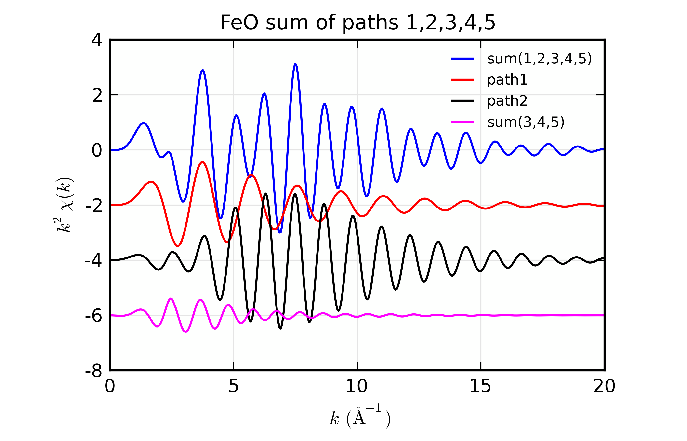
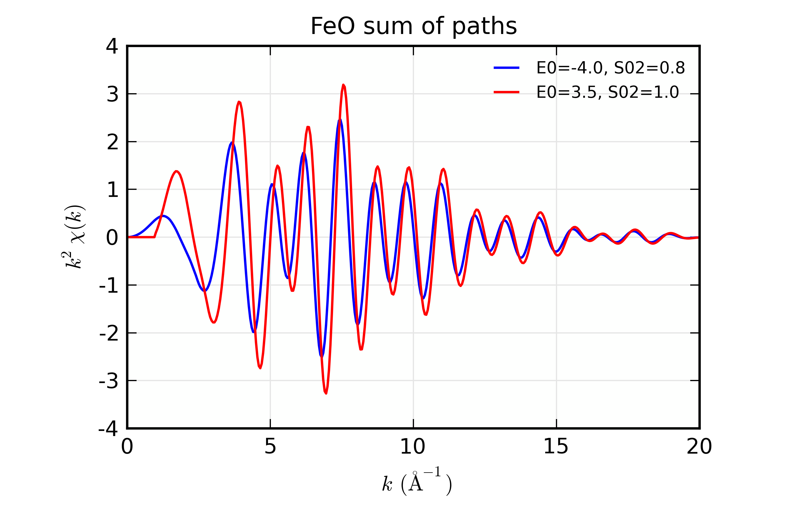

.. include:: _config.rst

.. _xafs-feffpaths_sec:

==============================================
XAFS: Reading and using Feff Paths
==============================================

.. _feff85exafs: https://github.com/xraypy/feff85exafs
.. _feff85exafs unit tests: https://github.com/xraypy/feff85exafs/tree/master/tests

For modeling EXAFS data, Larch relies heavily on calculations of
theoretical XAFS spectra using Feff.  Being able to run Feff and use its
results is of fundamental importance for using Larch for fitting EXAFS
spectra.  While a complete description of Feff (:cite:`feff6_Rehr`,
:cite:`feff6_siz`, :cite:`RehrAlbers_RMP`) is beyond the scope of this
documentation, here we describe how to read the results from Feff into
Larch.

The funcionality of Feff within Larch has been evolving to better
incorporate Feff8l into Larch.  Feff8L provideds a free version of Feff
Version 8.5 for EXAFS calculations (not XANES or other spectroscopies), and
is being developed in parallel to Larch at `feff85exafs`_
[#onfeff8_names]_. Part of the goal for this project is to replace Feff
Version 6l as a robust and easy-to-use EXAFS calculation engine for EXAFS
Analysis.  A larger goal for `feff85exafs`_ and Larch is to be able to
create the potentials and scattering factors needed for the EXAFS
calculation, and then to be able to use that to *dynamically* create EXAFS
scatternig paths with changing geometries.  This is a work-in-progress.  If
you're interested in exploring or helping with this, contact us!

The main interface for this is the :func:`feffpath` function that
reads *feffNNNN.dat* file and creates a FeffPath Group.

Running Feff
=====================

Larch comes with external programs for Feff6l and Feff8l, and provides two
simple functions for running the external Feff6l andFeff8l programs from
within Larch: :func:`feff6l` and :func:`feff8l`.  Note that the input files
for these two programs are similar but have important differences in syntax
such that the input for one cannot be used for running the other.

.. _feff6l_app:

Running Feff6l with :func:`feff6l`
~~~~~~~~~~~~~~~~~~~~~~~~~~~~~~~~~~~~~~

..  function:: feff6l(folder='.', feffinp='feff.inp', verbose=True)

    run Feff6 in the supplied folder.

    :param folder:   name of folder containing the Feff6 input file, and where to put the output files ['.', the current working directory]
    :param feffinp:   name of *feff.inp* file within the supplied folder ['feff.inp']
    :param verbose:   flag controlling screen output from Feff [True]
    :returns: a FeffRunner Group.

This will generate a number of outputs, including the *feffNNNN.dat* files
containing the data for each scattering path.

.. _feff8l_app:

Running Feff8l with :func:`feff8l`
~~~~~~~~~~~~~~~~~~~~~~~~~~~~~~~~~~~~~~

..  function:: feff8l(folder='.', feffinp='feff.inp', verbose=True)

    run Feff8L in the supplied folder.

    :param folder:   name of folder containing the Feff6 input file, and where to put the output files ['.', the current working directory]
    :param feffinp:   name of *feff.inp* file within the supplied folder ['feff.inp']
    :param verbose:   flag controlling screen output from Feff [True]
    :returns: a FeffRunner Group.

As with :func:`feff6l`, this will generate a number of outputs, including the *feffNNNN.dat* files
containing the data for each scattering path.

Running Feff8l with :func:`feffrunner`
~~~~~~~~~~~~~~~~~~~~~~~~~~~~~~~~~~~~~~~~~~

The incorporation of Feff8l in Larch is still in development, but is
ntended to make the executables from the `feff85exafs`_ package easy to use
and a seamless drop-in replacement for Feff6l. The FeffRunner tool is quite
flexible and can be used to run specific modules from `feff85exafs`_ or
other versions of Feff that you might have on your computer.

..  function:: feffrunner(feffinp=None, verbose=True, repo=None)

    create a FeffRunner Group from a *feff.inp* file.

    :param feffinp:   name (full path of) *feff.inp* file
    :param verbose:   flag controlling screen output from Feff [True]
    :param repo:      full path of the location of the Feff8l repository [None]
    :returns: a FeffRunner Group.

..  function:: feffrunner.run(exe)

    run Feff for FeffRunner Group.

    :param exe:   the name of the Feff program to be run [run all of Feff8l]
    :returns: None when Feff is run successfully or an Exception when a problem in encoiuntered

The simplest example of its use is

.. code:: python

   feff = feffrunner('path/to/feff.inp')
   feff.run()

The *feff.inp* file is specified when the Group is created, then
`feff85exafs`_ is run in the same folder as the *feff.inp* file.  In
this case, since no argument is given to the *run()* method, the
various modules of `feff85exafs`_ are run in sequence.  This behaves
much like the monolithic Feff executables of yore.

The `feff85exafs`_ modules (*rdinp*, *pot*, *xsph*, *pathfinder*,
*genfmt*, and *ff2x*) can be be run individually

.. code:: python

   feff = feffrunner('path/to/feff.inp')
   feff.run('rdinp')
   feff.run('pot')
   ## and so on ...

To specifically use the `feff85exafs`_ modules from a local copy of
the feff8l repository, do

.. code:: python

   feff = feffrunner('path/to/feff.inp')
   feff.repo = '/home/bruce/git/feff85exafs'
   feff.run()

The ``repo`` attribute is used when working on `feff85exafs`_ itself.
For example, the `feff85exafs unit tests`_ set the ``repo`` attribute
so that the just-compiled versions of the programs get used.

If you have an executable for some other version of Feff in a location
that in your shell's execution path and it is called something like
*feff6*, *feff7*, or any other name than begins with *feff*, that can
be run as

.. code:: python

   feff = feffrunner('path/to/feff.inp')
   feff.run('feff6') # or whatever your executable is called

If the *_xafs._feff_executable* symbol in Larch's symbol table is set
to a valid executable, then you can use that by doing

.. code:: python

   feff = feffrunner('path/to/feff.inp')
   feff.run(None)

The *feff.inp* file need not be called by that name.  FeffRunner will
copy the specified file to *feff.inp* in the specified folder --
taking care **not** to clobber an existing *feff.inp* file -- before
running Feff.  Once finished, it will copy files back to their
original names.

A log file called *f85e.log* is written in the same folder as the
*feff.inp*.  This log file captures all of the screen output (both
STDOUT and STDERR) from Feff.

The full structure of the FeffRunner group looks something like this::

    == External Feff Group: Copper/testrun/feff.inp: 5 symbols ==
      feffinp: 'Copper/testrun/feff.inp'
      repo: None
      resolved: '/usr/local/bin/ff2x'
      run: <bound method FeffRunner.run of <External Feff Group: Copper/testrun/feff.inp>>
      verbose: True

The ``resolved`` attribute has the fully resolved path to the most
recently run executable.  This can be used to verify that the
logic for executable resolution described above worked as intended.

:func:`feffpath` and FeffPath Groups
=======================================

The outputs from Feff for each path are complicated enough to need a
structured organization of data.  This is accomplished by providing a
special kind of a Larch Group -- a FeffPath Group which holds all the
information about a Feff Path, including the photo-electron scattering
amplitudes and phase-shifts needed to describe and calculate the EXAFS for
that Path.  A FeffPath Group is created with the :func:`feffpath`
group. For many uses a Feff Path can be treated as a "black box", and
simply setting the adjustable Path Parameters and passing around these
Groups is sufficient for simulating and fitting EXAFS spectra.

At times it can be helpful to inspect and study the detailed components of
the Feff Path.  Since a FeffPath Group is a regular Larch Group, all the
data can be read and viewed.  A FeffPath Group has the components listed in
the :ref:`Table of Feff Path Parameters <xafs-pathparams_table>`.  This
includes the *Adjustable Numerical Path Parameters* -- the values of which
can be changed to affect the calculated EXAFS for the Path -- as well as
the arrays for :math:`k` and :math:`\chi` and several other attributes.
Since this Group is used to calculate :math:`\chi(k)` for the path, many of
the components need to be in place and holding the expected values so that
the calculation can be done correctly, Due to Larch's flexibility, it is
possible to delete, overwrite, or put inappropriate values into the
components of a FeffPath Group, and care must be taken to avoid this.

.. index:: Feff Path Parameters

.. _xafs-pathparams_table:

    Table of FeffPath Parameters, including the Path
    Parameters used in the EXAFS equation.  The attributes here are
    arranged by category.  The *Info* attributes are informational only.
    The two *Numerical* attributes ``reff`` and ``nleg`` are used in the
    EXAFS equation but are meant to be constants and their values should
    not be changed.  The *Adjustable* attributes are the standard
    Adjustable, Numerical Path Parameters that can be changed to affect the
    resulting EXAFS :math:`\chi(k)`.  These can be set either as constant
    values or fitting Parameters as defined by :func:`_math.param`.  The
    *Output array* attributes are the arrays output from :func:`path2chi`.
    Finally, the sub-group ``_feffdat`` contains the low-level data as read
    directly from the *feffNNNN.dat* file, which is detailed in the next
    section, :ref:`xafs-feffdat_sec`.

    +-----------------+-----------------+----------------------------------------------------+
    | attribute name  | category        | description                                        |
    +=================+=================+====================================================+
    |   filename      |  Info           | name of *feffNNNN.dat* file                        |
    +-----------------+-----------------+----------------------------------------------------+
    |   label         |  Info           | path description                                   |
    +-----------------+-----------------+----------------------------------------------------+
    |   geom          |  Info           | path geometry: list of (symbol, ipot, x, y, z)     |
    +-----------------+-----------------+----------------------------------------------------+
    |   reff          |  Numerical      | :math:`R_{\rm eff}`, nominal path length           |
    +-----------------+-----------------+----------------------------------------------------+
    |   nleg          |  Numerical      | number of path legs (1+number of scatterers)       |
    +-----------------+-----------------+----------------------------------------------------+
    |   degen         |  Adjustable     | :math:`N`, path degeneracy                         |
    +-----------------+-----------------+----------------------------------------------------+
    |   s02           |  Adjustable     | :math:`S_0^2`, amplitude reduction factor          |
    +-----------------+-----------------+----------------------------------------------------+
    |   e0            |  Adjustable     | :math:`E_0`, energy origin                         |
    +-----------------+-----------------+----------------------------------------------------+
    |   deltar        |  Adjustable     | :math:`\Delta R`, shift in path length             |
    +-----------------+-----------------+----------------------------------------------------+
    |   sigma2        |  Adjustable     | :math:`\sigma^2`, mean-square displacement         |
    +-----------------+-----------------+----------------------------------------------------+
    |   third         |  Adjustable     | :math:`c_3`,  third cumulant                       |
    +-----------------+-----------------+----------------------------------------------------+
    |   fourth        |  Adjustable     | :math:`c_4`, the fourth cumulant                   |
    +-----------------+-----------------+----------------------------------------------------+
    |   ei            |  Adjustable     | :math:`E_i`, imaginary energy shift.               |
    +-----------------+-----------------+----------------------------------------------------+
    |   k             |  Output array   | :math:`k`, photo-electron wavenumber               |
    +-----------------+-----------------+----------------------------------------------------+
    |   chi           |  Output array   | :math:`\chi`, the EXAFS                            |
    +-----------------+-----------------+----------------------------------------------------+
    |   chi_imag      |  Output array   | :math:`\rm{Im}(\chi)`, imaginary EXAFS             |
    +-----------------+-----------------+----------------------------------------------------+
    |   p             |  Output array   | :math:`p`, complex photo-electron wavenumber       |
    +-----------------+-----------------+----------------------------------------------------+
    |   _feffdat      |  Group          | a Group containing raw data from *feffNNNN.dat*    |
    +-----------------+-----------------+----------------------------------------------------+

..  function:: feffpath(filename, label=None, s02=None, degen=None, e0=None, deltar=None, sigma2=None, ...)

    create a FeffPath Group from a *feffNNNN.dat* file.

    :param filename:  name (full path of) *feffNNNN.dat* file
    :param label:     label for path   [file name]
    :param degen:     path degeneracy, :math:`N` [taken from file]
    :param s02:       :math:`S_0^2`    value or parameter [1.0]
    :param e0:        :math:`E_0`      value or parameter [0.0]
    :param deltar:    :math:`\Delta R` value or parameter [0.0]
    :param sigma2:    :math:`\sigma^2` value or parameter [0.0]
    :param third:     :math:`c_3`      value or parameter [0.0]
    :param fourth:    :math:`c_4`      value or parameter [0.0]
    :param ei:        :math:`E_i`      value or parameter [0.0]
    :returns: a FeffPath Group.

For all the options described above with **value or parameter** either a
numerical value or a Parameter (as created by :func:`_math.param`) can be given.

:func:`path2chi` and :func:`ff2chi`: Generating :math:`\chi(k)` for a FeffPath
================================================================================

..  function:: path2chi(path, paramgroup=None, kmax=None, kstep=0.05, k=None)

    calculate :math:`\chi(k)` for a single Feff Path.

    :param path:        a FeffPath Group
    :param paramgroup:  a Parameter Group for calculating Path Parameters [``None``]
    :param kmax:        maximum :math:`k` value for :math:`\chi` calculation [20].
    :param kstep:       step in :math:`k` value for :math:`\chi` calculation [0.05].
    :param k:           explicit array of :math:`k` values to calculate :math:`\chi`.
    :returns: ``None``

If ``k`` is specified, that will be used as the set of :math:`k` values at which
to calculate :math:`\chi`.  If not given, the values of ``kstep`` and ``kmax``
will be used to construct a uniformly-spaced array of :math:`k` values starting
at 0 and extending to (and including) ``kmax``.

The calculated :math:`\chi` array is placed in the Feff Path Group ``path`` as
``path.chi``.  In addition calculated arrays for :math:`k`, :math:`p`, and
:math:`\rm{Im}(\chi)` are placed in the variables ``path.k``, ``path.p``, and
``path.chi_imag``, respectively.  See :ref:`xafs-exafsequation_sec` for the
detailed definitions of the quantities.

If specified, ``paramgroup`` is used as the Parameter Group -- the group
used for evaluating parameter expressions (ie, constraints using named
variables).  This is similar to the use for :func:`_math.minimize` as discussed
in :ref:`fitting-parameters_sec`.

..  function:: ff2chi(pathlist, paramgroup=None, group=None, k=None, kmax=None, kstep=0.05)

    sum the :math:`\chi(k)` for a list of FeffPath Groups.

    :param pathlist:    a list of FeffPath Groups
    :param paramgroup:  a Parameter Group for calculating Path Parameters [``None``]
    :param group:       a Group to which the outputs are written  [``None``]
    :param kmax:        maximum :math:`k` value for :math:`\chi` calculation [20].
    :param kstep:       step in :math:`k` value for :math:`\chi` calculation [0.05].
    :param k:           explicit array of :math:`k` values to calculate :math:`\chi`.
    :returns: ``None``

This essentially calls :func:`path2chi` for each of the paths in the
``pathlist`` and writes the resulting arrays for :math:`k` and :math:`\chi` the
sum of :math:`\chi` for all the paths) to ``group.k`` and ``group.chi``.

.. index:: _feffdat File Group

.. _xafs-feffdat_sec:

The _feffdat Group: Full Details of the Feff.Dat File
===========================================================

Each FeffPath Group will have a ``_feffdat`` sub-group which contains the
data from the underlying *feffNNNN.dat* file for the results of the Feff
calculation.  Many of the components of this group are used for the
calculations of :math:`\chi(k)` for that Path, though some (such as
``exch`` and ``edge``) are kept only for informational purposes.  Some
components from this sub-group (notably as ``geom`` and ``nleg``) are
copied into the FeffPath Group.  As with the FeffPath Group, this Group has
an expected set of components that should be treated as read-only unless
you really know what you're doing.

.. _xafs-feffdat_table:

    Table of Feff.dat components.  Listed here is the component read from
    the Feff.dat file and stored in the ``_feffdat`` group for each FeffPath.

    ================= =====================================================================
     attribute          description
    ================= =====================================================================
       amp               array: total amplitude,   :math:`F_{\rm eff}(k)`
       degen             path degeneracy (coordination number)
       edge              energy threshold relative to atomic valu (a poor estimate)
       exch              string describing electronic exchange model
       filename          File name
       gam_ch            core level energy width
       geom              path geometry: list of (Symbol, Z, ipot, x, y, z)
       k                 array: k values, :math:`k_{\rm feff}`
       kf                k value at Fermi level
       lam               array: mean-free path,  :math:`\lambda(k)`
       mag_feff          array: magnitude of Feff
       mu                Fermi level, eV
       pha               array: total phase shift, :math:`\delta(k)`
       pha_feff          array: scattring phase shift
       potentials        path potentials: list of (ipot, z, r_MuffinTin, r_Norman)
       real_phc          array: central atom phase shift
       red_fact          array: amplitude reduction factor
       rep               array: real part of p, :math:`p_{\rm real}(k)`
       rnorman           Norman radius
       rs_int            interstitial radius
       title             user title
       version           Feff version
       vint              interstitial potential
    ================= =====================================================================

The arrays from the data columns of the Feff data file break up the
amplitude and phase into two components (essentially as one for the central
atom and one for the scattering atoms) that are simply added together.
Thus ``amp`` = ``red_fact`` + ``mag_feff`` and the sum is used as
:math:`F_{\rm eff}(k)`.  Similarly, ``pha`` = ``real_phc`` + ``pha_feff``
and the sum is used as :math:`\delta(k)`.

.. index:: EXAFS Equation with Feff

.. _xafs-exafsequation_sec:

The EXAFS Equation using Feff and FeffPath Groups
===========================================================

Now we are ready to write down the full EXAFS equation used for a Feff Path
using the terms defined above in the
:ref:`Table of Feff Path Parameters <xafs-pathparams_table>`
and the :ref:`Table of Feff.Dat Components
<xafs-feffdat_table>`.  One of the trickier concepts is that we are
evaluating at experimental values of :math:`k` while the Feff calculation
is tabulated on its own set of :math:`k` values and we may need to apply an
energy shift of :math:`E_0` to the Feff calculation.  Thus, first we find
:math:`k` as

.. math::
    k = \sqrt{k_{\rm feff}^2  - {2m_e E_0}/{\hbar^2} }

where :math:`E_0` is taken from the ``e0`` parameter and :math:`k_{\rm
feff}` are the :math:`k` values from Feff (``_feffdat.k``).  This shifted
:math:`k` will be used to access the :math:`k` dependent values from the
Feff arrays.  Next, we note that we need the complex wavenumber, defined as

.. math::
   p = p' + i p'' = \sqrt{ \big[ p_{\rm real}(k) - i / \lambda(k) \big]^2 - i \,
	2 m_e E_i /{\hbar^2} }

where :math:`p_{\rm real}` and :math:`\lambda` are the values from Feff
(``_feffdat.rep`` and ``_feffdat.lam``) and :math:`E_i` is the complex energy
shift from the parameter ``ei``.  Note that :math:`i` is used as the complex
number following the physics literature, while within Larch ``1j`` is used.
The complex wavenumber :math:`p` includes a self-energy term (due to the
presence of multiple electrons in the system) and is meant to be referenced
to the absorption threshod while :math:`k` is meant to be referenced to the
Fermi level.  Thus :math:`p_{\rm real} \approx \Sigma + k`, where
:math:`\Sigma` is a small but usually positive offset.  Within the EXAFS
equation, :math:`k` is used to restore the calculation of :math:`\chi(k)` as
done by Feff, while :math:`p` is used to apply alterations to :math:`\chi(k)`
as for disorder terms.

The EXAFS equation used for constructing :math:`\chi(k)` from a Feff
calculation is then

.. math::
   :nowrap:

   \begin{eqnarray*}
   \chi(k) = & {\rm Im}\Bigl[
      {\displaystyle{
	      \frac{f_{\rm eff}(k) N S_0^2} {k(R_{\rm eff} + \Delta R)^2} }
	     \exp(-2p''R_{\rm reff} - 2p^2\sigma^2 +
	    \textstyle{\frac{2}{3}}p^4 c_4)}  \hspace{18mm} \,\, \\
	    &{\times  \exp \bigl\{ i\big[  2kR_{\rm eff} + \delta(k)
	    + 2p(\Delta R - 2\sigma^2/R_{\rm eff} )
	    - \textstyle{\frac{4}{3}} p^3 c_3  \big]  \bigr\} }
	   \Bigr]    \\
   \end{eqnarray*}

where the terms are all defined above. Again, note that :math:`k` is used to
reconstruct the unaltered EXAFS from the Feff.dat file, and the complex
:math:`p` is used for the terms adding the effects of disorder.  Also note
that :math:`p''` becomes :math:`\lambda(k)` for :math:`E_i = 0`, and is the
generalization of the mean-free-path contribution.  The terms :math:`\Delta
R`, :math:`\sigma^2`, :math:`c_3`, and :math:`c_4` are the first four
cumulants of the atomic pair distribution for the selected path. The
additional term :math:`-2p(2\sigma^2/R_{\rm eff})` in the phase is a
correction to the cumulant expansion due to the averaging over the
:math:`1/R^2` term in the EXAFS equation.

The use of the cumulant expansion here does not necessarily imply that
systems must be ordered enough for their atomic distributios to modeled by
the cumulant expansion.  All that is required is that contribution from each
path be ordered enough for the cumulant expansion to work.  A highly
disordered system can be modeled by applying a more complex weighting to a
set of paths -- that is, a histogram of paths.

.. index:: Einstein Model for sigma2
.. index:: Correlated Debye Model for sigma2

.. _xafs-sigma2calcs_sec:

Models for Calculating :math:`\sigma^2`
===========================================================

The value for :math:`\sigma^2` in the EXAFS equation gets a lot of
attention in the EXAFS literature, as it is often the only term used to
account for thermal and static disorder in an ensemble of Paths that makes
up a full EXAFS spectra.  Borrowing from Feff (see :cite:`feff6_Rehr`,
:cite:`Sevillano` and :cite:`RehrAlbers_RMP`) Larch provides two functions
that use simple models to calculate :math:`\sigma^2` for a Path.  Both
functions, :func:`sigma2_eins` and :func:`sigma2_debye` take arguments of
sample temperature, a characteristic temperature, and a FeffPath, and
return a value of :math:`\sigma^2`.  These are known to appy reasonably
well to very simple systems (such as metals and solids with few atomic
components), and less well to complex systems, including anything with
organic ligands.

..versionchanged:: 0.9.34
    removed `_sys.paramGroup`, now using `fiteval`

..  function:: sigma2_eins(t, theta)

    calculate :math:`\sigma^2` in the Einstein model.

    :param t:      sample temperature (in K)
    :param theta:  Einstein temperature (in K)
    :param path:   a FeffPath Group  [``None``]

The `path` argument can be left ``None``.  This will try to use the
''current FeffData group", (`_sys.fiteval.symtable._feffdat`), which is
updated during fits with :func:`feffit` and when summing paths with
:func:`ff2chi`.

..  function:: sigma2_debye(t, theta, path=None)

    calculate :math:`\sigma^2` in the Debye model.

    :param t:      sample temperature (in K)
    :param theta:  Debye temperature (in K)
    :param path:   a FeffPath Group  [``None``]

As with :func:`sigma2_eins, the `path` argument can be left ``None``, and the
''current FeffData group", (`_sys.fiteval.symtable._feffdat`), will be used.

Example:  Reading a Feff file
===========================================================

Here we simply read a *feffNNNN.dat* file and display its components, and
calculate :math:`\chi` for this path with two different values of
:math:`\sigma^2`.

.. literalinclude:: ../examples/feffit/doc_feffdat1.lar

The output of this looks like this::

    == FeffPath Group feff0001.dat: 16 symbols ==
      _feffdat: <Feff.dat File Group: feff0001.dat>
      chi: array<shape=(401,), type=dtype('float64')>
      chi_imag: array<shape=(401,), type=dtype('float64')>
      degen: 12.0
      deltar: 0
      e0: 0
      ei: 0
      filename: 'feff0001.dat'
      fourth: 0
      geom: [('Cu', 29, 0, 0.0, 0.0, 0.0), ('Cu', 29, 1, 0.0, -1.8016, 1.8016)]
      k: array<shape=(401,), type=dtype('float64')>
      label: 'feff0001.dat'
      p: array<shape=(401,), type=dtype('complex128')>
      s02: 1
      sigma2: 0
      third: 0

After the initial read, the values of ``k``, ``p``, ``chi``, and
``chi_imag`` are set to ``None``, and are not calculated until
:func:`path2chi` is called.

.. _xafs_fig12:

.. figure::  _images/feffdat_example1.png
    :target: _images/feffdat_example1.png
    :width: 65%
    :align: center

    Calculations of :math:`\chi(k)` for a Feff Path.

We can also use the data from the ``_feffdat`` group to look at the
individual scattering components.  Thus to look at the scattering amplitude
and mean-free-path for a particular scattering path, you could use a script
like this:

.. literalinclude:: ../examples/feffit/doc_feffdat2.lar

which will produce a plot like this:

.. _xafs_fig13:

.. figure::  _images/feffdat_example2.png
    :target: _images/feffdat_example2.png
    :width: 65%
    :align: center

    Components of ``_feffdat`` group for a Feff Path.

You can see here that the arrays in the ``_feffdat`` group are sampled at
varying :math:`k` spacing, and that this spacing becomes fairly large at
high :math:`k`.

Example:  Adding Feff files
===========================================================

Now, we add some Feff files together, applying some path parameters.  The
example is actually very similar to the one above except that we use
:func:`ff2chi` to create a :math:`\chi(k)` from a list of paths, and put
the result into its own group.  Thus:

.. literalinclude:: ../examples/feffit/doc_feffdat3.lar

With the result as shown below.  Note that we can also make a simple sum of
a set of paths, which was done in this example to add the contributions of
paths 3, 4, and 5.  This works because :func:`ff2chi` runs :func:`path2chi`
for each path to be summed, so that the ``chi`` component of the FeffPath
group is up to date.

.. _xafs_fig14:

    Results for sum of :math:`\chi(k)` for list of paths.

Example: Using Path Parameters when adding Feff files
===========================================================

Using :ref:`Parameters <fitting-parameters_sec>` for modelling data is a
key feature of Larch, and if you are modelling XAFS data with Feff, you
will want to parameterize Path Parameters, apply them to a set of Paths,
and investigate the resulting sum of Paths.    This is similar to the
examples above, but combines the Parameter concept from the Fitting
chapter.  In Larch, this looks like:

.. literalinclude:: ../examples/feffit/doc_feffdat4.lar

After reading in the Feff data files, we have created a group ``pars`` of
Parameters with :func:`_math.param`, specifically ``pars.del_e0`` and
``pars.amp``.   Then we set the ``e0`` path parameter for each path to the
string ``'del_e0'``, and the ``amp`` path parameter to ``'amp'``.   We set
the ``sigma2`` values to simple numbers, as above.

Now, when running :func:`ff2chi`, we give not only a ``group`` to put the
results in, but also a ``paramgroup`` to use as the parameters for
evaluating any mathematical expressions we've defined for the path
parameters.   At this point, the strings ``del_e0`` and ``amp`` for the
path parameters for path 1 and 2 are converted into Parameters and
evaluated.

..versionchanged:: 0.9.34
    removed `_sys.paramGroup`, now using `fiteval`

.. index:: _sys.fiteval with Feff paths

After plotting the results, we then change the values of the parameters.
We could re-run :func:`ff2chi`, but we can also just run :func:`path2chi`
on the paths for which we want to recalculate :math:`\chi`.  Note that we
specify the ``paramgroup`` to :func:`path2chi` here.

.. _xafs_fig15:

    Results for making 2 different sums of paths using parameterized Path
    Parameters

The resulting plot shows the effect of changing :math:`E_0` and
:math:`S_0^2` for a sum of paths.  The same result could be shown by just
setting the path parameters to the appropriate numerical values, but the
use of parameters makes this somewhat more general.  As we will see in the
next section, the use of parameters also allows us to easily refine their
values in a fit of XAFS data to such a sum of paths.

.. rubric:: Footnotes

.. [#onfeff8_names] There have been several names used for "Free version of
   Feff Version 8.5 for EXAFS only", including `Feff8l`, `Feff8lite`,
   `Feff85exafs`.  These all refer to the same project and code, which is
   based on but distinct from the Feff 8 and 9 from the University of
   Washington group in that the free version can calculate only EXAFS.
