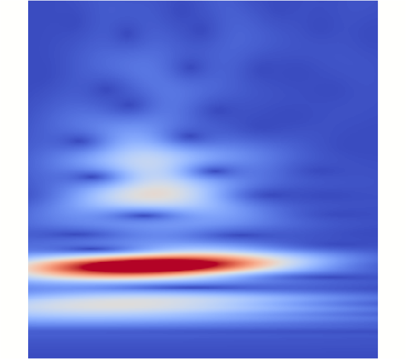
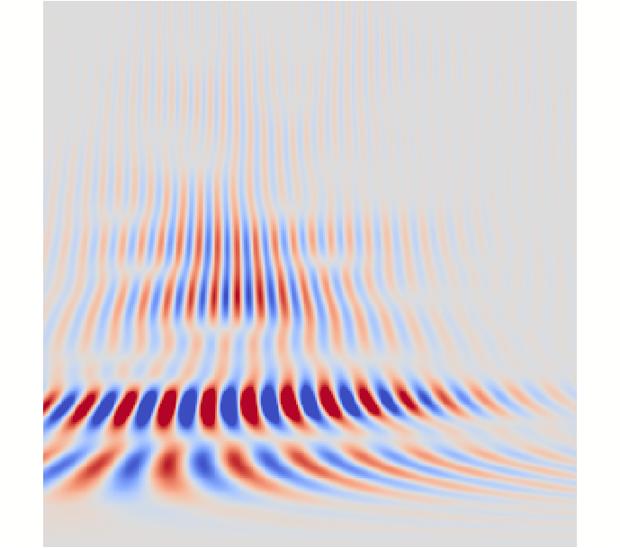
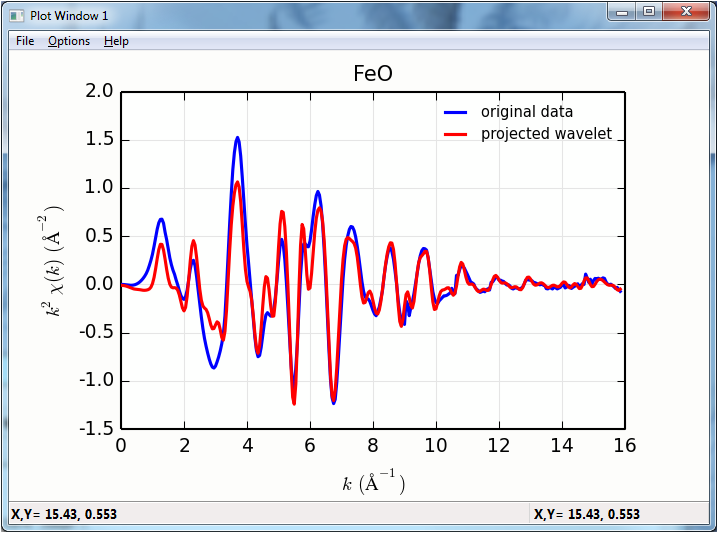

.. include:: _config.rst

.. _xafs-wavelet_sec:

==============================================
XAFS: Wavelet Transforms for XAFS
==============================================

`Wavelet transforms`_ extend Fourier transforms, effectively separating
contributions of a waveform into both time and frequency (or, for EXAFS,
:math:`k` and :math:`R`).  A variety of mathematical kernels can be used
for wavelet transforms.  There are a few examples in the literature of
applying wavelet transforms to EXAFS data, with the Cauchy wavelet used by
Munoz *et al* :cite:`munoz_wavelet` being one early application.   The
:func:`cauchy_wavelet` function described below follows this work,  and
that article should be cited as the reference for this transform.

:func:`cauchy_wavelet`
~~~~~~~~~~~~~~~~~~~~~~~~~~~~~~~~~~~~~~~~~~~~~~~~~~~~~~~~~~~~~

The Continuous Cauchy Wavelet transform of Munoz *et al* :cite:`munoz_wavelet`
is implemented as the function :func:`cauchy_wavelet`:

..  function:: cauchy_wavelet(k, chi, group=None, kweight=0, rmax_out=10)

    perform a Continuous Cauchy wavelet transform of :math:`\chi(k)`.

    :param k:        1-d array of photo-electron wavenumber in :math:`\rm\AA^{-1}`
    :param chi:      1-d array of :math:`\chi`
    :param group:    output Group
    :param rmax_out: highest *R* for output data (10 :math:`\rm\AA`)
    :param kweight:  exponent for weighting spectra by :math:`k^{\rm kweight}`
    :param nfft:     value to use for :math:`N_{\rm fft}` (2048).

    :returns:  ``None`` -- outputs are written to supplied group.

    If a ``group`` argument is provided of if the first argument is a
    Group, the following data arrays are put into it:

       ================= ===============================================================
	array name         meaning
       ================= ===============================================================
	r                  uniform array of :math:`R`, out to ``rmax_out``.
	wcauchy            complex array cauchy transform of :math:`R` and :math:`k`
	wcaychy_mag        magnitude of cauchy transform
	wcauchy_re         real part of cauchy transform
	wcauchy_im         imaginary part of cauchy transform
       ================= ===============================================================

    It is expected that the input ``k`` be a uniformly spaced array of
    values with spacing ``kstep``, starting a 0.

Wavelet Example
~~~~~~~~~~~~~~~~~~~~~~~~~~~~~~~~~~~~~

Applying the Cauchy wavelet transform to Fe K-edge data of FeO is fairly
straightforward:

.. literalinclude:: ../examples/xafs/wavelet_example.lar

With results for the Cauchy transforms looking like (here, :math:`k`\ is
along the horizontal axis extending to 16 :math:`\rm\AA^{-1}`, and with
:math:`R` along the vertical axis, increasing from 0 at the bottom to 10
:math:`\rm\AA` at the top.

.. subfigstart::

.. _fig-xafswt_1:

.. _fig-xafswt_2:

.. subfigend::
    :width: 0.45
    :label: fig-xafswt

    The Cauchy Wavelet transforms, with magnitude on the left hand panel
    and real part on the right hand panel.

The projection of the wavelets to :math:`k` and :math:`R` space looks like:

.. subfigstart::

.. _fig-xafswt_3:

.. _fig-xafswt_4:

.. figure::  _images/xwt_rsp.png
    :target: _images/xwt_rsp.png
    :width: 100%

.. subfigend::
    :width: 0.45
    :label: fig-xafswt3

    The Cauchy Wavelet transform projected to :math:`k` and :math:`R`
    space.  In the left hand panel, the original EXAFS :math:`k^2\chi(k)`
    is shown for comparison.
