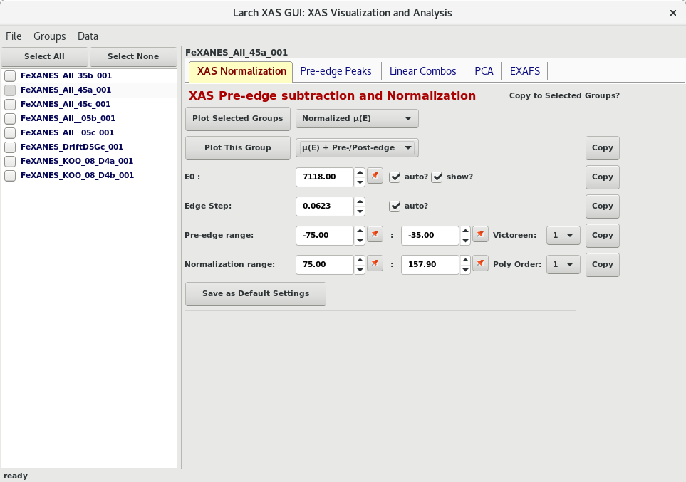
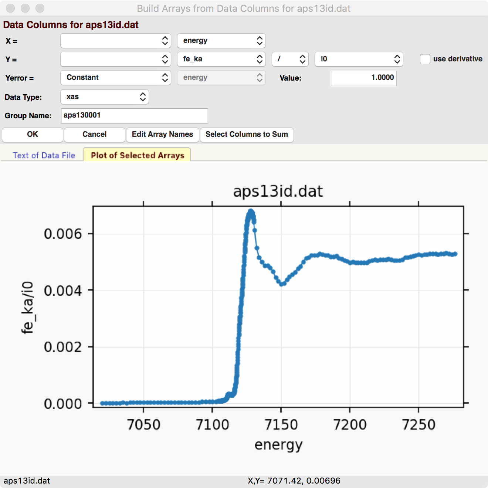
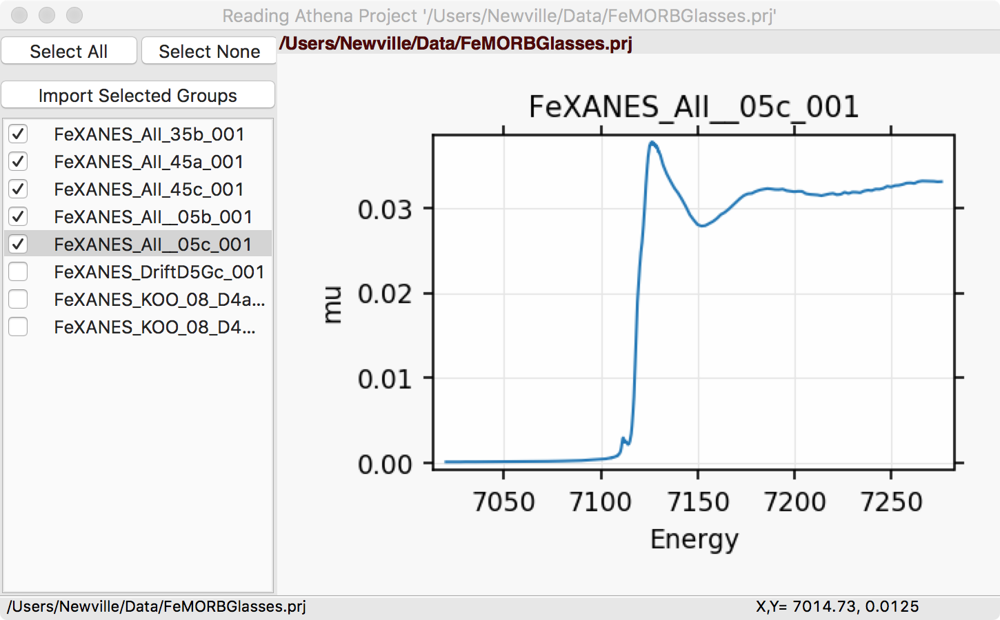
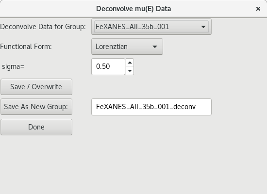
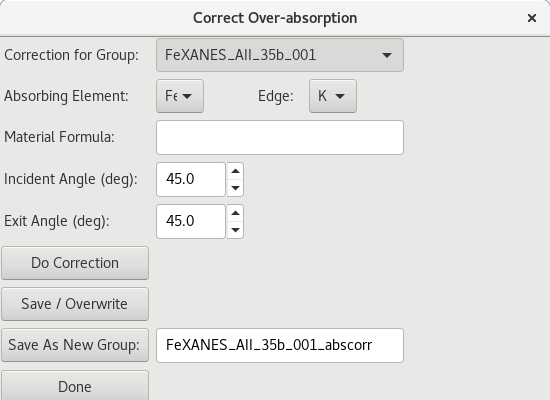
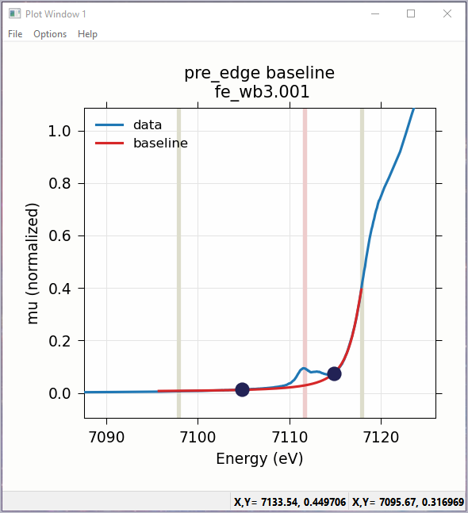
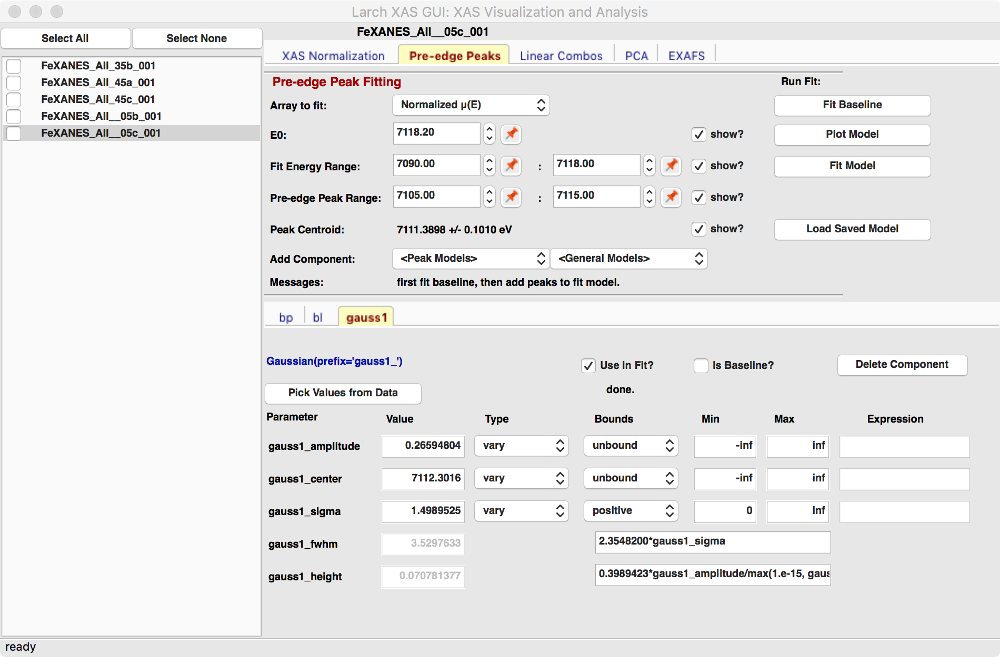
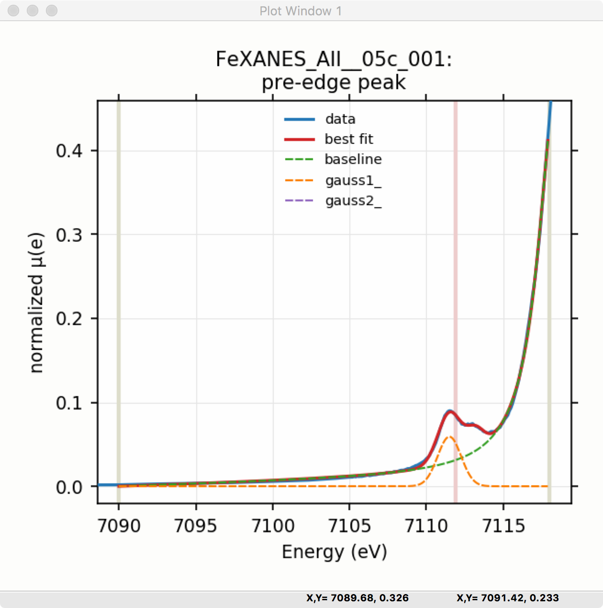
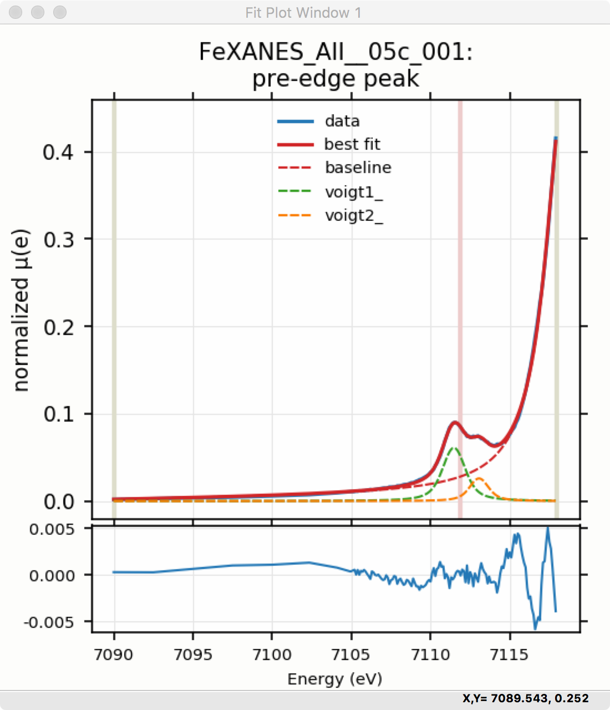
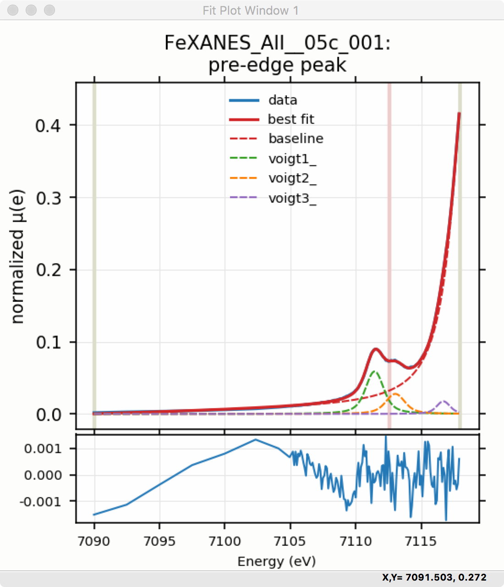

.. _lmfit:    http://lmfit.github.io/lmfit-py

.. |pin| image:: ../_images/pin_icon.png
    :width: 18pt
    :height: 18pt

.. _xasviewer_app:

XASViewer
=======================

The XASViewer GUI uses Larch to read and display XAFS spectra.  This
application is still in active development, with more features planned with
special emphasis on helping users with XANES analysis.  Current features
(as of July, 2018, Larch version 0.9.40) include:

   * read XAFS spectra from simple data column files or Athena Project Files.
   * XAFS pre-edge removal and normalization.
   * visualization of normalization steps.
   * data merging
   * data de-glitching, and energy recalibration
   * data smoothing, rebinning, and deconvolution.
   * over-absorption corrections (for XANES)
   * linear combination analysis of spectra.
   * pre-edge peak fitting.
   * saving of data to Athena Project files.
   * saving of data to CSV files.

The XAS Viewer GUI includes a simple form for basic pre-edge subtraction,
and normalization of XAFS spectra. :numref:`fig_xasviewer_1` shows the main
window for the XAS Viewer program.  The left-hand portion contains a list
of files (or data groups) that have been read into the program either from
individual ASCII column files or Athena Project files.  Clicking on the
file or group name makes that "the current data group", while checking the
boxes next to each name will select multiple files or group.  Buttons at
the top of the list of files can be used to "Select All" or "Select None".
Right-clicking on the file list will pop up a menu that allows more
detailed selecting of data sets.

.. _fig_xasviewer_1:

    XASViewer showing the File/Group list on the left-hand side and the
    the XAFS pre-edge subtraction and normalization panel on the right.

The right-hand portion of the XAS Viewer window shows multiple forms for
more specialized XAFS data processing tasks, each on a separate Notebook
tab.  These will be covered in more detail in sections below. The default
panel shown is for pre-edge subtraction and normalization
(:ref:`xasviewer_preedge`), with other available tabs for fitting pre-edge
peaks (:ref:`xasviewer_peakfit`), Linear Combination Analysis
(:ref:`xasviewer_lincombo`),
Principal Component Analysis (:ref:`xasviewer_pca`),
Advanced Linear Regression (:ref:`xasviewer_regression`),
and EXAFS Analysis (:ref:`xasviewer_exafs_bkg` and
:ref:`xasviewer_exafs_fft`).

There are a few important general notes to mention about XAS Viewer before
going into more detail about how to use it.  First, XAS Viewer is somewhat
new, and in active development.  If you find problems with it or unexpected
or missing functionality, please let us know.  Second, XAS Viewer has many
features, functionality, and concepts in common with Athena and
Sixpack. This is intentional, as we intend XAS Viewer to be a useful
alternative to these applications, possibly with new or better features but
also without requiring too much relearning of concepts or workflow.  As an
important example of this compatibility, XAS Viewer can read in and import
data from Athena Project files, and can save these project files as well,
so that if you have lots of data organized with Athena Project Files, you
can use XAS Viewer and Athena on the same datasets.  This aim for
compatibility also means that if you find features to be missing or
different from how Athena or Sixpack work, let us know.

As a GUI, XAS Viewer is intended to make data processing analysis easy and
intuitive. As a Larch application it is also intended to enable more
complex analysis, batch processing, and scripting of analysis tasks.  To do
this, essentially all the real processing work, including most of the
plotting of data, in XAS Viewer is done through the Larch Buffer (as shown
in :ref:`larchgui_app`) which records the commands that it executes.  If,
at any point you want to know exactly what XAS Viewer is "really doing",
you can open the Larch Buffer and see the commands being executed.  You can
also copy the code from the Larch buffer to reproduce the analysis steps,
or modify into procedures for batch processing with the Larch scripting
language or with Python.

XAS Viewer will display many different datasets as 2-d line plots.  As with
all such plots made with Larch (see :ref:`plotting-chapter`), these are
highly interactive, customizable, and can produce publication-quality
images.  The plots can be zoomed in and out, and can be configured to
change the colors, linestyles, margins, text for labels, and more. From any
plot window you can use Ctrl-C to copy the image to the clipboard, Ctrl-S
to Save the image as PNG file, or Ctrl-P to print the image with your
systems printer. Ctrl-K will bring up a window with forms to configure the
colors, text, styles and so on. These common options are available from the
File and Options menu of the plotting window.

In particular, clicking on the legend for any labeled curve on a plot will
toggle whether that curve is displayed and partially lighten the label
itself.  This feature of the plotting window means that XAS Viewer may draw
several different traces on the same plot window and allow (or even expect)
you to turn some of them on or off interactively to better view the
different components being shown.  This can be especially useful for
comparing XANES spectra or for inspecting the results of peak fitting.

Also note that many of the entries for numbers on the form panels in XAS
Viewer have a button with a 'pin' icon |pin|.  Clicking anywhere on the
plot window will remember the X and Y values of the last point clicked, and
show the value in the middle section of the status bar, just below the plot
itself. Clicking on any of these 'pin' buttons will insert the appropriate
value (usually the energy) from that "most recently clicked position" into
the corresponding field.

.. _xasviewer_io:

Reading Data into XAS Viewer
~~~~~~~~~~~~~~~~~~~~~~~~~~~~~~~~~

Data groups can be read from plain ASCII data files using a GUI form to
help build :math:`\mu(E)`, or from Athena Project files, as shown in
:numref:`fig_xasviewer_2a` and :numref:`fig_xasviewer_2b`.  Multiple data
groups can be read in, compared, and merged.  These datasets can then be
exported to Athena Project files, or to CSV files.

.. subfigstart::

.. _fig_xasviewer_2a:

    ASCII data file importer.

.. _fig_xasviewer_2b:

    Athena Project importer.

.. subfigend::
    :width: 0.45
    :label: fig_xasviewer2

When reading in raw data, the data importer shown in
:numref:`fig_xasviewer_2a` will help you build XAFS :math:`\mu(E)` from the
various columns in your data file. This form wraps some of the routines
described in Chapter :ref:`data-io_chapter`.  Currently, this form is
somewhat limited in being able to process all data formats, but should be
useful for many data sets.  If you have trouble reading in your data with
XAS Viewer, contact us and we will try to help.

.. _xasviewer_dialogs:

Common XAS Processing Dialogs
~~~~~~~~~~~~~~~~~~~~~~~~~~~~~~~~~~~~~~~~~~~

There are several dialogs for interacting with data groups and for doing
data corrections.  These include speciality dialogs for:

  * copying, removing, and renaming data groups.
  * merging of data groups -- summing spectra.
  * de-glitching spectra.
  * recalibrating spectra.
  * smoothing of noisy spectra.
  * re-binning of spectra onto a "normal" XAFS energy grid.
  * de-convolving spectra.
  * correcting over-absorption in fluorescence XANES spectra.

Screenshots of some of these dialogs are shown in the images below.

.. subfigstart::

.. _fig_xasviewer_dialog_cal:

.. figure:: ../_images/XASViewer_calibrate_dialog.png
    :target: ../_images/XASViewer_calibrate_dialog.png
    :width: 100%
    :align: center

    Energy calibration dialog.

.. _fig_xasviewer_dialog_deglitch:

.. figure:: ../_images/XASViewer_deglitch_dialog.png
    :target: ../_images/XASViewer_deglitch_dialog.png
    :width: 100%
    :align: center

    De-glitching dialog

.. _fig_xasviewer_dialog_smooth:

.. figure:: ../_images/XASViewer_smooth_dialog.png
    :target: ../_images/XASViewer_smooth_dialog.png
    :width: 100%
    :align: center

    Energy smoothing dialog.

.. _fig_xasviewer_dialog_deconv:

    Deconvolution dialog.

.. _fig_xasviewer_dialog_rebin:

.. figure:: ../_images/XASViewer_rebin_dialog.png
    :target: ../_images/XASViewer_rebin_dialog.png
    :width: 100%
    :align: center

    Energy re-binning dialog.

.. _fig_xasviewer_dialog_overabs:

    Over-absorption correction dialog

.. subfigend::
    :width: 0.32
    :label: fig-xasviewer-dialogs

.. _xasviewer_preedge:

Pre-edge subtraction and Normalization
~~~~~~~~~~~~~~~~~~~~~~~~~~~~~~~~~~~~~~~~~~~

As shown above in :numref:`fig_xasviewer_1`, the main analysis panel for
the XAS Viewer program is the "XAS Normalization" Panel.  This panel helps
you do pre-edge subtraction and normalization of XAFS data using the
:func:`find_e0`, :func:`pre_edge`, or :func:`mback_norm` functions.  This
processing step is important for getting normalized XAFS spectra that is
used for further analysis of both XANES and EXAFS.  In general, the idea is
to get the main step of each XAS spectrum to go from 0 below the main edge
to 1 above the edge, so that the normalized spectrum represents the average
absorption of each absorbing element in the sample.

The first step in the process is to identify :math:`E_0`, the absorption
threshold energy.  This is typically (and by default) chosen as the energy
point where the first derivative :math:`d\mu(E)/dE` has a maximum.  This
may not necessarily reflect the onset of absorption or the Fermi level, but
it is easy to identify reliably for any spectrum.  At this point, the value
does not have to be highly accurate, so that predictability and
reproducibility are favored.  You can set the value of :math:`E_0` or allow
it to be determined automatically.

The next step is to measure how large the jump in absorption is. This
process can be somewhat trickier, so that there are some heuristics built
in to XAS Viewer (and :func:`pre_edge`) to help make this more robust.
You can explicitly set the the value of the edge step, or allow it to be
calculated from the spectra in one of two ways.

The classic way for determining the edge step is encapsulated in the
:func:`pre_edge` function.  Default values for ranges for the fitted
pre-edge line and post-edge normalization curve can be set, or you can rely
on the default settings for these values.  In general, the default settings
give pretty good results, but the value for the edge step or the fitting
ranges and curve forms can be altered here.

Consult with :func:`pre_edge` and :func:`mback_norm` function for more
details on these parameters.  Note that you can copy processing parameters
from one group to other groups with the set of "copy" buttons that will
copy the corresponding parameters to all the selected groups.

Finally, from the normalization panel, you can plot the data for the one
currently selected group or for all selected groups in a few different
ways: Raw :math:`\mu(E)`, normalized :math:`\mu(E)`, the derivative
:math:`d\mu(E)/dE`, flattened :math:`\mu(E)`.  For the current group there
are even mor options, including the raw :math:`\mu(E)` with the pre-edge
line and post-edge normalization curve, or compare with the
MBACK-calculation for normalization.

.. _xasviewer_peakfit:

Pre-edge peak fitting
~~~~~~~~~~~~~~~~~~~~~~~~~~~~~~~~~~~~~~

The "Pre-edge Peak Fit" tab (show in :numref:`fig_xasviewer_3a`) provides a
form for fitting pre-edge peaks to line shapes such as Gaussian, Lorentzian,
or Voigt functions.  This provides an easy-to-use wrapper around `lmfit`_
and the :func:`minimize` function for curve-fitting with the ability to
constrain fitting Parameters.

Fitting of pre-edge peaks with this panel is a two step process.

First, one fits a "baseline" curve to account for the main absorption edge.
This baseline is modeled as a Lorentzian curve plus a line which should be
a reasonable enough approximation of the main absorption edge (say,
:math:`4p`) so that its tail represents the background of the main edge
underneath the pre-edge peaks.

Fitting the baseline requires identifying energy ranges for both the main
spectrum to be fitted and the pre-edge peaks -- the part of the spectrum
which should be ignored when fitting the baseline.  This is illustrated in
:numref:`fig_xasviewer_3a` and :numref:`fig_xasviewer_3b`.  Note that there
are separate ranges for the "fit range" and the "pre-edge peak" range
(illustrated with grey lines and blue circles on the plot).  The "pre-edge
peak" range should be inside the fit range so that the baseline can fit
part of the pre-edge region, at energies below the pre-edge peaks, and part
of the main absorption edge region above the pre-edge peaks.

Clicking "Fit baseline" will fit a baseline function and display the plot
as shown below.  The initial fit may have poorly guessed ranges for the
pre-edge peaks and fit range and may require some adjustment.  As mentioned
above, clicking on the plot will select an energy that can then be
transferred to any of the bounds energy using the corresponding pin icon
|pin| on the form.

.. subfigstart::

.. _fig_xasviewer_3a:

.. figure:: ../_images/XASViewer_prepeaks_baseline_form.png
    :target: ../_images/XASViewer_prepeaks_baseline_form.png
    :width: 100%
    :align: center

    Pre-edge peak Panel of XASViewer, showing how select regions of
    pre-edge peaks for fitting a baseline.

.. _fig_xasviewer_3b:

    Plot of pre-edge peaks with baseline.  The grey vertical lines show the
    fit range and blue circles show the boundaries of the pre-edge peak
    range ignored in the baseline fit. The pink line shows the centroid of
    the pre-edge peaks after removal of the baseline.

.. subfigend::
    :width: 0.45
    :label: fig-xasviewer3

We will allow the baseline to be refined when fitting the peaks, so it does
not need to be modeled perfectly, but it is helpful to get a decent fit to
the baseline.  Once this baseline is satisfactorily modeled, you can add
functions to model the pre-edge peaks themselves.  Selecting one of the
"Peak Models" (typically Gaussian, Lorentzian, or Voigt) will show a new
tab in the "model components area" in the lower part of the form.  Since
the baseline consists of a Lorentzian curve and a line, there will now be 3
tabs for the 3 components of the pre-edge peak model.  The background peak
and the background line will have tabs labeled `bp_` and `bl_`,
respectively, and the added Gaussian curve will be labeled `gauss1_`, as
shown in :numref:`fig_xasviewer_4a`, which shows the form with 1 Gaussian
peak, and the two-component baseline.  You can add more peaks by repeatedly
selecting the peak type from the drop-down menu labeled *Add Component*.

Each of the tab for each functional component of the model will include a
table of the Parameters for that peak.  For example, a line will have an
*intercept* and a *slope* parameter, and most peak functions will have an
*amplitude*, *center*, and *sigma* parameters (and perhaps more).  Each of
these parameters will have a name and a value, and also have a Type
drop-down list to allow it to *vary* or stay *fixed* in the fit.  You can
also set it to be *constrained* by a simple mathematical expression of
other parameter values.  If varied, you can also set bounds on the
parameter values by using the Bounds drop-down list (to select *positive*,
*negative*, or *custom*) and/or set Min and Max values.

After selecting a functional form for the peak, clicking on the "Pick
Values from Data" button, and then clicking two points on the plot near the
peak of interest will fill in the form with initial values for the
parameters for that peak.  This is shown in :numref:`fig_xasviewer_4a`
which has values filled in from the "two click method", and in
:numref:`fig_xasviewer_4b` which shows the initial Gaussian peak.  The
points you pick do not have to be very accurate, and the initial values
selected for the `amplitude`, `center`, and `sigma` parameters can be
modified.  You can also set bounds on any of these parameters -- it is
probably a good idea to enforce the `amplitude` and `sigma` to be positive,
for example.  If using multiple peaks, it is often helpful to give
realistic energy bounds for the `center` of each peak, so that the peaks
don't try to exchange.

.. subfigstart::

.. _fig_xasviewer_4a:

    Pre-edge peak Window of XASViewer, showing 3 components of a Gaussian
    and a baseline that includes a line and Lorentzian.

.. _fig_xasviewer_4b:

.. figure:: ../_images/XASViewer_prepeaks_1gaussian_plot.png
    :target: ../_images/XASViewer_prepeaks_1gaussian_plot.png
    :width: 60%
    :align: center

    Plot of initial Gaussian guessed from the "two click method" for
    modeling pre-edge peaks.

.. subfigend::
    :width: 0.45
    :label: fig-xasviewer4

Once the model function is defined and initial parameters values set,
clicking the Fit Model button will perform the fit. This will bring up
a Fit Result form shown in :numref:`fig_xasviewer_5a` and an
initial plot of the data and fit as shown in :numref:`fig_xasviewer_5b`.

The Fit Result panel contains goodness-of-fit statistics and parameter
values and uncertainties (or standard error).  At the top portion of the
form, you can save a model to be read in and used later or export the data
and fit components to a simple column-based data file.  You can also view
the fit goodness-of-fit statistics for the fit.  There are also some
options and a button for the plot of data and fit.

In the lower portion of the form, you can read the values and uncertainties
for the fitting parameters and for a number of *derived* parameters,
including `fit_centroid` that is the (area-weighted) centroid of the
functions that comprise the pre-edge peaks (not including the baseline) and
the full-width-at-half-maximum and height of each of the peaks (note that
`amplitude` represents the area of the unit-normalized peak and `height`
represents the maximum height for a peak).  You can click on the button
labeled "Update Model with these Values" to put these best-fit values back
into the starting values on the main form.  In addition, clicking on any
variable parameter to show it correlations with other variables.  Note that
the baseline parameters *are* refined (by default) in the fit to the
pre-edge peaks.

.. subfigstart::

.. _fig_xasviewer_5a:

.. figure:: ../_images/XASViewer_prepeaks_fitresult1_form.png
    :target: ../_images/XASViewer_prepeaks_fitresult1_form.png
    :width: 75%
    :align: left

    Fit result frame for Pre-edge peak fit for a fit with 1 Gaussian.

.. _fig_xasviewer_5b:

.. figure:: ../_images/XASViewer_prepeaks_fitresult1_plot.png
    :target: ../_images/XASViewer_prepeaks_fitresult1_plot.png
    :width: 60%
    :align: center

    Pre-edge Peak data and best-fit with 1 Gaussian and baseline.

.. subfigend::
    :width: 0.45
    :label: fig-xasviewer5

Though the plot of the fit in :numref:`fig_xasviewer_5b` does not look too
bad, we can see the fit is not perfect. Checking the "Plot with residual?"
box we get the plot in :numref:`fig_xasviewer_6` that shows the data and fit
and also the residual.  From this, we can see systematic oscillations in
the fit residual that is well above the noise level and suggests that
another peak may be needed to explain this data.  This is not too
surprising here -- there are obviously two peaks in the pre-edge -- but it
is does illustrate a useful way to determine when it is useful to add more
peaks.

.. _fig_xasviewer_6:

.. figure:: ../_images/XASViewer_prepeaks_fitresult1_residual_plot.png
    :target: ../_images/XASViewer_prepeaks_fitresult1_residual_plot.png
    :width: 55%
    :align: center

    Pre-edge Peak plot of data, fit and residual.

Adding a second Gaussian (and maybe even a third) will greatly help this
fit.  If we add another Gaussian peak component to the fit model using the
drop-down menu of "Add component:", select initial values for that second
Gaussian before, and re-run the fit, we'll see the Fit Results form and
plot as shown in :numref:`fig_xasviewer_7a` and :numref:`fig_xasviewer_7b`.

.. subfigstart::

.. _fig_xasviewer_7a:

.. figure:: ../_images/XASViewer_prepeaks_fitresult2_form.png
    :target: ../_images/XASViewer_prepeaks_fitresult2_form.png
    :width: 95%
    :align: left

    Fit result frame for Pre-edge peak fit for a fit with 2 Gaussians.

.. _fig_xasviewer_7b:

    Pre-edge Peak data and best-fit with 2 Gaussians and baseline.

.. subfigend::
   :width: 0.48
   :alt: pre-edge peak results2
   :label: fig_xasviewer_7

As mentioned above, fit results can be saved in two different ways, using
the "PreEdge Peaks" menu.  First, the model to set up the fit can be saved
to a `.modl` file and then re-read later and used for other fits. This
model file can also be read in and used with the `lmfit`_ python module for
complete scripting control.  Secondly, a fit can be *exported* to an ASCII
file that will include the text of the fit report and columns including
data, best-fit, and each of the components of the model.

To continue with the analysis of the data in this example,
:numref:`fig_xasviewer_7b` shows that the fit residual still has
significant structure, indicating that either another peak should be
included or that the Gaussian peak shape is not a good model for these
peaks.  In fact, using 2 Voigt functions significantly improves the fit, as
shown in :numref:`fig_xasviewer_8a`, with reduced :math:`\chi^2` dropping
from 4.4e-6 to 3.2e-6 and similar improvements in the AIC and BIC
statistics.  To do this, the two Gaussian peaks were deleted and two Voigt
peaks added, with initial values selected with the "two click method".

The fit of the pre-edge peaks is visibly improved but a systematic
variation in the residual is still seen at the high energy side of the
pre-edge peaks.  Adding a third Voigt function at around 7117 eV improves
the fit even more as shown in :numref:`fig_xasviewer_8b`.  As shown, the
scale of the residual is now 0.001, ten times better than the scale of the
fit with 1 peak shown in :numref:`fig_xasviewer_6`, and shows much less
systematic structure.  In addition, all the fit statistics are improved
despite now using 14 variables: reduced :math:`\chi^2` becomes from 5.1e-7,
AIC is -1957 and BIC is -1917.

.. subfigstart::

.. _fig_xasviewer_8a:

    Fit result frame for Pre-edge peak fit
    for a fit with 2 Voigt functions
    plus the baseline.

.. _fig_xasviewer_8b:

    Pre-edge Peak data and best-fit for a fit with 3 Voigt functions plus
    the baseline.

.. subfigend::
   :width: 0.48
   :alt: pre-edge peak results3
   :label: fig_xasviewer_8

.. _xasviewer_lincombo:

Linear Combination Analysis
~~~~~~~~~~~~~~~~~~~~~~~~~~~~~~~~~~~~~~

Linear Combination Analysis is useful for modeling a XANES spectrum as a
combination of other spectra.

.. _xasviewer_pca:

Principal Component and Non-negative Factor Analysis
~~~~~~~~~~~~~~~~~~~~~~~~~~~~~~~~~~~~~~~~~~~~~~~~~~~~~~~

Principal Component Analysis (PCA) is one of a family of numerical
techniques to reduce the number of variable components in a set of data.
There are many related techniques and procedures, and quite a bit of
nomenclature and jargon around the methods.

In essence, all these methods are aimed at taking a large set of similar
data and trying to determine how many independent components make up that
larger dataset.    That is, the only question PCA and related methods can
ever really answer is::

    how many independent spectra make up my collection of spectra?

It is important to note that PCA cannot tell you what those independent
spectra represent or even what they look like.  However, you can also use
the results of PCA to ask::

    is this *other* spectrum made up of the same components as make up my collection?

.. _xasviewer_exafs_bkg:

EXAFS Processing: Background Subtraction
~~~~~~~~~~~~~~~~~~~~~~~~~~~~~~~~~~~~~~~~~~~~~~~~~~~~~~~~~~~~~~~~~~~~~

.. _xasviewer_exafs_fft:

EXAFS Processing:  Fourier Transforms
~~~~~~~~~~~~~~~~~~~~~~~~~~~~~~~~~~~~~~~~~~~~~~~~~~~~~~~~~~~~~~~~~~~~~
